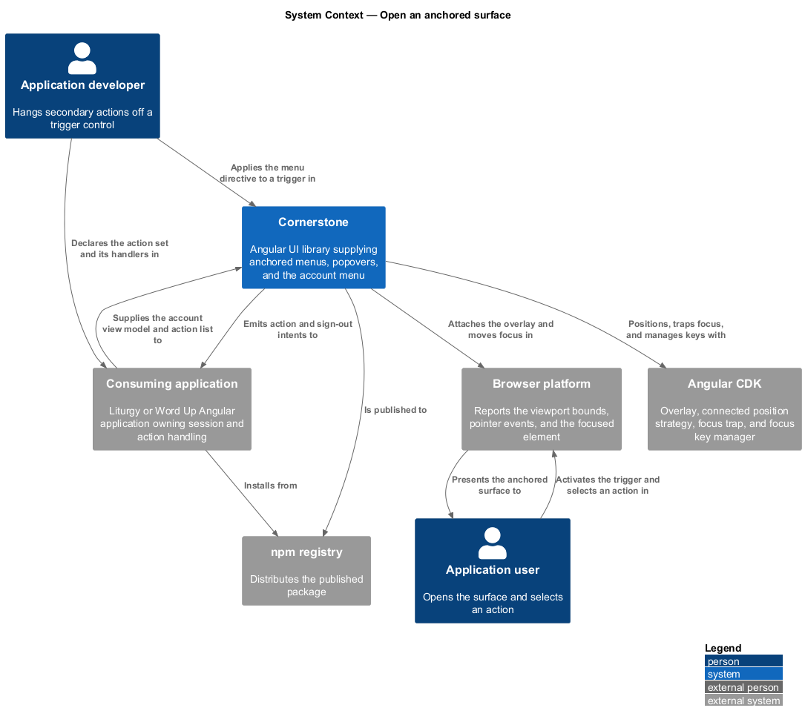
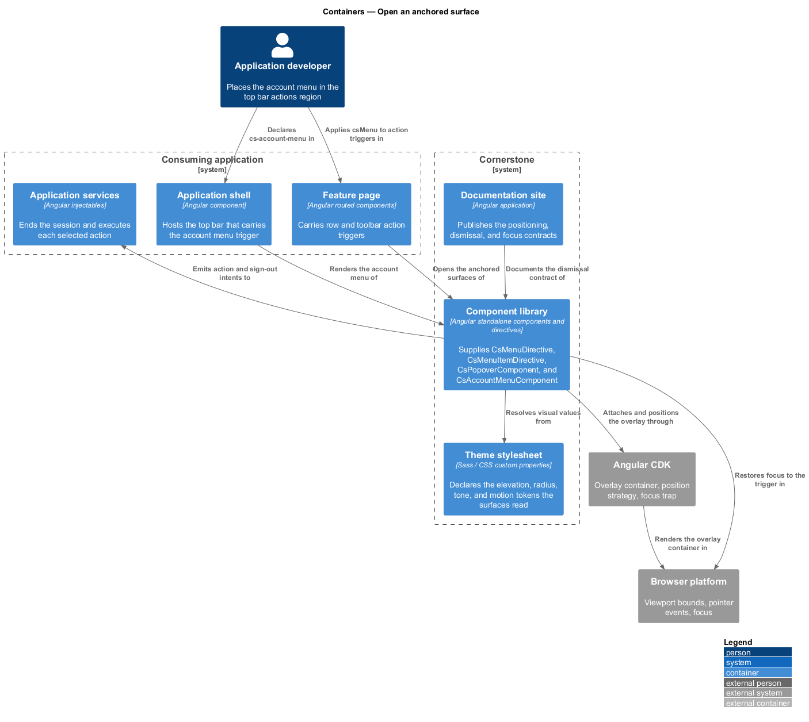
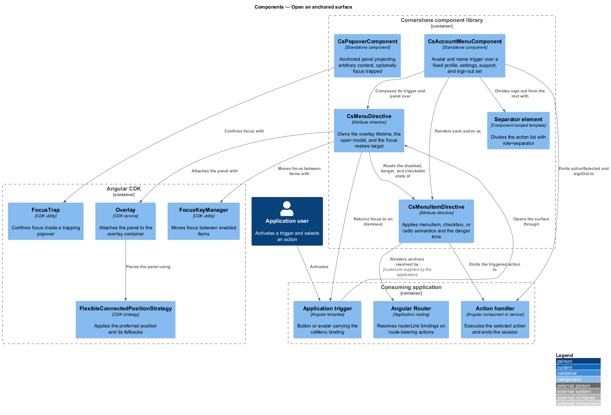
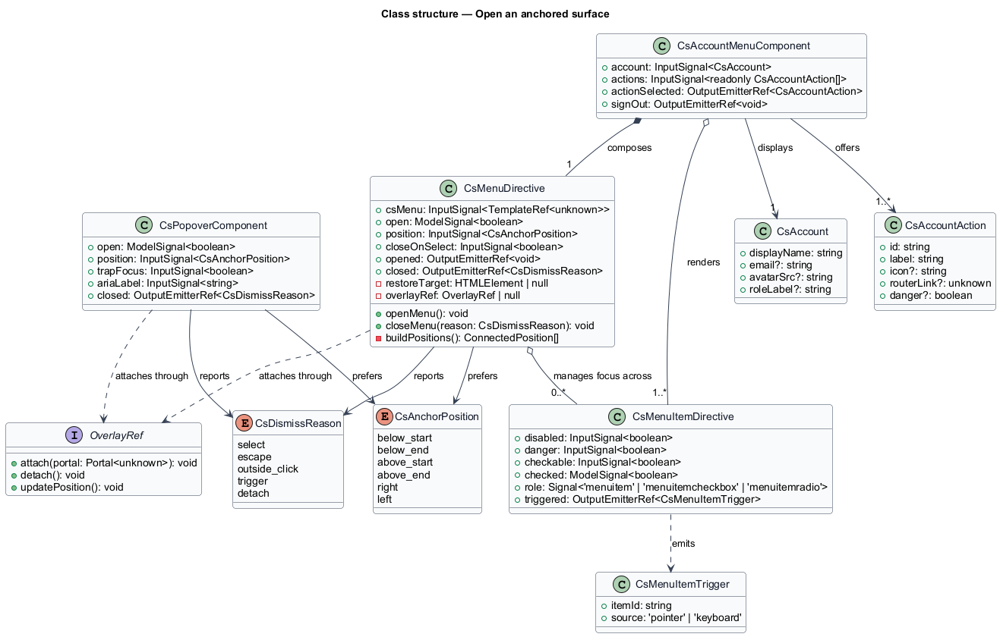
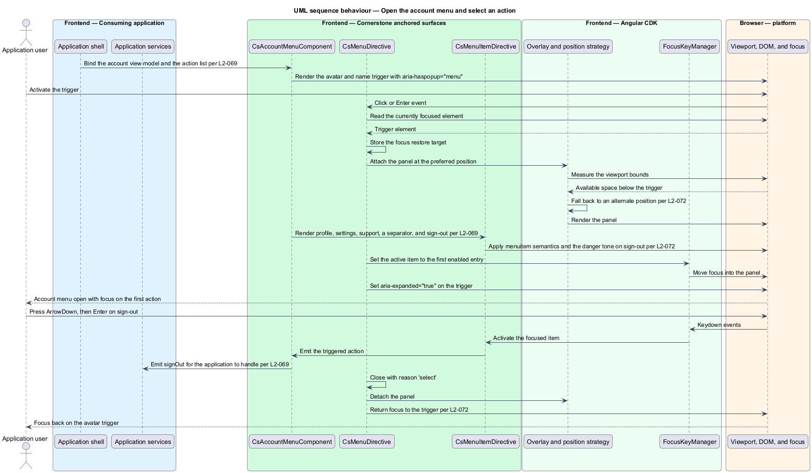
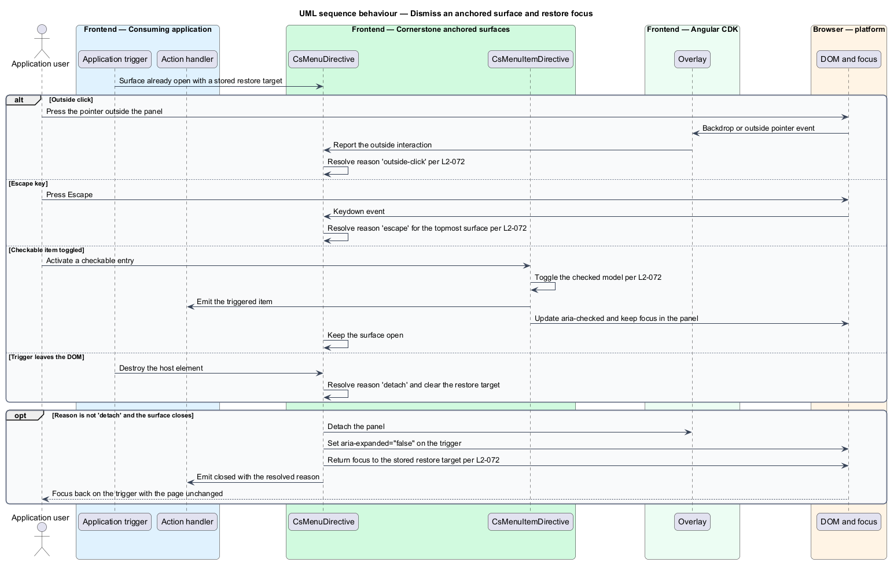

# Open an anchored surface

## Overview

Cornerstone is the Angular user-interface library published as `@quinntyne/cornerstone`.
It supplies the components that the Liturgy and Word Up applications compose
their screens from. Both applications hang secondary actions off a control rather
than spending page space on them, and this feature covers the surfaces that carry
those actions.

**anchored surface** — transient panel positioned against a trigger element and
dismissed without changing the route

**menu** — anchored surface holding a list of actions, navigated with the arrow
keys and dismissed on selection

**popover** — anchored surface holding arbitrary projected content rather than an
action list

**trigger** — element that opens an anchored surface and receives focus back when
that surface closes

An anchored surface differs from a dialog. A dialog centres itself, blocks the
page behind a scrim, and states an obligation the user resolves. An anchored
surface points at its trigger, leaves the page usable, and closes on an outside
click. Dialogs belong to the overlays subsystem; this feature covers the anchored
case only.

The feature sits beside the shell in the navigation subsystem. The account menu
hangs from the top bar's actions region (L2-065); the generic menu and popover
serve the breadcrumb overflow (L2-068), the tab overflow (L2-070), row actions in
data tables, and any application control that needs a short action list. Word Up
consumes the account menu across its portals. Both applications consume the menu
and popover.

**collision-aware positioning** — placement strategy that moves a surface to a
fallback position when the preferred position would render it outside the
viewport

## Description

The feature is a vertical slice from a trigger element down to the restored focus
of that same element. It spans four public building blocks, their item types, and
the CDK overlay they attach to.

- **`CsMenuDirective`** (`[csMenu]`) — the attribute directive an application
  applies to a trigger. It reads `csMenu: InputSignal<TemplateRef<unknown>>`,
  `open: ModelSignal<boolean>`,
  `position: InputSignal<CsAnchorPosition>`, and
  `closeOnSelect: InputSignal<boolean>`. It emits
  `opened: OutputEmitterRef<void>` and
  `closed: OutputEmitterRef<CsDismissReason>`. It sets `aria-haspopup="menu"`
  and `aria-expanded` on the trigger and owns the overlay lifetime. Its states
  are `closed`, `opening`, `open`, and `closing`.
- **`CsMenuItemDirective`** (`[csMenuItem]`) — the directive applied to each
  entry inside a menu panel. It reads
  `disabled: InputSignal<boolean>`,
  `danger: InputSignal<boolean>`,
  `checkable: InputSignal<boolean>`, and
  `checked: ModelSignal<boolean>`. It emits
  `triggered: OutputEmitterRef<CsMenuItemTrigger>`. It renders `menuitem`,
  `menuitemcheckbox`, or `menuitemradio` semantics according to its inputs, and
  marks a danger action with the error tone from the token layer. A separator
  renders as a sibling element carrying `role="separator"`.
- **`PopoverComponent`** (`cs-popover`) — the generic anchored panel. It reads
  `open: ModelSignal<boolean>`, `position: InputSignal<CsAnchorPosition>`,
  `trapFocus: InputSignal<boolean>`, and `ariaLabel: InputSignal<string>`, and
  projects arbitrary content. It emits
  `closed: OutputEmitterRef<CsDismissReason>`. It applies `role="dialog"` when
  `trapFocus` is set and `role="group"` when it is not.
- **`AccountMenuComponent`** (`cs-account-menu`) — the composed menu for the
  signed-in user. It reads `account: InputSignal<Account>` and
  `actions: InputSignal<readonly AccountAction[]>`. It emits
  `actionSelected: OutputEmitterRef<AccountAction>` and
  `signOut: OutputEmitterRef<void>`. Its trigger shows the avatar and the display
  name; its panel holds profile, settings, and support entries, a separator, and
  a sign-out entry marked as a danger action. It performs no sign-out itself; it
  emits the intent and the application ends the session.
- **`CsAnchorPosition`** — union type of the preferred placements:
  `'below-start' | 'below-end' | 'above-start' | 'above-end' | 'right' | 'left'`.
- **`CsDismissReason`** — union type of the ways a surface closes:
  `'select' | 'escape' | 'outside-click' | 'trigger' | 'detach'`.
- **`Account`** — configuration type holding a display name, an optional email
  address, an optional avatar source, and an optional role label.
- **`AccountAction`** — configuration type holding an identifier, a label, an
  optional icon name, an optional `routerLink` value, and a danger flag.
- **`CsMenuItemTrigger`** — output type holding the item identifier and whether
  the trigger came from a pointer or the keyboard.

Positioning runs through the CDK `Overlay` with a flexible connected position
strategy. The directive supplies the preferred position and an ordered fallback
list, so a surface near the viewport edge flips rather than clipping. The overlay
repositions on scroll and on viewport resize while it is open.

The focus contract is uniform across all four. Opening moves focus into the
surface: to the first enabled item for a menu, and to the panel itself for a
popover unless the projected content holds an autofocus target. Closing returns
focus to the trigger for every dismissal reason except `detach`, which fires when
the trigger leaves the DOM and no restore target remains. The `Escape` key closes
the topmost surface only.

Keyboard navigation inside a menu uses the CDK focus key manager. The arrow keys
move between enabled items, `Home` and `End` jump to the ends, typing a character
moves to the next item starting with it, and `Enter` or `Space` triggers the
focused item. A checkable item toggles without closing the panel; every other
item closes it when `closeOnSelect` holds.

An action that maps to a route renders an anchor carrying an
application-supplied `routerLink` value under the router integration contract
(L2-076). The library resolves no route itself.

Every visual value resolves from the token layer (L2-005). Open and close
transitions collapse to an instant state change under
`prefers-reduced-motion: reduce` (L2-008).

The ordered fallback list for each `CsAnchorPosition` value is `<TO SUPPLY>`.

## Requirements

The feature realizes the following level-2 (L2) requirements. Each L2 requirement
refines a level-1 (L1) requirement, cited by identifier.

| L2 ID | Refines (L1) | Requirement |
|-------|--------------|-------------|
| `L2-069` | `L1-009` | The library shall provide an account menu with an avatar and name trigger and profile, settings, support, and sign-out actions, with keyboard navigation, outside-click dismissal, and focus return. |
| `L2-072` | `L1-009` | The library shall provide anchored menus and popovers with separators, danger actions, checkable items, focus return, and collision-aware CDK positioning. |

## Diagrams

### System context

An application developer hangs secondary actions off a trigger. Cornerstone
positions and dismisses the surface through Angular CDK; the consuming
application executes each action.

### Containers

The trigger lives in the application shell or in a feature page. The overlay
attaches to the CDK overlay container outside the application's own DOM subtree.

### Components

`CsMenuDirective` owns the overlay lifetime and the focus contract.
`AccountMenuComponent` composes it with a fixed action set;
`PopoverComponent` reuses the same positioning for projected content.

### Class structure

The menu directive holds the open model and the dismissal reason. The item
directive carries the disabled, danger, and checkable states, and the account
menu composes both over a typed account view model.

### Behaviour — open the account menu and select an action

A user activates the avatar trigger. The overlay attaches at a collision-aware
position, focus moves to the first item, and selecting an action emits an intent
the application acts on.

### Behaviour — dismiss a surface and restore focus

A menu closes by outside click, by the `Escape` key, or by a checkable item that
keeps it open. Each path resolves a dismissal reason and returns focus to the
trigger.

