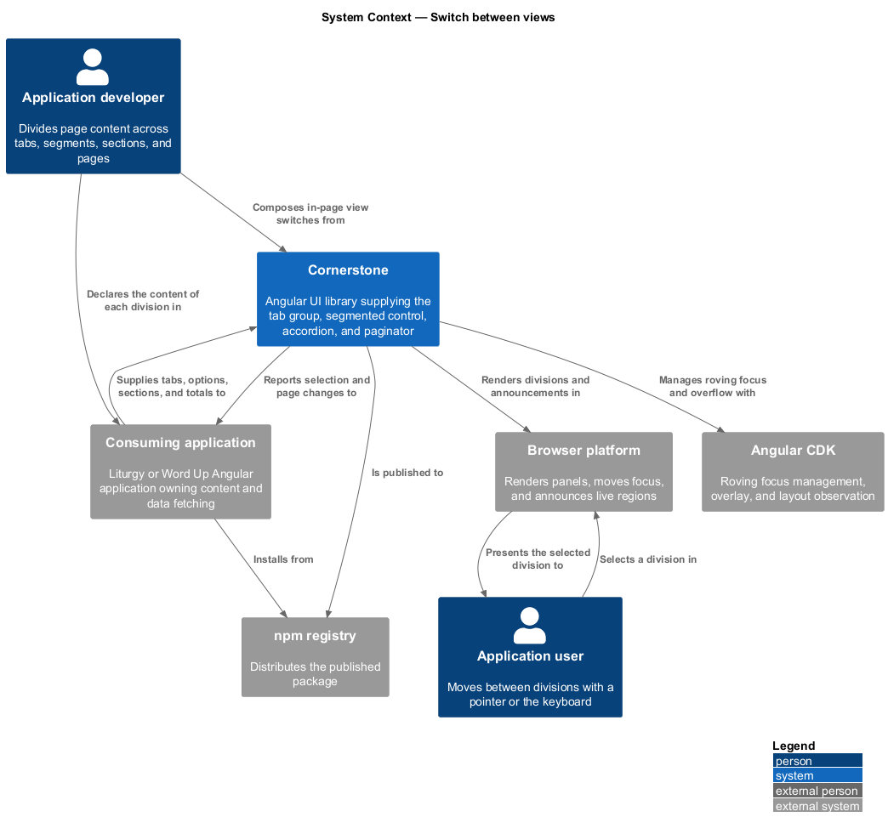
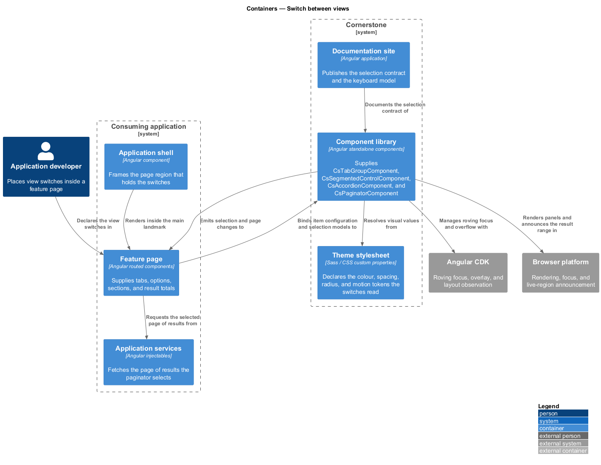
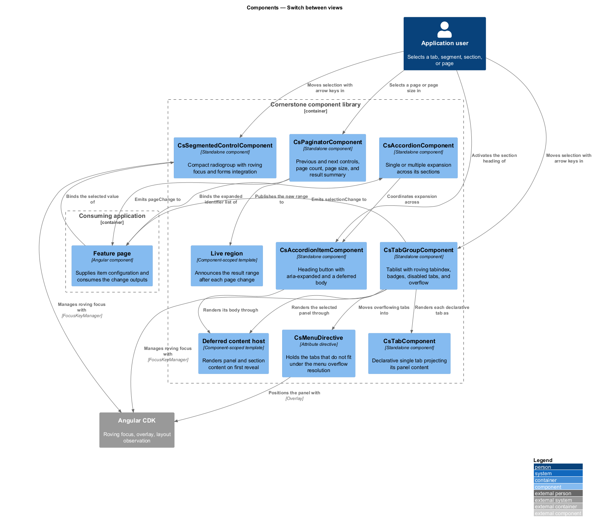
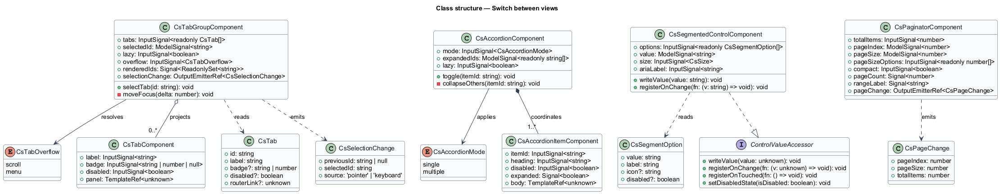
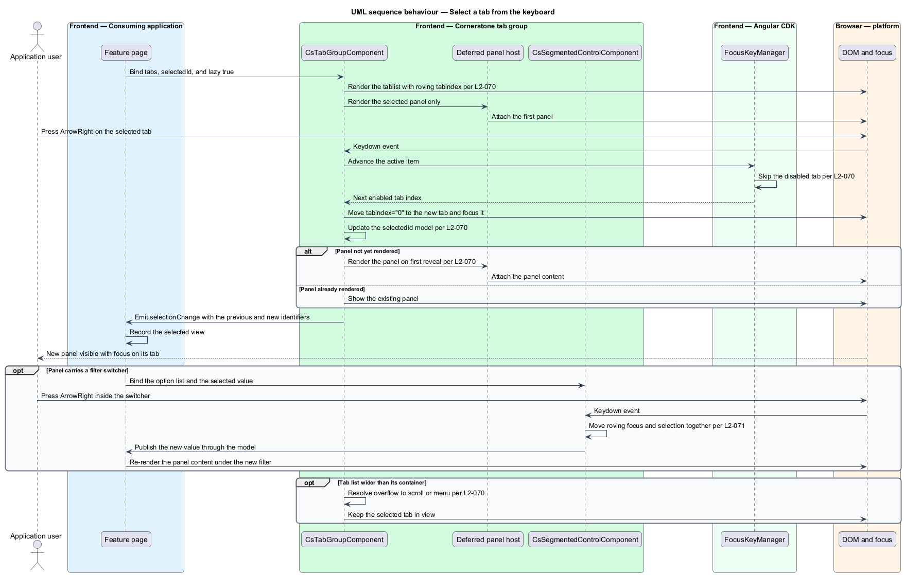
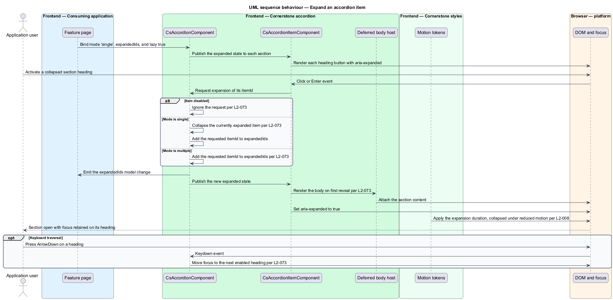
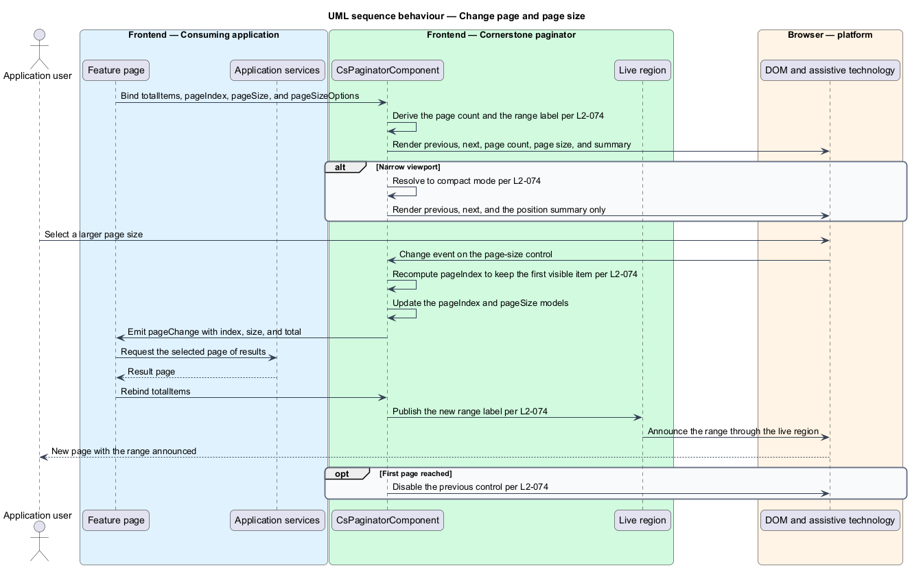

# Switch between views

## Overview

Cornerstone is the Angular user-interface library published as `@quinntyne/cornerstone`.
It supplies the components that the Liturgy and Word Up applications compose
their screens from. Screens in both applications routinely hold more content than
one viewport can carry, and this feature covers the four controls that divide
that content and let a user move between the divisions without leaving the page.

**in-page view switch** — control that changes which part of a page's content is
visible without changing the route

All four controls in this feature are in-page view switches. They differ in what
they divide and how the divisions relate.

**tab group** — horizontal set of labelled panels of which exactly one is visible
at a time

**segmented control** — compact single-select switch that changes the
presentation or filter applied to one body of content

**accordion** — vertical stack of labelled sections, each independently
expandable, with either one open at a time or any number open at once

**paginator** — control that selects one page of a long result set and reports
the range in view

The four sit inside the page region of the application shell (L2-064), which the
`frame-the-application-shell` feature defines. Liturgy uses tabs across its 4D
and 5R workflow screens and the accordion in long content pages. Word Up uses
the segmented control in the calendar and reports screens, the paginator in
roster tables and the audit log, and tabs across both portals.

**controlled selection** — selection state the consuming application owns and
supplies, as opposed to state the component holds internally

Each of the four supports both modes. A `model()` input holds the selection; an
application that binds it two-way controls the selection, and an application that
leaves it unbound lets the component manage its own.

None of the four performs navigation. A tab that maps to a route renders an
anchor carrying an application-supplied `routerLink` value under the router
integration contract (L2-076).

## Description

The feature is a vertical slice from a page's view-model input down to the
keyboard focus of a single control. It spans four components, their item types,
and the change types they emit.

- **`TabGroupComponent`** (`cs-tab-group`) — the tab set. It reads
  `tabs: InputSignal<readonly CsTab[]>`,
  `selectedId: ModelSignal<string>`, `lazy: InputSignal<boolean>`, and
  `overflow: InputSignal<CsTabOverflow>` (`'scroll' | 'menu'`). It emits
  `selectionChange: OutputEmitterRef<CsSelectionChange>`. It renders a
  `tablist` with roving `tabindex`, moves selection with the arrow, `Home`, and
  `End` keys, and skips disabled tabs. When `lazy` is set, a panel's content
  renders on first selection and stays rendered afterwards. Its states are
  `selected`, `unselected`, `disabled`, and `overflowing`.
- **`TabComponent`** (`cs-tab`) — the declarative form of a single tab, for
  applications that supply panel content as template rather than as data. It
  reads `label: InputSignal<string>`, `badge: InputSignal<string | number | null>`,
  and `disabled: InputSignal<boolean>`, and projects its panel content.
- **`SegmentedControlComponent`** (`cs-segmented-control`) — the compact
  switcher. It reads `options: InputSignal<readonly SegmentOption[]>`,
  `value: ModelSignal<string>`, `size: InputSignal<CsSize>`, and
  `ariaLabel: InputSignal<string>`. It emits
  `valueChange` through the model. It renders a `radiogroup` with roving focus:
  one option holds `tabindex="0"`, the rest hold `tabindex="-1"`, and the arrow
  keys move both focus and selection. It implements `ControlValueAccessor` so a
  reactive form may own the value.
- **`AccordionComponent`** (`cs-accordion`) — the stack. It reads
  `mode: InputSignal<CsAccordionMode>` (`'single' | 'multiple'`),
  `expandedIds: ModelSignal<readonly string[]>`, and
  `lazy: InputSignal<boolean>`. It emits
  `expandedChange` through the model. In `single` mode expanding one item
  collapses the rest.
- **`AccordionItemComponent`** (`cs-accordion-item`) — one section. It reads
  `itemId: InputSignal<string>`, `heading: InputSignal<string>`, and
  `disabled: InputSignal<boolean>`, and projects its body. The heading renders a
  `<button>` carrying `aria-expanded` and `aria-controls`; the arrow, `Home`, and
  `End` keys move focus between headings.
- **`PaginatorComponent`** (`cs-paginator`) — the page selector. It reads
  `totalItems: InputSignal<number>`, `pageIndex: ModelSignal<number>`,
  `pageSize: ModelSignal<number>`,
  `pageSizeOptions: InputSignal<readonly number[]>`, and
  `compact: InputSignal<boolean>`. It emits
  `pageChange: OutputEmitterRef<PageChange>`. It renders previous and next
  controls, the page count, a page-size select, and a result summary in a live
  region so a screen reader hears the new range after each change. In `compact`
  mode it renders the previous and next controls and the position summary only.
- **`CsTab`** — configuration type holding an identifier, a label, an optional
  badge, an optional disabled flag, and an optional `routerLink` value.
- **`SegmentOption`** — configuration type holding a value, a label, an
  optional icon name, and an optional disabled flag.
- **`CsSelectionChange`** — output type holding the previous identifier, the new
  identifier, and whether the change came from a pointer or the keyboard.
- **`PageChange`** — output type holding the page index, the page size, and the
  total item count.

Overflow in the tab group has two resolutions. Under `scroll` the tab list scrolls
horizontally with scroll-snap and keeps the selected tab in view. Under `menu`
the tabs that do not fit move into an anchored menu behind an overflow trigger,
using the surface defined in the `open-an-anchored-surface` feature (L2-072).

Lazy rendering in both the tab group and the accordion uses a deferred template.
Content that has never been shown holds no DOM and runs no change detection; the
component renders it on first reveal.

Every visual value resolves from the token layer (L2-005). Panel and section
transitions collapse to an instant state change under
`prefers-reduced-motion: reduce` (L2-008).

The width at which the paginator switches to `compact` automatically is
`<TO SUPPLY>`, and the default `pageSizeOptions` list is `<TO SUPPLY>`.

## Requirements

The feature realizes the following level-2 (L2) requirements. Each L2 requirement
refines a level-1 (L1) requirement, cited by identifier.

| L2 ID | Refines (L1) | Requirement |
|-------|--------------|-------------|
| `L2-070` | `L1-009` | The library shall provide tabs with keyboard navigation, disabled tabs, badges, lazily rendered panels, controlled and uncontrolled selection, and responsive overflow. |
| `L2-071` | `L1-009` | The library shall provide a compact single-select view or filter switcher with roving focus. |
| `L2-073` | `L1-009` | The library shall provide an accordion with single and multiple expansion modes, disabled items, controlled state, keyboard navigation, and lazily rendered content. |
| `L2-074` | `L1-009` | The library shall provide pagination with previous and next controls, a page count, page-size selection, a compact mobile mode, and a live result summary. |

## Diagrams

### System context

An application developer divides a page's content across the four switches.
Cornerstone renders them and reports selection; the consuming application owns
the content each division holds.

### Containers

Each switch renders inside a feature page within the application shell. The page
supplies the item configuration and receives the typed change output.

### Components

The four switches share a selection contract and a keyboard model. The tab group
and the accordion both defer content until first reveal; the paginator reports
its range through a live region.

### Class structure

Each component holds its selection in a `model()` signal and emits a typed change
output. The item types travel from the page as plain data.

### Behaviour — select a tab from the keyboard

A user moves through the tab list with the arrow keys. The component skips
disabled tabs, updates the selection model, and renders the lazy panel on first
reveal.

### Behaviour — expand an accordion item

A user activates a section heading. In `single` mode the component collapses the
open section before expanding the new one and renders its deferred body.

### Behaviour — change page and page size

A user selects a larger page size. The paginator recomputes the page index,
emits the change for the page to fetch against, and announces the new range.

