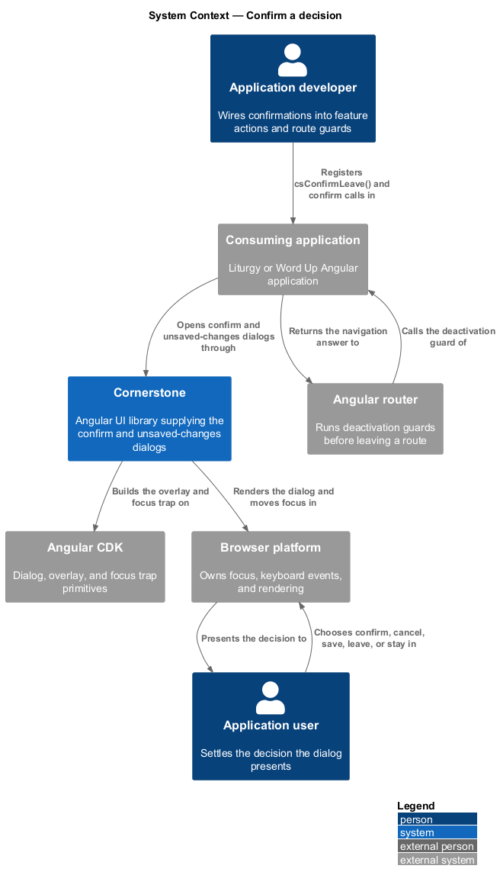
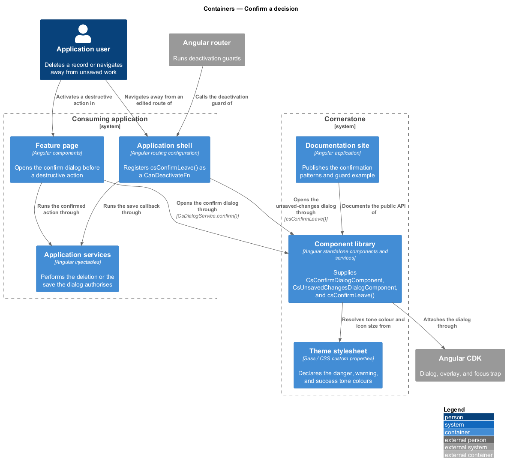
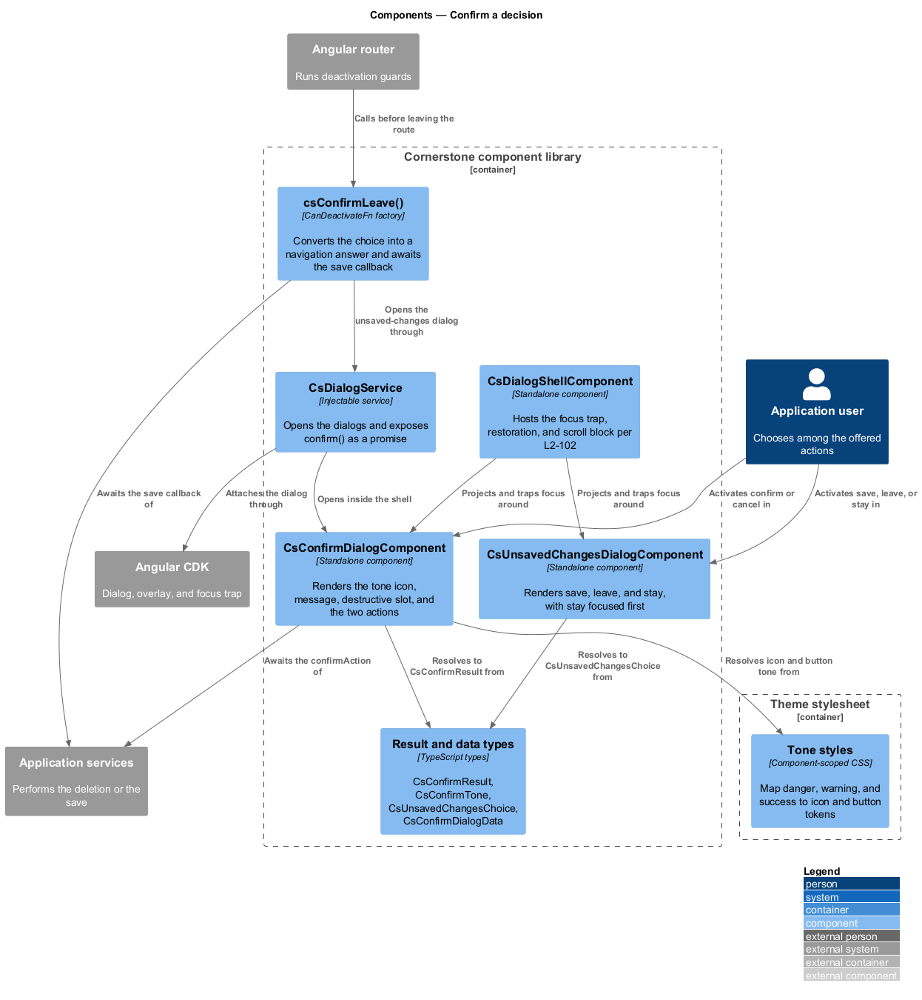
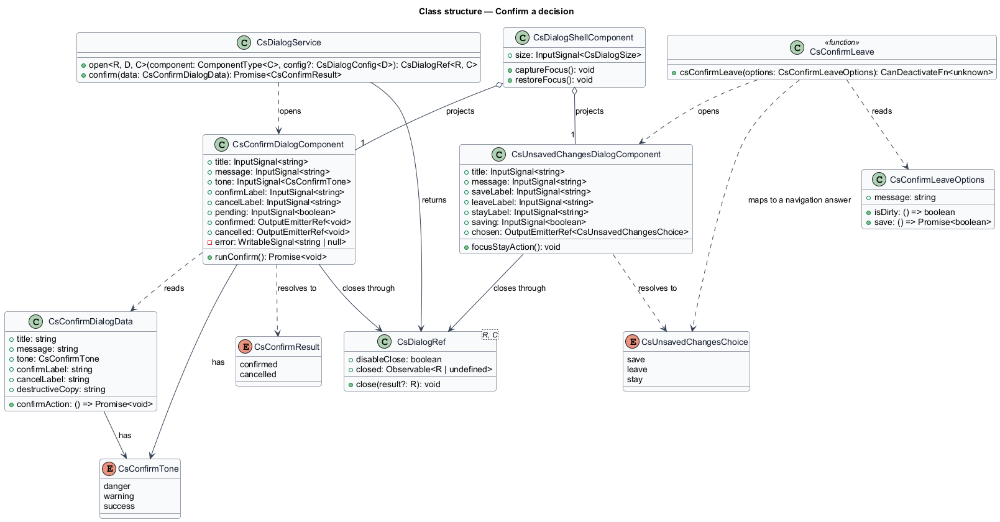
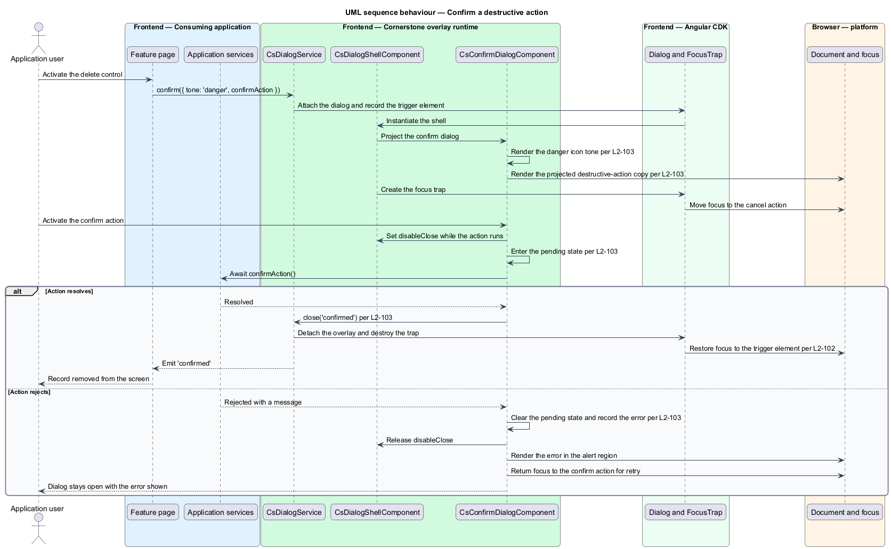
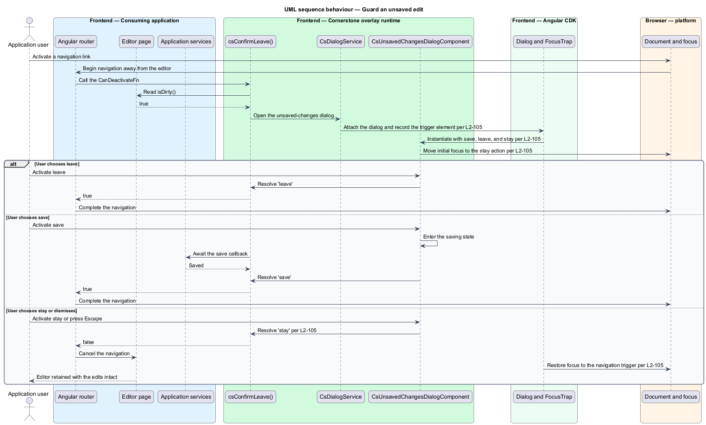

# Confirm a decision

## Overview

Cornerstone is the Angular user-interface library published as `@quinntyne/cornerstone`.
It supplies the components that the Liturgy and Word Up applications compose their
screens from. This feature covers the two dialogs that ask an application user to
settle a decision before an action proceeds: the confirm dialog, which guards a
single action, and the unsaved-changes dialog, which guards navigation away from
edited work.

**confirmation** — interruption that states the consequence of an action and
requires an explicit choice before that action proceeds

**destructive action** — action whose effect cannot be undone from the interface,
such as deleting a record or revoking access

Both applications need these dialogs, and both need them to look and behave the
same way. Liturgy confirms gate rejections and work-item deletion; Word Up confirms
roster removal, submission withdrawal, and leaving an authoring session with
unsaved edits. Before this feature each screen wrote its own confirmation markup,
so the icon, the button order, and the wording of the destructive case varied
between screens.

**guard** — function Angular calls before it leaves a route, which allows or
cancels the navigation

**pending state** — state a dialog holds while the confirmed action runs, in which
the confirm control is busy and the dialog resists dismissal

Both dialogs open through `DialogService` (L2-102) and inherit its focus trap,
focus restoration, scroll blocking, and typed result channel. This feature adds the
decision semantics on top: the tone of the icon, the shape of the choice, the
handling of an asynchronous outcome, and the three-way answer a route guard needs.

The unsaved-changes dialog carries a further constraint. A route guard runs outside
the Angular change-detection context that opened the editor, so the dialog resolves
to a plain promise the guard can await, and it restores focus to the control that
triggered the navigation rather than to whichever element the router left focused.

## Description

The feature spans two dialog components, their result types, and one convenience
opener on the dialog service.

- **`ConfirmDialogComponent`** — the `cs-confirm-dialog` element rendered inside
  `DialogShellComponent`. It carries a `title` input, a `message` input, a
  `tone` input of `'danger' | 'warning' | 'success'`, a `confirmLabel` input, a
  `cancelLabel` input, and a `pending` input. It renders the tone icon, the
  message, an optional projected destructive-action slot, and the two actions. It
  emits `confirmed` and `cancelled`, and resolves the dialog to a
  `ConfirmResult`.
- **`ConfirmDialogData`** — the typed payload passed through
  `DialogConfig.data`. It carries `title`, `message`, `tone`, `confirmLabel`,
  `cancelLabel`, `destructiveCopy`, and an optional `confirmAction` returning a
  promise or observable.
- **`ConfirmResult`** — union type of the answer:
  `'confirmed' | 'cancelled'`. The dialog resolves to `undefined` when the user
  dismisses it, which the calling code treats as `'cancelled'`.
- **`ConfirmTone`** — union type of the icon tones:
  `'danger' | 'warning' | 'success'`. The tone selects the icon glyph, the icon
  colour token, and the confirm button variant; `danger` renders the destructive
  button variant.
- **Destructive-action copy slot** — the `[csConfirmDestructive]` projection region
  the confirm dialog renders beneath the message. An application places the name of
  the record, the count of affected rows, or a typed-confirmation control in it.
  The library supplies no copy of its own for this region.
- **`UnsavedChangesDialogComponent`** — the `cs-unsaved-changes-dialog` element.
  It renders three actions rather than two and resolves to a
  `UnsavedChangesChoice`. It carries a `title` input, a `message` input, a
  `saveLabel` input, a `leaveLabel` input, a `stayLabel` input, and a `saving`
  input.
- **`UnsavedChangesChoice`** — union type of the three answers:
  `'save' | 'leave' | 'stay'`. Dismissal resolves to `'stay'`, so an interrupted
  dialog never discards work.
- **`confirmLeave()`** — the guard helper an application registers as a
  `CanDeactivateFn`. It opens the unsaved-changes dialog, awaits the choice,
  returns `true` for `'leave'`, returns `false` for `'stay'`, and awaits the
  supplied save callback before returning `true` for `'save'`.
- **`DialogService.confirm(data)`** — the convenience opener that returns a
  `Promise<ConfirmResult>` for call sites that want the answer without holding a
  `DialogRef`.

The confirm dialog owns the pending and error states when the caller supplies
`confirmAction`. On confirmation it sets `disableClose`, marks the confirm control
busy, and awaits the action. On resolution it closes with `'confirmed'`. On
rejection it clears the busy state, releases `disableClose`, renders the error
message in an alert region inside the dialog, and returns focus to the confirm
control so a retry needs no pointer.

The stay action carries initial focus in the unsaved-changes dialog, so an
accidental Enter press cannot discard edits.

The wording the library supplies as the default confirm and cancel labels is
`<TO SUPPLY>`; both applications currently pass their own.

## Requirements

The feature realizes the following level-2 (L2) requirements. Each L2 requirement
refines a level-1 (L1) requirement, cited by identifier.

| L2 ID | Refines (L1) | Requirement |
|-------|--------------|-------------|
| `L2-103` | `L1-011` | The library shall provide a confirm dialog with confirm and cancel actions, danger, warning, and success icon tones, a typed result, asynchronous pending and error states, and a destructive-action copy slot. |
| `L2-105` | `L1-011` | The library shall provide an unsaved-changes dialog offering leave, stay, and save choices, with a focus-safe integration point for Angular route guards. |

## Diagrams

### System context

An application developer wires confirmations into feature actions and route guards,
and an application user settles the decision. Cornerstone renders both dialogs over
Angular CDK; the Angular router drives the unsaved-changes case.

### Containers

The feature page opens the confirm dialog directly; the router calls the guard,
which opens the unsaved-changes dialog. Both reach the component library, and both
resolve back into application services that perform the action or the save.

### Components

Both dialog components render inside `DialogShellComponent` and therefore inherit
its focus trap and restoration. `confirmLeave()` sits between the router and the
unsaved-changes dialog and converts the choice into a navigation answer.

### Class structure

`ConfirmDialogComponent` reads a `ConfirmDialogData` and resolves to a
`ConfirmResult`; `UnsavedChangesDialogComponent` resolves to a
`UnsavedChangesChoice`. Both depend on `DialogRef` for the typed close.

### Behaviour — confirm a destructive action

The page opens the confirm dialog with the `danger` tone and an asynchronous
action. The dialog traps focus, holds the pending state while the action runs, and
either closes with `'confirmed'` or surfaces the error and returns focus to the
confirm control.

### Behaviour — guard an unsaved edit

The user navigates away from an edited form. The guard opens the unsaved-changes
dialog, focus moves to the stay action, and the returned choice becomes the
router's answer; on save the guard awaits the save callback before allowing the
navigation.

