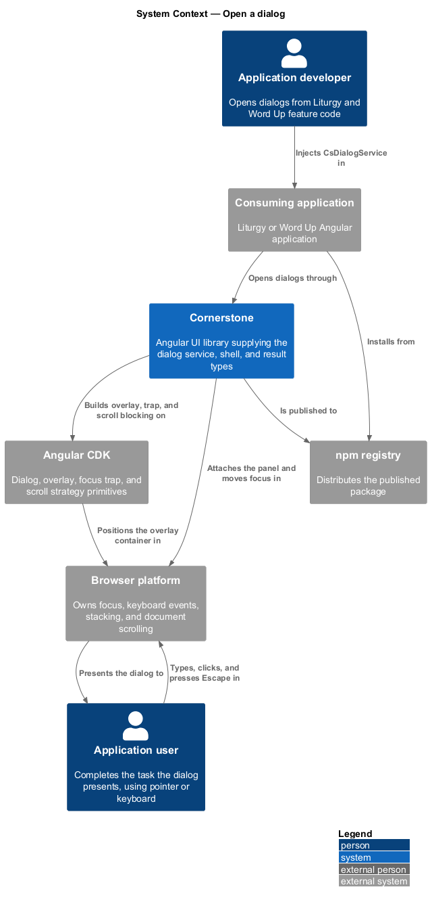
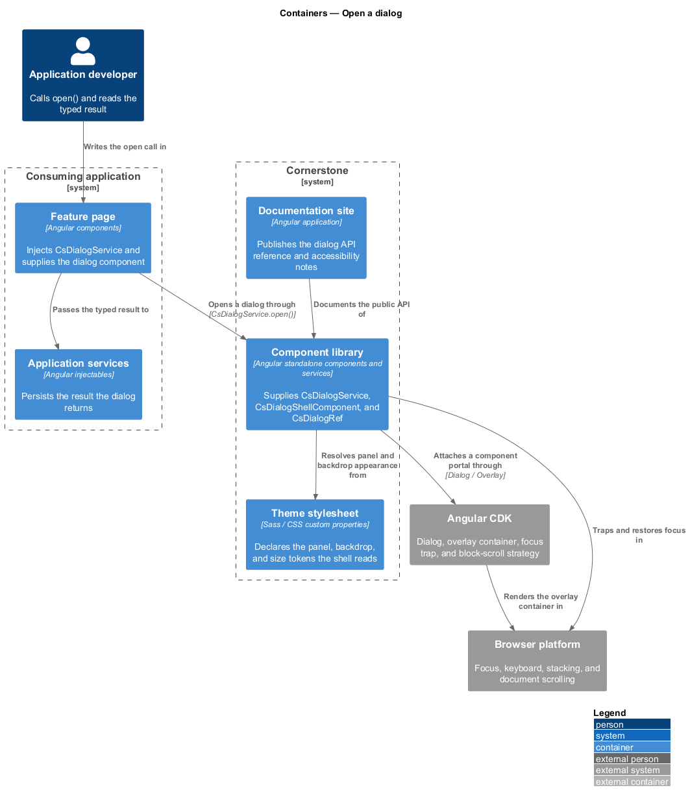
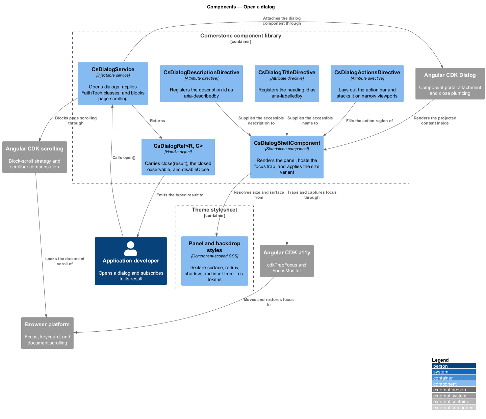
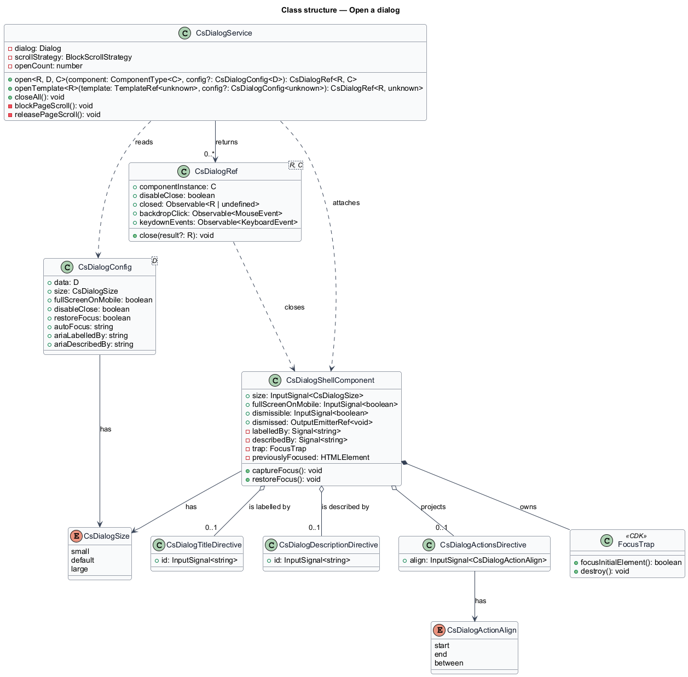
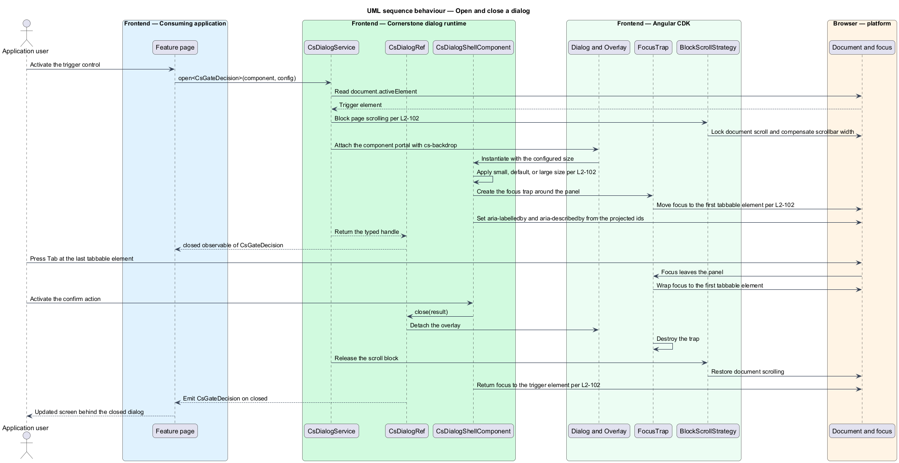
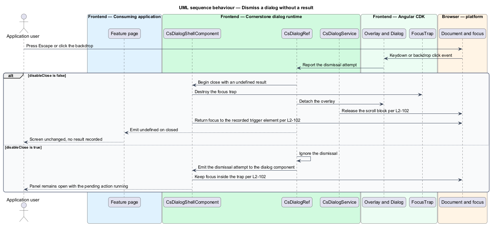
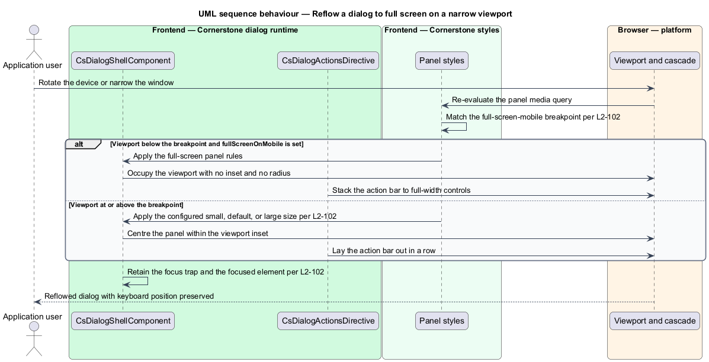

# Open a dialog

## Overview

Cornerstone is the Angular user-interface library published as `@quinntyne/cornerstone`.
It supplies the components that the Liturgy and Word Up applications compose
their screens from. This feature covers the general-purpose dialog: how an
application opens one, how the library holds keyboard focus inside it while it is
open, and how the application receives a typed answer when it closes.

**overlay** — element rendered outside the document flow, positioned above the
page content by the browser's stacking context

**dialog** — modal overlay that presents a task or a decision and blocks
interaction with the page beneath it until it closes

Both applications open dialogs. Liturgy opens them for work-item editing and gate
decisions; Word Up opens them for filters, editors, and confirmations. Before this
feature the two applications each carried a dialog wrapper of their own, so focus
behaviour and sizing diverged between them. This feature moves that behaviour into
the library.

**focus trap** — region of the document that constrains sequential keyboard
navigation to the elements inside it

**focus restoration** — return of keyboard focus to the element that was focused
before an overlay opened, performed when that overlay closes

The dialog sits on Angular CDK's `Dialog` service and its overlay and
accessibility primitives. Cornerstone does not reimplement the overlay
positioning, the backdrop, or the focus trap; it supplies the FaithTech visual
shell, the size variants, the labelling contract, and a typed result channel over
the top of them.

The feature is the base of the overlays subsystem. The confirm dialog and the
unsaved-changes dialog both open through this service, and the drawer shares its
scroll and focus handling.

## Description

The feature spans an injectable service, a presentational shell component, and the
types that carry configuration and results across the boundary.

- **`DialogService`** — the injectable an application calls to open a dialog. Its
  `open<R, D, C>(component, config)` method takes a component type, an optional
  typed data payload of type `D`, and returns a `DialogRef<R, C>` whose result
  type `R` is the type the dialog resolves to. It applies the `cs-backdrop`
  backdrop class and the FaithTech panel class before delegating to the CDK
  `Dialog` service. It also exposes `openTemplate<R>()` for a template-portal
  dialog and `closeAll()`.
- **`DialogShellComponent`** — the `cs-dialog-shell` element that renders the
  panel. It projects three regions: a header selected by `[csDialogTitle]`, the
  default content, and an action bar selected by `[csDialogActions]`. It carries a
  `size` input of `'small' | 'default' | 'large'`, a `fullScreenOnMobile` input,
  and a `dismissible` input that governs whether the backdrop and the Escape key
  close the dialog. It hosts the CDK focus trap and captures initial focus on
  open.
- **`DialogRef<R, C>`** — the handle returned from `open()`. It carries
  `close(result?: R)`, a `closed` observable of `R | undefined`, a `backdropClick`
  observable, a `keydownEvents` observable, and a writable `disableClose` flag that
  a dialog sets while an asynchronous action is in flight.
- **`DialogConfig<D>`** — the configuration object. It carries `data` of type
  `D`, `size`, `fullScreenOnMobile`, `disableClose`, `ariaLabelledBy`,
  `ariaDescribedBy`, `restoreFocus`, and `autoFocus`.
- **`DialogSize`** — union type of the size identifiers:
  `'small' | 'default' | 'large'`.
- **`DialogTitleDirective`** — the `csDialogTitle` attribute directive. It stamps
  a generated element id and registers that id as the panel's `aria-labelledby`
  target, so the accessible name comes from the rendered heading rather than a
  duplicated string.
- **`DialogDescriptionDirective`** — the `csDialogDescription` attribute
  directive. It performs the same registration for `aria-describedby`.
- **`DialogActionsDirective`** — the `csDialogActions` attribute directive. It
  applies the action-bar layout and its responsive stacking.

The shell resolves every visual value from the token surface (L2-005), so a dialog
inherits the active theme without any configuration.

Scroll management belongs to the service. While at least one modal dialog is open,
the service blocks scrolling on the page beneath through the CDK block strategy and
compensates for the scrollbar width, so the page behind does not shift. The block
is released when the last modal dialog closes.

The size variants resolve against the viewport. Below the small breakpoint a dialog
configured with `fullScreenOnMobile` occupies the full viewport and its action bar
stacks to full-width buttons; above that breakpoint the configured size applies.

The exact breakpoint at which `fullScreenOnMobile` engages is `<TO SUPPLY>`.

## Requirements

The feature realizes the following level-2 (L2) requirements. Each L2 requirement
refines a level-1 (L1) requirement, cited by identifier.

| L2 ID | Refines (L1) | Requirement |
|-------|--------------|-------------|
| `L2-102` | `L1-011` | The library shall provide a CDK-dialog-backed service and shell with focus trapping and restoration, a labelled title and description, small, default, large, and full-screen-mobile sizes, scroll management, and typed results. |

## Diagrams

### System context

An application developer opens dialogs from feature code, and an application user
completes the task the dialog presents. Cornerstone builds the behaviour on Angular
CDK and reaches the browser for focus, keyboard events, and scrolling.

### Containers

The consuming application injects the dialog service from the component library and
passes a component to render. The theme stylesheet supplies the panel and backdrop
appearance; the CDK overlay container hosts the rendered panel outside the
application's own DOM.

### Components

`DialogService` wraps the CDK `Dialog`, attaches `DialogShellComponent`, and
returns a `DialogRef`. The labelling directives register their element ids with
the shell, and the shell delegates the trap to the CDK focus trap.

### Class structure

`DialogService` produces a `DialogRef<R, C>` from a `DialogConfig<D>`. The
shell holds the size and dismissal inputs; the three content directives supply the
accessible name, the description, and the action layout.

### Behaviour — open and close a dialog

The application calls `open()`; the service records the active element, blocks page
scrolling, attaches the panel, and traps focus. On close the service emits the typed
result, releases the scroll block, and returns focus to the recorded element.

### Behaviour — dismiss without a result

The user presses Escape or clicks the backdrop on a dismissible dialog. The dialog
closes with an undefined result; when `disableClose` is set the dismissal is
ignored and focus stays inside the trap.

### Behaviour — reflow to full screen

The viewport narrows below the small breakpoint while a dialog configured with
`fullScreenOnMobile` is open. The shell drops its panel inset and radius, occupies
the viewport, and stacks its action bar, without reattaching the panel or moving
focus.

