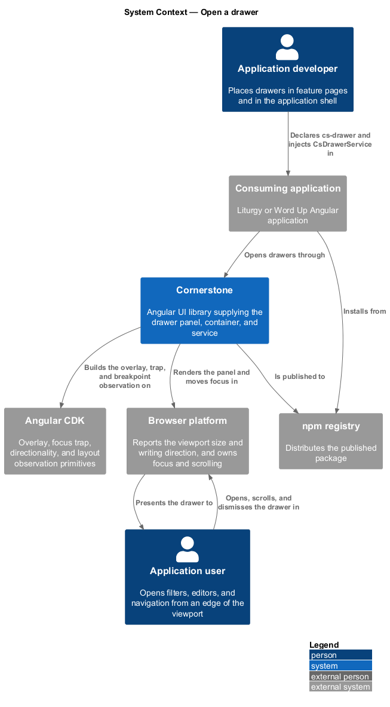
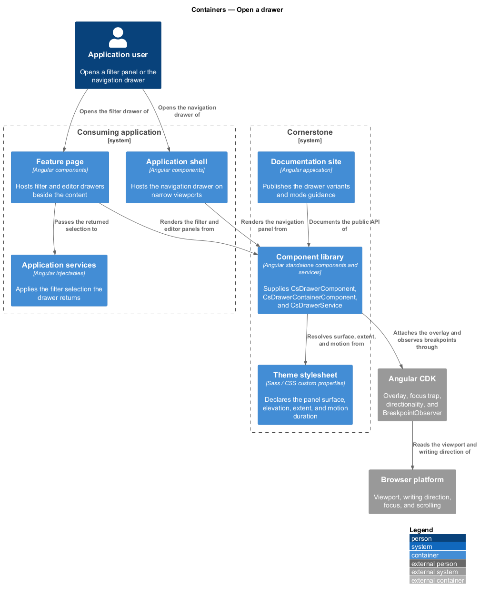
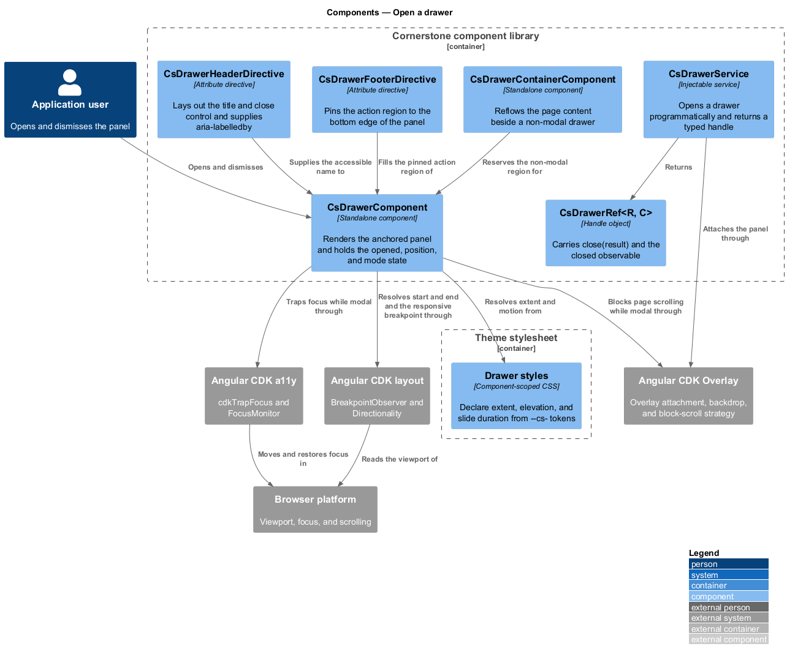
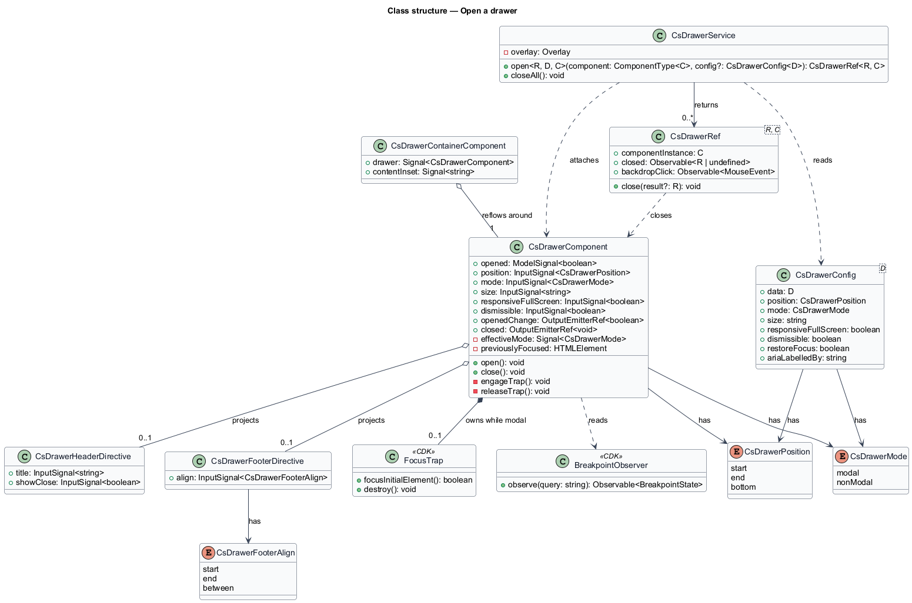
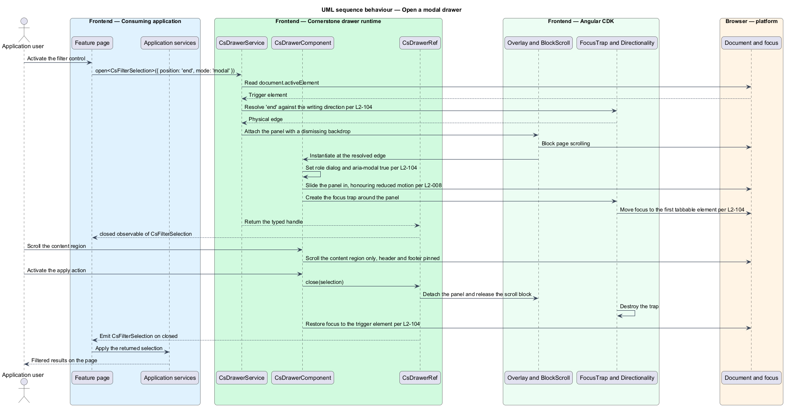
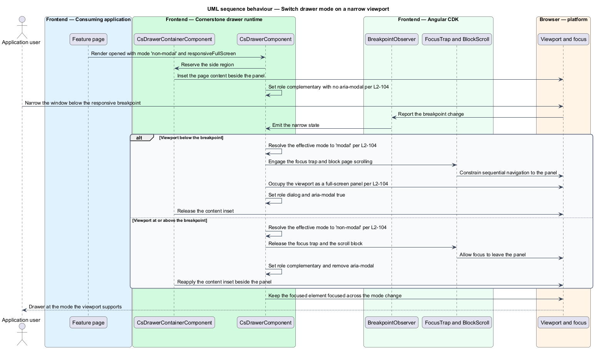

# Open a drawer

## Overview

Cornerstone is the Angular user-interface library published as `@quinntyne/cornerstone`.
It supplies the components that the Liturgy and Word Up applications compose their
screens from. This feature covers the drawer: the panel that slides in from an edge
of the viewport to hold navigation, filters, or a secondary editor beside the work
the user is already doing.

**drawer** — overlay panel anchored to one edge of the viewport, sliding into view
along the axis of that edge

**edge** — side of the viewport a drawer is anchored to, expressed in
writing-direction terms as `start` or `end`, or as `bottom`

**modal mode** — mode in which a drawer traps focus, blocks page scrolling, and
renders a backdrop that dismisses it

**non-modal mode** — mode in which a drawer occupies its own region beside the page
content, leaves focus free to move out of it, and does not block page scrolling

Word Up opens drawers for filter panels and record editors; both applications open
a drawer for the shell navigation on narrow viewports. Before this feature the
navigation drawer existed only inside the application shell, so the filter and
editor cases each carried their own panel.

The drawer sits on the same Angular CDK overlay and accessibility primitives as the
dialog (L2-102) and shares its focus lifecycle in modal mode: it records the trigger
element, traps focus while open, and restores focus on close. The two differ in
anchoring, in the transition axis, and in the non-modal mode the dialog does not
have.

The mode is not fixed at the call site. A drawer configured to be responsive runs
non-modal on a wide viewport, where the page has room for it beside the content, and
becomes modal and full-screen on a narrow viewport, where it does not. That
transition changes the focus contract mid-life, so the drawer applies the trap and
the scroll block as the mode changes rather than only at open.

## Description

The feature spans one component, its content directives, a service for programmatic
opening, and the types that carry position and mode.

- **`DrawerComponent`** — the `cs-drawer` element that renders the panel. It
  carries an `opened` model of `boolean`, a `position` input of
  `'start' | 'end' | 'bottom'`, a `mode` input of `'modal' | 'non-modal'`, a
  `responsiveFullScreen` input, a `dismissible` input, and a `size` input holding
  the panel extent along the anchored axis. It emits `openedChange` and `closed`,
  and projects a header selected by `[csDrawerHeader]`, the default content, and a
  footer selected by `[csDrawerFooter]`.
- **`DrawerPosition`** — union type of the anchoring edges:
  `'start' | 'end' | 'bottom'`. The `start` and `end` values resolve against the
  writing direction reported by the CDK directionality service, so a
  right-to-left application anchors a `start` drawer to the right.
- **`DrawerMode`** — union type of the modes: `'modal' | 'non-modal'`.
- **`DrawerService`** — the injectable that opens a drawer from application code
  without a template declaration. Its `open<R, D, C>(component, config)` method
  returns a `DrawerRef<R, C>` carrying the same typed close channel as
  `DialogRef` (L2-102).
- **`DrawerConfig<D>`** — the configuration object. It carries `data`,
  `position`, `mode`, `size`, `responsiveFullScreen`, `dismissible`,
  `ariaLabelledBy`, and `restoreFocus`.
- **`DrawerHeaderDirective`** — the `csDrawerHeader` attribute directive. It lays
  out the title and the close control, and registers the title id as the panel's
  `aria-labelledby` target.
- **`DrawerFooterDirective`** — the `csDrawerFooter` attribute directive. It pins
  the action region to the bottom edge of the panel and keeps it visible while the
  content region scrolls.
- **`DrawerContainerComponent`** — the `cs-drawer-container` element that hosts a
  non-modal drawer and the page content side by side, and reflows the content
  region when the drawer opens or closes.

The panel carries `role="dialog"` and `aria-modal="true"` in modal mode, and
`role="complementary"` with no `aria-modal` in non-modal mode, so assistive
technology reports the correct relationship to the page in each mode.

Scrolling is scoped to the content region. The header and footer stay fixed, the
content region scrolls on the anchored axis, and in modal mode the page beneath is
blocked as it is for a dialog.

The transition respects the reduced-motion preference (L2-008): the panel appears
and disappears without translation when that preference is set, and the state
change still occurs.

The default panel extent for each position, and the breakpoint at which
`responsiveFullScreen` switches a drawer to modal, are `<TO SUPPLY>`.

## Requirements

The feature realizes the following level-2 (L2) requirements. Each L2 requirement
refines a level-1 (L1) requirement, cited by identifier.

| L2 ID | Refines (L1) | Requirement |
|-------|--------------|-------------|
| `L2-104` | `L1-011` | The library shall provide a start, end, or bottom overlay panel with modal and non-modal modes and a responsive full-screen option. |

## Diagrams

### System context

An application developer places drawers in feature pages and in the application
shell, and an application user opens and dismisses them. Cornerstone builds the
panel on Angular CDK and reads the viewport and writing direction through the
browser.

### Containers

The application shell hosts the navigation drawer and the feature page hosts the
filter and editor drawers. Both draw the panel from the component library, which
resolves its surface and motion from the theme stylesheet.

### Components

`DrawerComponent` renders the panel and delegates the trap and the scroll block to
the CDK when it runs modal. `DrawerContainerComponent` reflows the page content
around a non-modal drawer, and the header and footer directives fill the fixed
regions.

### Class structure

`DrawerComponent` holds the position, mode, and opened state, and composes a
focus trap only while modal. `DrawerService` produces a `DrawerRef<R, C>` from a
`DrawerConfig<D>` for the programmatic case.

### Behaviour — open a modal drawer

The user opens a filter drawer anchored to the end edge. The drawer records the
trigger, blocks page scrolling, traps focus, and on close restores focus to the
trigger control.

### Behaviour — switch mode on a narrow viewport

The viewport narrows below the responsive breakpoint while a non-modal drawer is
open. The drawer becomes modal and full-screen, engages the focus trap and the
scroll block, and reverses both when the viewport widens again.

