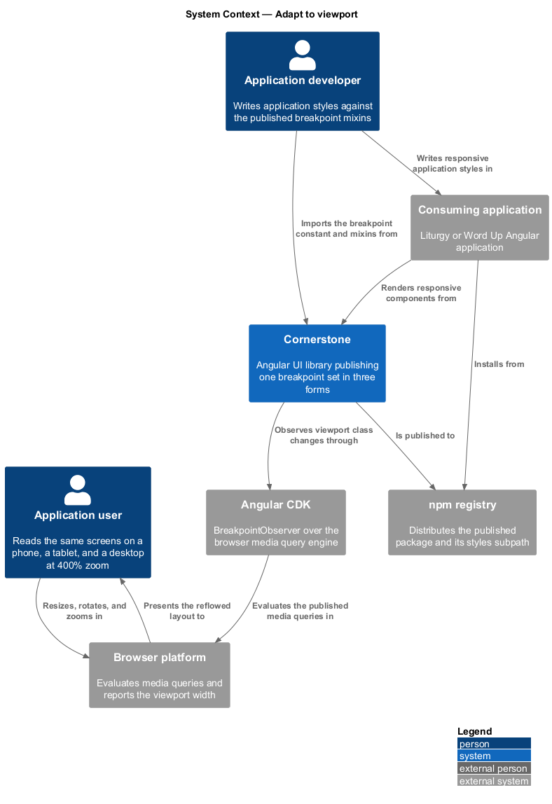
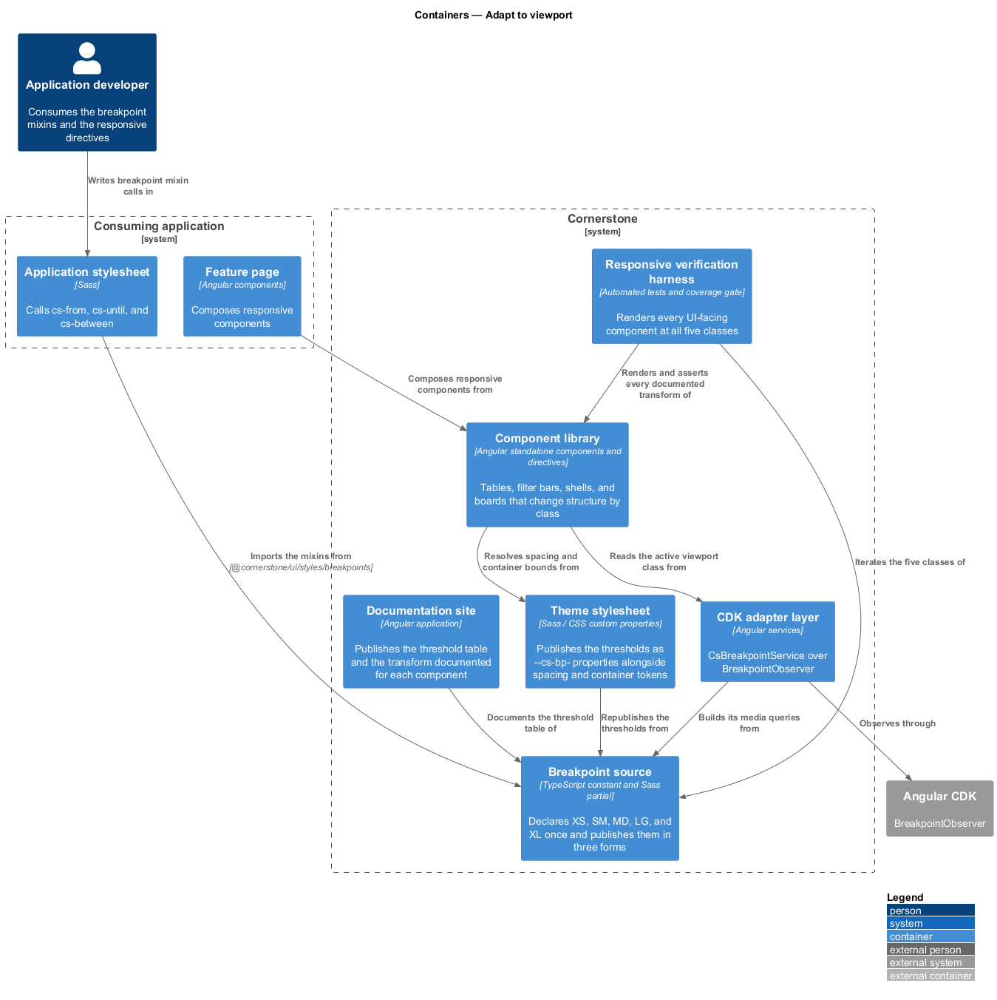
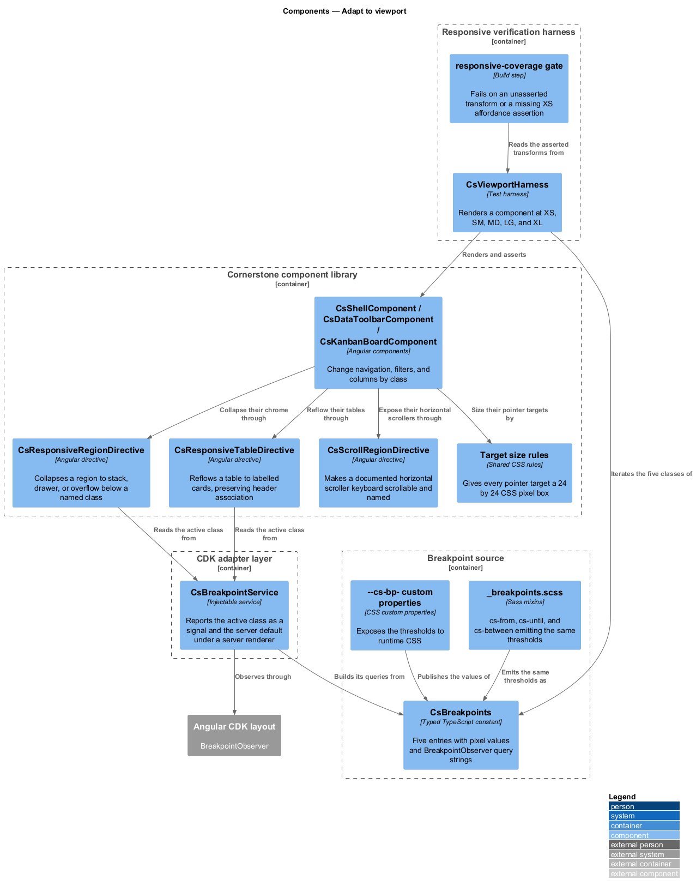
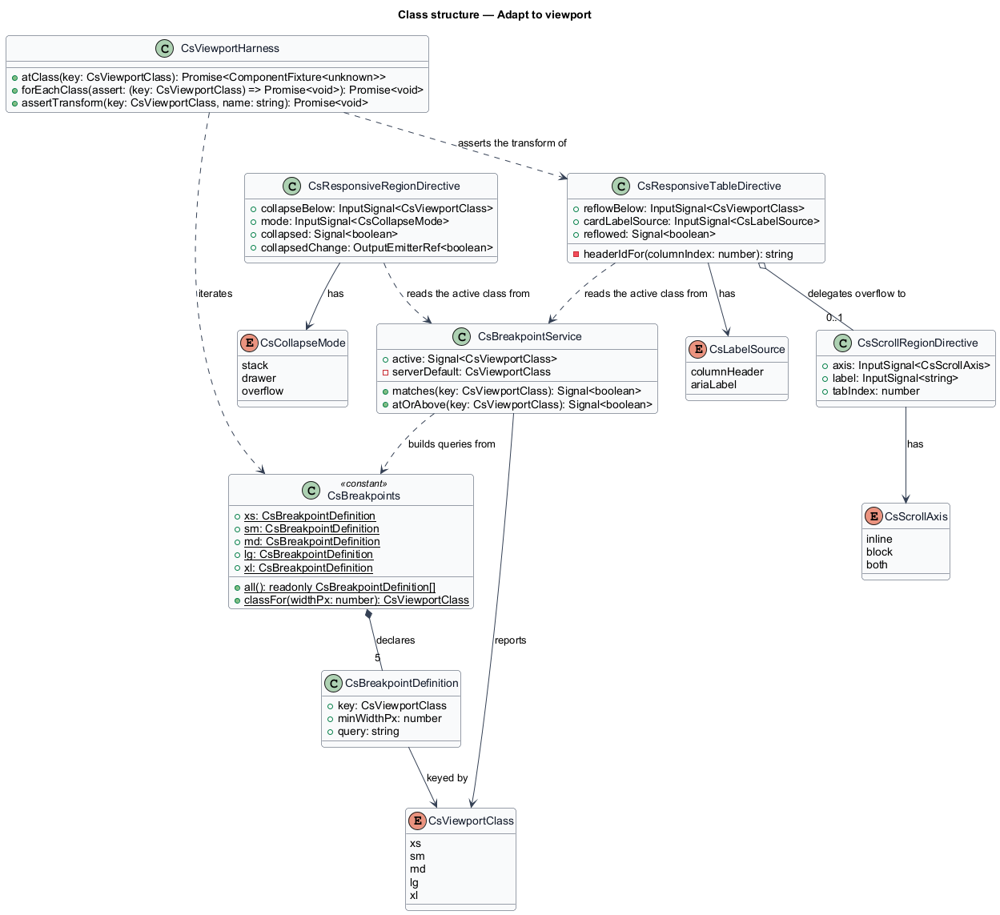
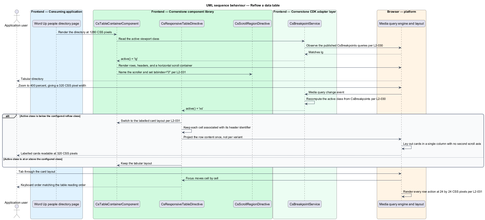
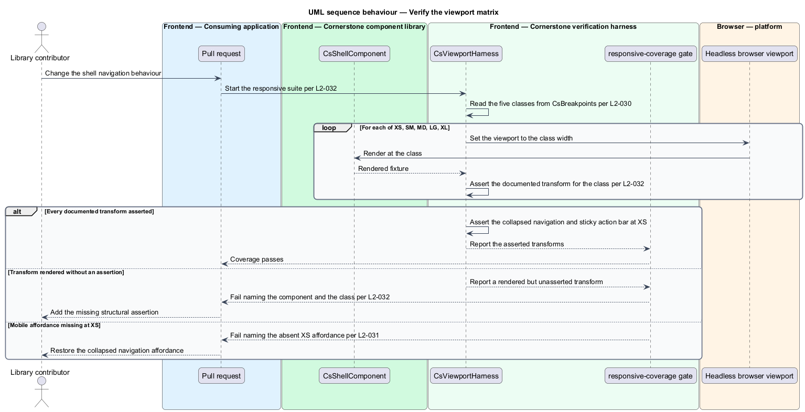

# Adapt to viewport

## Overview

Cornerstone is the Angular user-interface library published as `@quinntyne/cornerstone`.
It supplies the components that the Liturgy and Word Up applications compose
their screens from. Those screens are read on a phone in a church hall, on a
tablet in a mentoring session, and on a desktop monitor in an administrator's
office, and some of those readers run the desktop at 400% zoom.

**breakpoint** — published viewport width threshold at which the library changes
layout or structure

This feature covers the responsive foundation: the one breakpoint set the library
publishes, the three forms it publishes it in, the behaviour components change
when a threshold is crossed, and the automated harness that asserts those changes
at every viewport class.

**viewport class** — named band between two adjacent breakpoints, one of XS, SM,
MD, LG, or XL

The set is fixed at five classes: XS below 576 px, SM from 576 px, MD from
768 px, LG from 992 px, and XL from 1200 px. Every media query in the library
uses one of those five thresholds. No component invents a threshold of its own,
and no component reads a viewport width through a `window` resize listener.

**reflow** — presentation of content at 320 CSS pixels of width without a second
scrolling axis

Reflow is the constraint the whole set serves. A screen that reflows at 320 px
also serves a 1280 px viewport at 400% zoom, because the two produce the same
CSS pixel width. The feature therefore governs pointer target size and scroll
direction as well as layout thresholds.

The feature sits beneath every UI-facing component in the catalog. It draws its
observation primitive from the CDK adapter layer (L2-013) and its spacing and
container tokens from the theme layer (L2-005).

## Description

The feature is a horizontal slice made of one constant, one Sass partial, one
service, two behaviour directives, and a test harness.

- **`CsBreakpoints`** — the typed constant naming the five thresholds. It holds
  exactly five entries: `xs` at 0 px, `sm` at 576 px, `md` at 768 px, `lg` at
  992 px, and `xl` at 1200 px, each with a media query string built for
  `BreakpointObserver`. Every responsive behaviour in the library reads from it.
- **`CsViewportClass`** — union type of the five class identifiers:
  `'xs' | 'sm' | 'md' | 'lg' | 'xl'`.
- **`_breakpoints.scss`** — the Sass partial an application imports through the
  `@quinntyne/cornerstone/styles/breakpoints` export subpath. It publishes the
  `cs-from($class)`, `cs-until($class)`, and `cs-between($from, $to)` mixins,
  each emitting a media query at the same threshold the constant declares, and it
  publishes the thresholds as CSS custom properties under `--cs-bp-`.
- **`CsBreakpointService`** — the observation service shared with the CDK adapter
  layer (L2-013). It exposes an `active` signal holding the current
  `CsViewportClass`, a `matches(key)` signal factory, and an `atOrAbove(key)`
  signal factory. It observes through `BreakpointObserver` and registers no
  `window` resize listener. Under a server renderer it reports the documented
  server default without touching `window`.
- **`CsResponsiveRegionDirective`** — attribute directive `csResponsiveRegion`
  that carries the shared collapse and reflow behaviour used by tables, side
  panels, filter bars, and action bars. It takes a `collapseBelow` input naming a
  viewport class and a `mode` input of `'stack' | 'drawer' | 'overflow'`, and it
  projects its content once rather than duplicating it per variant.
- **`ResponsiveTableDirective`** — attribute directive `csResponsiveTable` that
  reflows a table into labelled cards below its configured class. Each card cell
  keeps its header association through the generated header identifiers, and the
  keyboard order of the card layout matches the reading order of the table.
- **`CsScrollRegionDirective`** — attribute directive `csScrollRegion` applied to
  the components documented as horizontally scrollable: the table container, the
  kanban board, the code block, and the timeline rail. It sets `tabindex="0"` and
  an accessible name on the scroll container so the region is keyboard
  scrollable.
- **Target size rules** — the shared style rules that give every pointer target a
  rendered box of at least 24 by 24 CSS pixels, or the spacing exemption WCAG 2.2
  Target Size (Minimum) allows. Compact variants raise the hit area with padding
  rather than shrinking the target.
- **`CsViewportHarness`** — the test harness that renders a component at each of
  the five viewport classes and exposes `atClass(name)` for assertions. It fails
  a test that renders at a class without asserting the documented structural
  difference for that class.
- **`responsive-coverage` gate** — the build step that fails when a UI-facing
  component has no viewport matrix test, when a documented structural transform
  has no assertion, or when a mobile-specific affordance has no XS assertion.

Components observe the class rather than the pixel width, so a structural change
is expressed as `active() === 'xs'` rather than as a measured number. That
keeps the threshold in one place and keeps the server render deterministic.

The documented server default for `CsBreakpointService` is `<TO SUPPLY>`, pending
a decision between a desktop-first and a mobile-first default.

The viewport heights the harness pairs with each class are `<TO SUPPLY>`.

## Requirements

The feature realizes the following level-2 (L2) requirements. Each L2 requirement
refines a level-1 (L1) requirement, cited by identifier.

| L2 ID | Refines (L1) | Requirement |
|-------|--------------|-------------|
| `L2-030` | `L1-006` | The library shall publish the breakpoint set XS below 576 px, SM from 576 px, MD from 768 px, LG from 992 px, and XL from 1200 px as tokens, Sass mixins, and a typed `CsBreakpoints` constant, and every responsive behaviour in the library shall key off that set. |
| `L2-031` | `L1-006` | Every component shall satisfy WCAG 2.2 Reflow at 320 CSS pixels of width and 400% zoom, shall avoid two-dimensional scrolling except where content requires it, and shall present pointer targets of at least 24 by 24 CSS pixels. |
| `L2-032` | `L1-006` | Every UI-facing component shall be verified at all five viewport classes by automated tests, and every documented responsive transformation shall be asserted rather than merely rendered. |

## Diagrams

### System context

An application user reads the same screens on a phone, a tablet, and a zoomed
desktop. Cornerstone reads the viewport through Angular CDK and adapts structure
at the five published thresholds.

### Containers

The breakpoint set is published in three forms from one source: a typed constant
for TypeScript, mixins for an application's Sass, and custom properties for CSS.
The responsive verification harness asserts the result at each class.

### Components

`CsBreakpoints` is the single source the constant, the mixins, and the service
share. `CsResponsiveRegionDirective` and `ResponsiveTableDirective` consume the
service, and `CsScrollRegionDirective` covers the components documented as
horizontally scrollable.

### Class structure

`CsBreakpoints` holds five `CsBreakpointDefinition` entries keyed by
`CsViewportClass`. `CsBreakpointService` derives its `active` signal from them,
and both responsive directives read that signal rather than a measured width.

### Behaviour — reflow a data table

A people directory renders as a table at MD and above. Crossing below SM
switches it to labelled cards through the responsive table directive, preserving
header association and keyboard order, with no horizontal page scrolling at
320 px.

### Behaviour — verify the viewport matrix

The harness renders each UI-facing component at XS, SM, MD, LG, and XL. A
documented transform that renders without an assertion fails the coverage gate,
as does a mobile affordance with no XS assertion.

