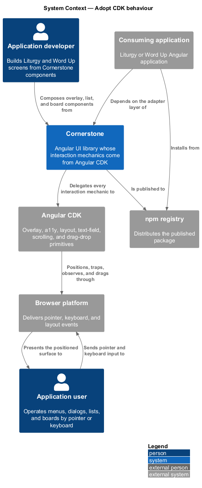
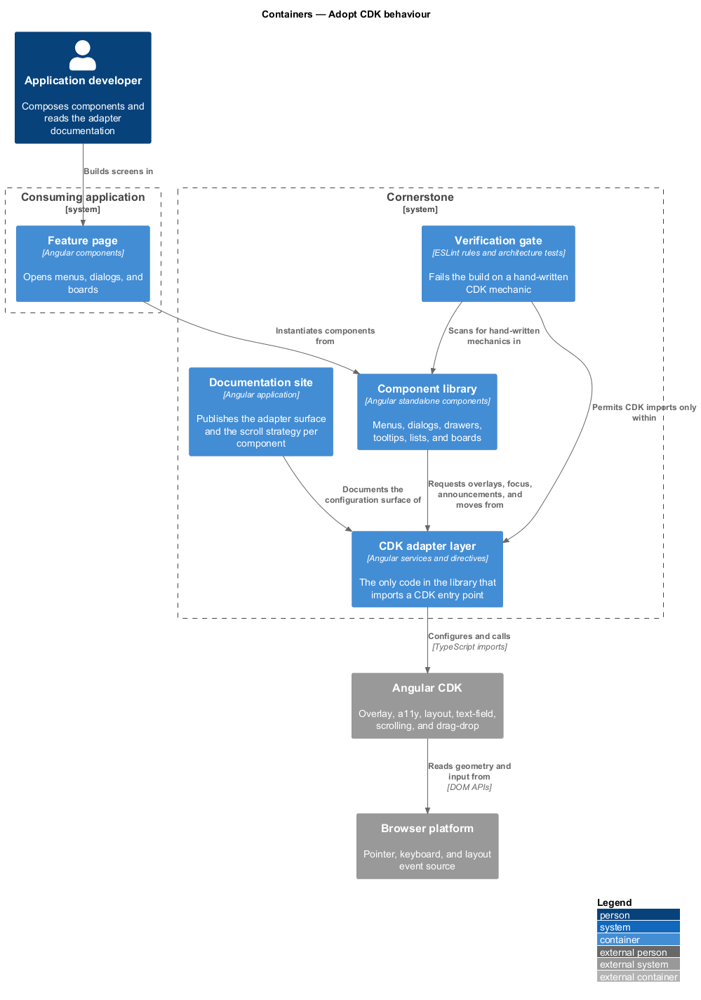
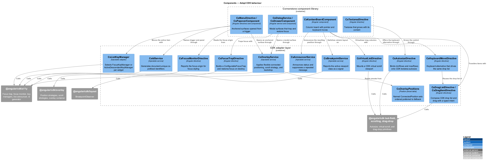
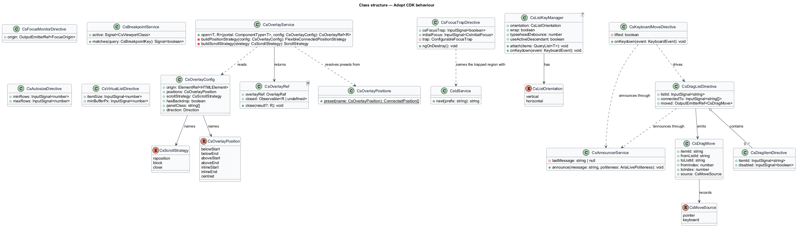
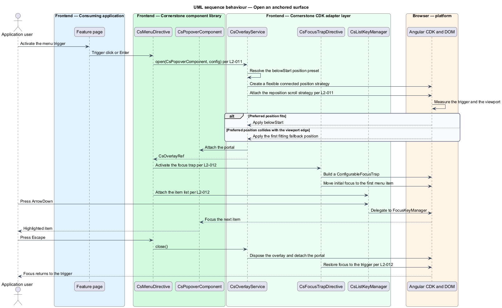
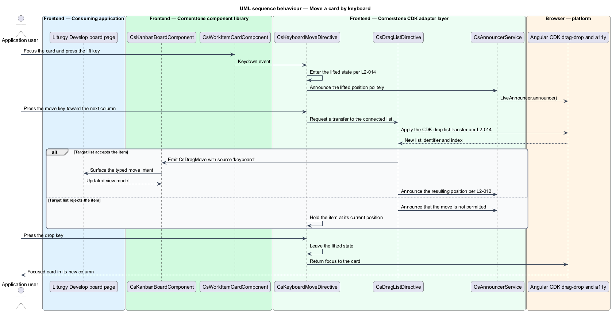
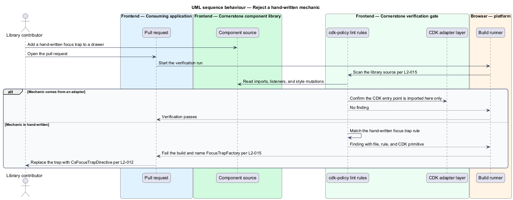

# Adopt CDK behaviour

## Overview

Cornerstone is the Angular user-interface library published as `@quinntyne/cornerstone`.
It supplies the components that the Liturgy and Word Up applications compose
their screens from. Those components carry interaction behaviour as well as
appearance: surfaces that float above the page, focus that moves under keyboard
control, lists that virtualize, textareas that grow, and cards that move between
columns.

**behaviour primitive** — reusable, framework-level implementation of an
interaction mechanic that carries no visual decision of its own

Angular CDK publishes that primitive layer. This feature covers the policy that
binds Cornerstone to it: every mechanic the CDK already implements is taken from
the CDK, and no equivalent is written by hand inside the library.

**CDK adapter** — thin Cornerstone service or directive that configures a CDK
primitive with the library's defaults and exposes a `Cs`-prefixed surface to
components

The adapters exist so that positioning, trapping, announcing, observing,
autosizing, virtualizing, and dragging are each configured once. A component
consumes an adapter and states what it wants; the adapter decides how the CDK
delivers it. That indirection keeps the CDK dependency at a single seam and
keeps every anchored surface in the library behaving the same way.

**anchored surface** — floating element whose position is computed relative to a
trigger element rather than to the document

The feature sits beneath every overlay-bearing, list-bearing, and drag-bearing
component in the library: the menu, popover, tooltip, combobox listbox, dialog,
drawer, toast outlet, account menu, date picker panel, kanban board, and every
composite built from them. Liturgy consumes it through the 4D workflow board and
the gate panels; Word Up consumes it through the shell drawer, the people
directory, and the messaging surfaces.

## Description

The feature is a horizontal slice: a set of adapters plus a verification gate
that holds the policy in place. It introduces no visual output of its own.

- **`CsOverlayService`** — the single entry point for opening an anchored or
  modal surface. It takes a `CsOverlayConfig` and returns a `CsOverlayRef`. It
  configures a flexible connected position strategy for anchored surfaces and a
  global position strategy for modal surfaces, attaches the configured scroll
  strategy, and disposes the overlay when the owning component is destroyed.
- **`CsOverlayConfig`** — the typed configuration an opening component supplies:
  `origin`, `positions` (a `CsOverlayPosition` preset), `scrollStrategy`
  (`'reposition' | 'block' | 'close'`), `hasBackdrop`, `panelClass`, and
  `direction`.
- **`CsOverlayRef`** — the handle returned to the opener. It exposes the attached
  `overlayRef`, a `closed` observable carrying a typed result, and `close()`.
- **`CsOverlayPositions`** — the named position presets the library uses:
  `belowStart`, `belowEnd`, `aboveStart`, `aboveEnd`, `inlineStart`, `inlineEnd`,
  and `centred`. Each preset is a `ConnectedPosition[]` ordered from preferred to
  last fallback, so CDK collision handling selects the first fitting entry.
- **`CsFocusTrapDirective`** — attribute directive `csFocusTrap` that builds a
  `ConfigurableFocusTrap` over its host element, moves initial focus to the
  documented target, and restores focus to the opening element on destruction.
- **`CsFocusMonitorDirective`** — attribute directive `csFocusOrigin` that
  reports the focus origin (`'keyboard' | 'mouse' | 'touch' | 'program'`) from
  the CDK `FocusMonitor` so styles can distinguish keyboard focus from pointer
  focus.
- **`CsListKeyManager`** — the adapter over `FocusKeyManager` and
  `ActiveDescendantKeyManager`. A composite declares its orientation, wrap
  behaviour, typeahead debounce, and whether focus moves to the item or is
  tracked by `aria-activedescendant`; the adapter selects the CDK manager that
  matches.
- **`CsAnnouncerService`** — the adapter over `LiveAnnouncer`. It exposes
  `announce(message, politeness)` and suppresses a repeat of the message it
  announced last.
- **`CsIdService`** — the adapter over the CDK identifier generator. It returns
  document-unique identifiers with a `cs-` prefix and a per-component
  discriminator, and it produces the same sequence on the server and on the
  client.
- **`CsBreakpointService`** — the adapter over `BreakpointObserver`. It reports
  the active viewport class as a signal keyed to the published breakpoint set
  (L2-030) and reports the documented default under a server renderer.
- **`CsAutosizeDirective`** — attribute directive `csAutosize` that composes the
  CDK `CdkTextareaAutosize` directive and binds `minRows` and `maxRows` inputs.
  Beyond `maxRows` the element scrolls internally.
- **`CsVirtualListDirective`** — attribute directive `csVirtualList` that mounts
  a CDK `cdk-virtual-scroll-viewport` around a projected list and exposes
  `itemSize` and `minBufferPx` inputs.
- **`CsDragListDirective` and `CsDragItemDirective`** — the pair that composes
  `cdkDropList` and `cdkDrag`. `CsDragListDirective` emits a typed
  `CsDragMove` intent for both a pointer drag and a keyboard move, and calls
  `CsAnnouncerService` with the resulting position.
- **`CsKeyboardMoveDirective`** — the keyboard alternative to a pointer drag. It
  binds the documented lift, move, drop, and cancel keys on a focused drag item
  and drives the same `CsDragMove` intent as the pointer path.
- **`cdk-policy` lint rules** — the checked-in ESLint rule set that fails a build
  on a hand-written focus trap, a `getBoundingClientRect`-based placement outside
  a CDK position strategy, a module-scope `document` keydown listener, or a
  direct mutation of `document.body.style.overflow` (L2-015).

No adapter re-implements a CDK mechanic. Each one restricts the CDK surface to
the configuration the library documents and names the result in Cornerstone
terms.

The documented keyboard move sequence for `CsKeyboardMoveDirective` is
`<TO SUPPLY>`, pending confirmation against the ARIA Authoring Practices Guide
drag-and-drop guidance.

The default `minBufferPx` and `maxBufferPx` for `CsVirtualListDirective` are
`<TO SUPPLY>`.

## Requirements

The feature realizes the following level-2 (L2) requirements. Each L2 requirement
refines a level-1 (L1) requirement, cited by identifier.

| L2 ID | Refines (L1) | Requirement |
|-------|--------------|-------------|
| `L2-011` | `L1-003` | Every anchored or floating surface shall be positioned by `@angular/cdk/overlay` with collision-aware flexible connected positioning, a documented scroll strategy, and documented backdrop configuration. |
| `L2-012` | `L1-003` | Focus trapping, focus restoration, focus monitoring, roving tabindex and active-descendant list management, live announcement, high-contrast detection, and unique identifier generation shall use `@angular/cdk/a11y` primitives. |
| `L2-013` | `L1-003` | Components with responsive structural changes shall observe breakpoints through the `@angular/cdk/layout` `BreakpointObserver` rather than through a `window` resize listener. |
| `L2-014` | `L1-003` | Autosizing textareas shall use `@angular/cdk/text-field`, virtualizable lists shall offer `@angular/cdk/scrolling` virtual scroll, and drag-and-drop shall use `@angular/cdk/drag-drop` with an accessible keyboard alternative. |
| `L2-015` | `L1-003` | The library shall not contain a hand-written focus trap, overlay positioning routine, keyboard manager, scroll block, or drag-and-drop implementation. |

## Diagrams

### System context

An application developer composes screens from Cornerstone components. Those
components draw every interaction mechanic from Angular CDK and reach the browser
only through it, so the browser platform sits behind the CDK rather than beside
it.

### Containers

The component library depends on the CDK adapter layer, and the adapter layer is
the only container that imports a CDK entry point. The verification gate runs in
the build and reads the library source.

### Components

Each adapter maps one Cornerstone concern onto one CDK entry point.
`CsOverlayService` covers `@angular/cdk/overlay`, the focus and announcement
adapters cover `@angular/cdk/a11y`, `CsBreakpointService` covers
`@angular/cdk/layout`, and the autosize, virtual list, and drag directives cover
the remaining three entry points.

### Class structure

`CsOverlayService` returns a `CsOverlayRef` configured from a `CsOverlayConfig`
and a `CsOverlayPositions` preset. `CsListKeyManager`, `CsAnnouncerService`, and
`CsIdService` wrap the three `@angular/cdk/a11y` primitives that composites
depend on, and the drag directives share one `CsDragMove` intent type across the
pointer and keyboard paths.

### Behaviour — open an anchored surface

A menu trigger asks `CsOverlayService` for a surface anchored below its start
edge. CDK selects the first preset position that fits, the focus trap takes
focus, and the key manager drives arrow-key movement. Closing the surface
disposes the overlay and restores focus to the trigger.

### Behaviour — move a card by keyboard

A kanban card is focused rather than dragged. `CsKeyboardMoveDirective` lifts it,
moves it between columns through the same CDK drop list the pointer path uses,
and announces the resulting position, so the pointer and keyboard paths emit one
intent type.

### Behaviour — reject a hand-written mechanic

The verification gate scans the library source on every build. A hand-written
focus trap fails the build and names the file, the rule, and the CDK primitive
that supersedes it.

