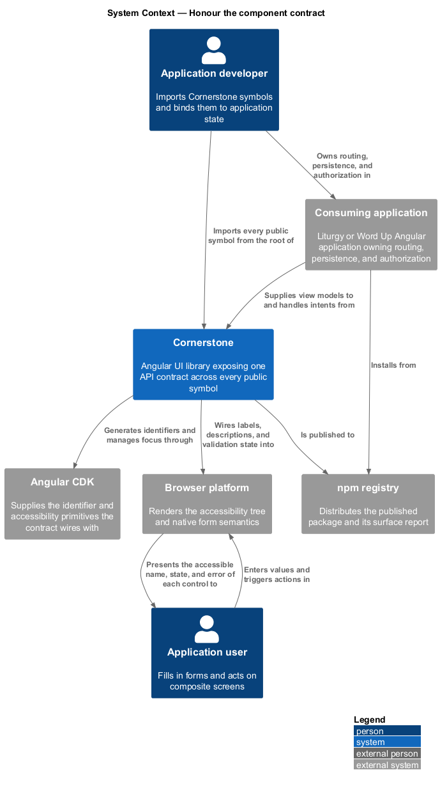
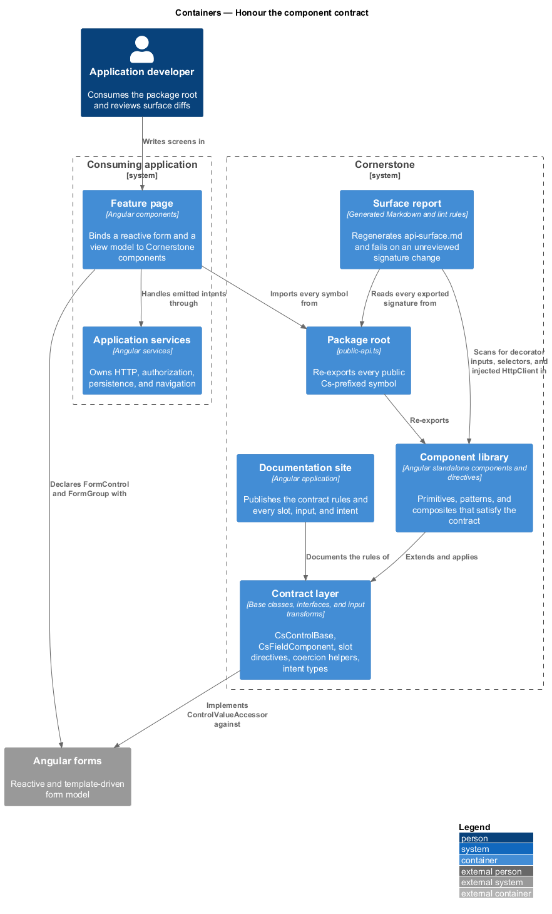
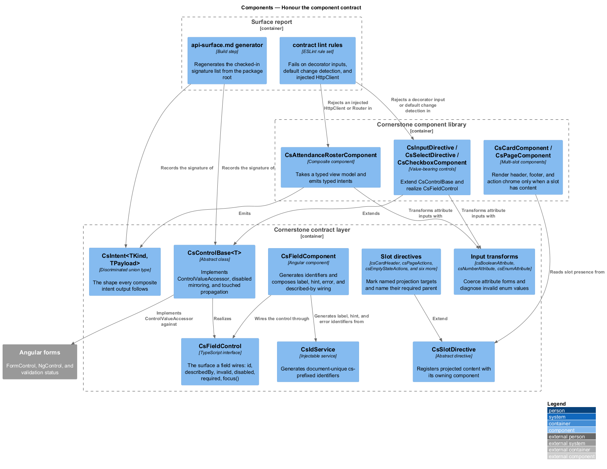
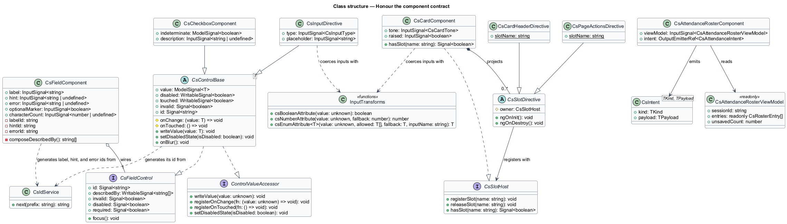
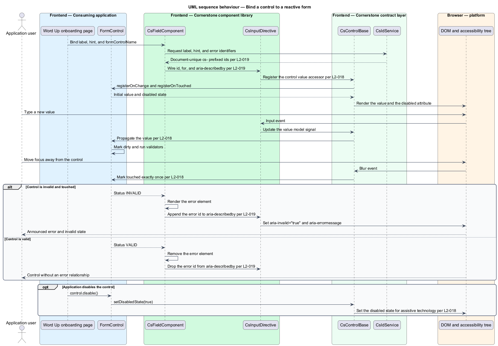
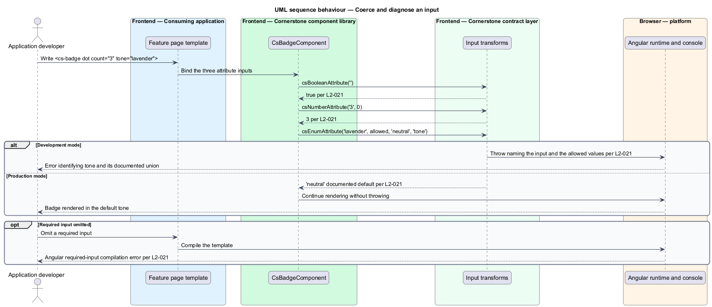
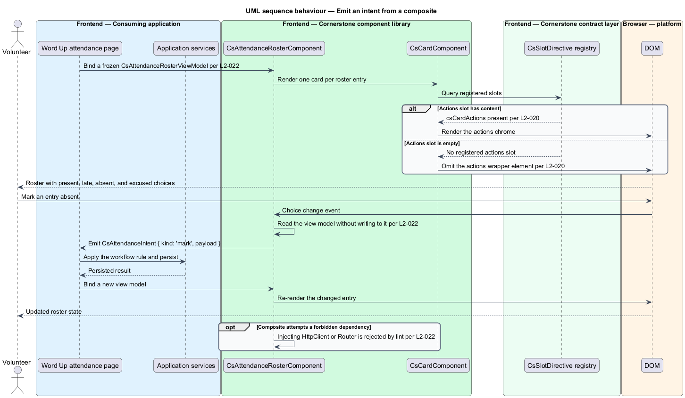

# Honour the component contract

## Overview

Cornerstone is the Angular user-interface library published as `@quinntyne/cornerstone`.
It supplies the components that the Liturgy and Word Up applications compose
their screens from. Those applications import from one package root and expect
every symbol behind it to behave the same way, whether it is a button directive
from the primitive layer or a roster composite from the workflow suite.

**component contract** — single set of API rules that every public component,
directive, and service in the library satisfies

The contract covers seven concerns: how a type is declared, how it is named, how
it takes input, how it reports output, how it accepts projected content, how it
participates in Angular forms, and how it wires its own accessibility
relationships. It exists so that an application developer learns the rules once
and applies them to every catalog entry, and so that a change to the surface is
visible as a reviewed diff rather than discovered at a consumer's compile step.

**intent output** — typed event describing what a user asked for, emitted by a
composite in place of performing the action itself

**view model input** — typed, read-only object holding everything a composite
renders, supplied by the consuming application

The contract draws the boundary between the library and the applications.
Cornerstone owns visual structure, interaction behaviour, accessibility
semantics, and FaithTech styling. Liturgy and Word Up own routing, persistence,
authorization, and workflow rules. A composite receives a view model input and
emits an intent output; it holds no HTTP client, makes no authorization
decision, and calls no router.

This feature sits alongside the theme layer as one of the two foundations every
other feature is built on. Every component in the catalog conforms to it.

## Description

The feature is a horizontal slice made of base types, helper functions, slot
directives, and a build-time surface report. It renders nothing on its own.

- **`CsControlBase<T>`** — the abstract base every value-bearing control extends.
  It implements `ControlValueAccessor` for reactive and template-driven forms,
  holds the `value` model signal, mirrors the form model's disabled state into a
  `disabled` signal, propagates touched state on the first blur after focus, and
  derives `invalid` from the bound `NgControl` status and touched state.
- **`FieldComponent`** — the framing component that owns a label, an optional
  hint, an optional error, an optional success message, and an optional character
  count. It generates the control identifier, sets `for` on the label, and
  composes `aria-describedby` from the hint and error identifiers, appending to a
  developer-supplied value rather than replacing it.
- **`CsFieldControl`** — the interface a control implements so `FieldComponent`
  can wire it: `id`, `describedBy`, `invalid`, `disabled`, `required`, and
  `focus()`.
- **`CsIdService`** — the identifier source shared with the CDK adapter layer
  (L2-012). It returns document-unique `cs-` prefixed identifiers and produces
  the same sequence on the server and on the client.
- **`csBooleanAttribute()`, `csNumberAttribute()`, `csEnumAttribute()`** — the
  input transform functions. The first resolves a bare attribute to `true`, the
  second resolves a string attribute to a `number`, and the third validates a
  value against a documented union. In development mode `csEnumAttribute()`
  throws an error naming the input and the allowed values; in production mode it
  returns the documented default and rendering continues.
- **Slot directives** — the documented named projection markers, applied as
  attributes on a projected element: `csCardHeader`, `csCardFooter`,
  `csCardActions`, `csPageActions`, `csSectionActions`, `csEmptyStateActions`,
  `csDialogTitle`, `csDialogActions`, and `csInputAddon`. Each one injects its
  owning component and throws a development-mode error naming the required parent
  when it is applied outside it.
- **`CsSlotDirective`** — the base the slot directives extend. It registers with
  the owning component so the component renders slot-dependent chrome only when
  the slot has content.
- **`CsIntent<TKind, TPayload>`** — the discriminated-union shape every intent
  output follows. A composite declares its own union of intent kinds, and each
  member carries a typed payload.
- **`CsViewModel` conventions** — composites take their view model as a single
  `input.required()` of a `readonly` interface. No composite writes to an input
  object, so a frozen view model produces no runtime error.
- **`api-surface.md`** — the checked-in public API surface report. The build
  regenerates it from `public-api.ts`, listing every exported symbol with its
  full signature. A build whose regenerated report differs from the checked-in
  copy fails and prints the diff. A removal without a prior deprecation release
  fails citing L2-183.
- **`contract` lint rules** — the checked-in ESLint rule set that fails a build
  on a `@Input()` or `@Output()` decorator, a non-`OnPush` public component, a
  selector outside the `cs-` element or `cs` attribute pattern, an export without
  a `Cs` prefix, an injected `HttpClient`, or an injected `Router` in a
  presentation component.

The library ships no `NgModule` for public consumption. Every component and
directive is standalone and importable from `@quinntyne/cornerstone` directly.

The exact character budget at which `FieldComponent` switches its character
count from polite to assertive announcement is `<TO SUPPLY>`.

## Requirements

The feature realizes the following level-2 (L2) requirements. Each L2 requirement
refines a level-1 (L1) requirement, cited by identifier.

| L2 ID | Refines (L1) | Requirement |
|-------|--------------|-------------|
| `L2-016` | `L1-004` | Every public component and directive shall be standalone, shall declare inputs through `input()`, `input.required()`, or `model()`, shall declare outputs through `output()`, and shall use `ChangeDetectionStrategy.OnPush`. |
| `L2-017` | `L1-004` | Component selectors shall use the `cs-` element prefix, directive selectors shall use the `cs` camelCase attribute prefix, every exported symbol shall carry a `Cs` prefix, and every public symbol shall be re-exported from the package root. |
| `L2-018` | `L1-004` | Every value-bearing control shall implement `ControlValueAccessor`, shall support reactive and template-driven forms, shall reflect the form model's disabled state, shall propagate touched state on blur, and shall expose validation state visually and to assistive technology. |
| `L2-019` | `L1-004` | Components shall generate and wire their own `id`, `for`, `aria-labelledby`, `aria-describedby`, and `aria-errormessage` relationships, and an application shall not be required to author those attributes. |
| `L2-020` | `L1-004` | Multi-slot components shall expose named projection slots through documented `cs`-prefixed selector directives, shall render slot-dependent chrome only when the slot has content, and shall not require empty placeholder markup. |
| `L2-021` | `L1-004` | Inputs shall apply documented defaults, shall coerce boolean and numeric attribute forms, shall reject an invalid enum value with a development-mode error, and shall not throw in production for a recoverable input mistake. |
| `L2-022` | `L1-004` | Composite components shall accept a typed view model input and emit typed intent outputs, and shall not perform an HTTP call, an authorization decision, persistence, workflow enforcement, or navigation. |
| `L2-023` | `L1-004` | The build shall produce a checked-in public API surface report, and any change to that surface shall appear as an explicit, reviewed diff. |

## Diagrams

### System context

An application developer consumes one contract across the whole library. The
contract governs what Cornerstone exposes to the consuming application and keeps
domain concerns — persistence, authorization, routing — on the application side
of the boundary.

### Containers

The component library exposes a single package root. The contract layer supplies
the base types and helpers the components extend, and the surface report
container regenerates the checked-in signature list on every build.

### Components

`CsControlBase` and `FieldComponent` implement the forms and wiring clauses,
the coercion helpers implement the input clause, the slot directives implement
the projection clause, and the intent types implement the composite clause. The
lint rules and the surface report hold all four in place.

### Class structure

`CsControlBase<T>` realizes `ControlValueAccessor` and `CsFieldControl`, and each
value-bearing control extends it. `FieldComponent` aggregates one field control
and composes its described-by list from the hint and error identifiers. Composites
take a `CsViewModel` and emit a `CsIntent`.

### Behaviour — bind a control to a reactive form

A field renders a label, a control, a hint, and an error. `FieldComponent`
generates the identifiers and wires the relationships; `CsControlBase` reports
value, touched, and disabled state back to the `FormControl`.

### Behaviour — coerce and diagnose an input

A bare boolean attribute and a string numeric attribute resolve to their typed
forms. An invalid enum value throws in development mode and falls back to the
documented default in production mode.

### Behaviour — emit an intent from a composite

A roster composite receives a frozen view model and renders it. A user action
emits a typed intent; the application performs the persistence and returns a new
view model. The composite mutates nothing.

