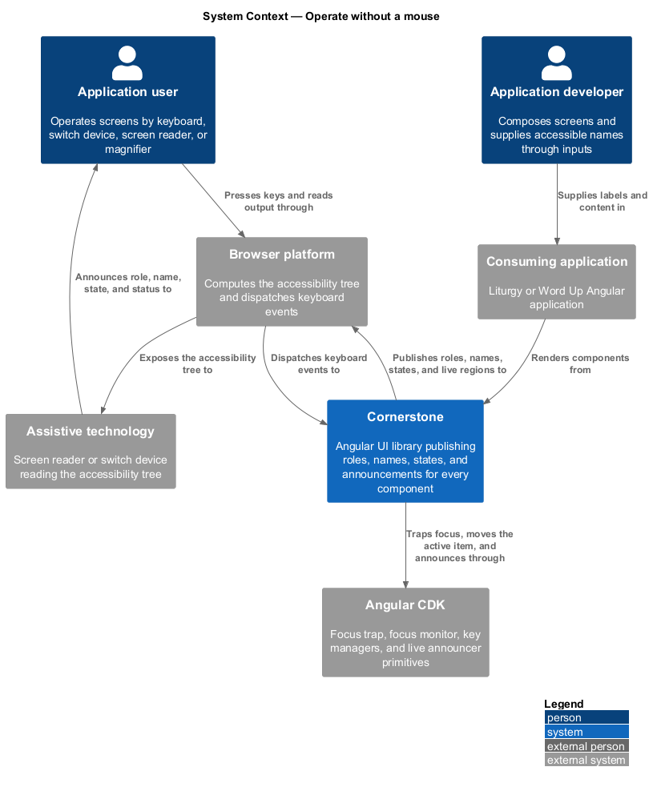
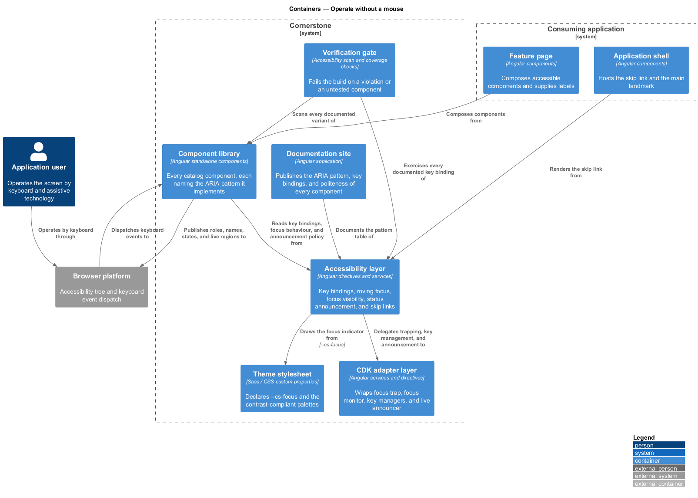
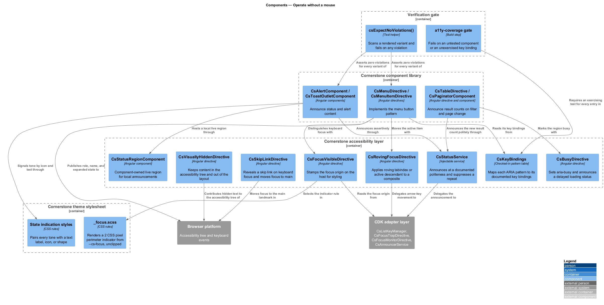
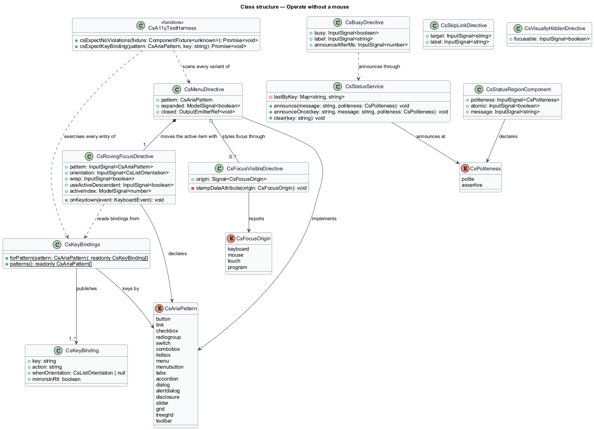
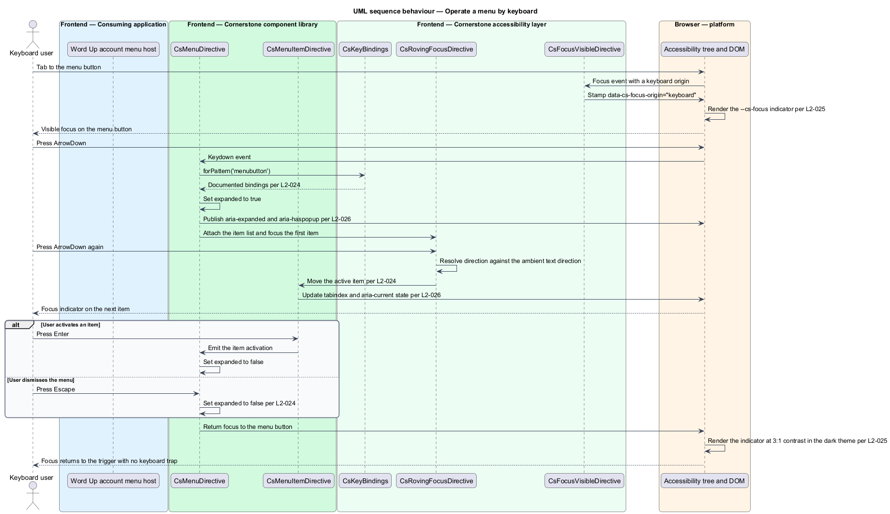
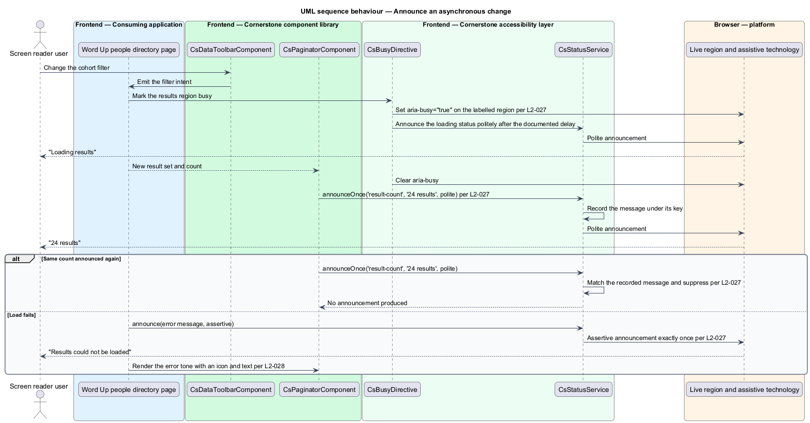
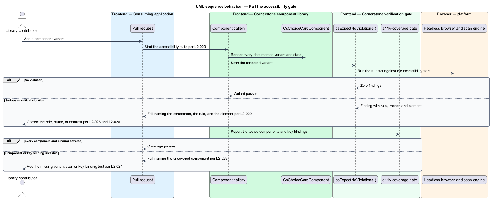

# Operate without a mouse

## Overview

Cornerstone is the Angular user-interface library published as `@quinntyne/cornerstone`.
It supplies the components that the Liturgy and Word Up applications compose
their screens from. Those applications serve youth, mentors, guardians,
volunteers, and administrators. Some of those people reach the screen through a
keyboard, a switch device, a screen reader, or a magnifier rather than a mouse.

**accessibility conformance** — state in which every component meets WCAG 2.2
Level AA and exposes the semantics its interaction pattern prescribes

This feature covers the accessibility layer of the library: which keys operate a
widget, how focus is shown, which role and name a component publishes, when a
change is announced, how state is signalled without relying on colour, and how
all of that is verified on every build.

**ARIA pattern** — named interaction model from the ARIA Authoring Practices
Guide that fixes the role, states, relationships, and key bindings of a widget

Each component in the catalog names the ARIA pattern it implements, and the
pattern determines its key bindings and its accessibility tree. Where a native
element already carries the pattern — `button`, `input`, `select`, `dialog`,
`progress`, `table` — the native element is used and no role is added.

**live region** — element whose changes assistive technology announces without
moving focus

The feature sits beside the CDK adapter layer, which supplies the focus,
key-manager, and announcement primitives it configures, and beside the token
layer, which supplies `--cs-focus`. It applies to every component in the
catalog; no component is exempt.

## Description

The feature is a horizontal slice made of directives, a key-binding table, an
announcement service, focus styles, and a verification gate.

- **`CsKeyBindings`** — the checked-in table mapping each ARIA pattern to its
  documented key bindings. Entries cover the button, link, checkbox, radio group,
  switch, combobox, listbox, menu, menu button, tabs, accordion, dialog, alert
  dialog, disclosure, slider, grid, treegrid, and toolbar patterns. A component
  declares its pattern and reads its bindings from the table rather than
  hard-coding a key list.
- **`CsRovingFocusDirective`** — attribute directive `csRovingFocus` that applies
  a roving-tabindex or active-descendant model to a composite. It delegates to
  `CsListKeyManager` (L2-012), takes an `orientation` input, a `wrap` input, and
  a `useActiveDescendant` input, and resolves arrow-key direction against the
  ambient text direction.
- **`CsFocusVisibleDirective`** — attribute directive `csFocusVisible` that reads
  the focus origin from `CsFocusMonitorDirective` (L2-012) and stamps
  `data-cs-focus-origin` on the host so styles can distinguish keyboard focus
  from pointer focus.
- **`_focus.scss`** — the focus indicator rules. Every focusable element renders
  an indicator of at least 2 CSS pixels perimeter at no less than 3:1 contrast
  against adjacent colours, drawn from the `--cs-focus` token (L2-005). The
  indicator is drawn with `outline` and `outline-offset` so an ancestor
  `overflow: hidden` does not clip it. No rule declares `outline: none` without
  declaring a replacement indicator in the same rule set.
- **`CsStatusService`** — the announcement policy layer over `CsAnnouncerService`
  (L2-012). It exposes `announce(message, politeness)` and
  `announceOnce(key, message, politeness)`. The second form suppresses a repeat
  of an identical message under the same key, so a status set twice consecutively
  produces one announcement.
- **`StatusRegionComponent`** — element component `cs-status-region` that hosts
  a component-owned live region where a shared announcer is unsuitable. It takes
  a `politeness` input of `'polite' | 'assertive'` and an `atomic` input.
- **`CsBusyDirective`** — attribute directive `csBusy` that sets `aria-busy` on a
  labelled region during a loading transition and announces a polite status when
  the transition exceeds the documented delay.
- **`CsSkipLinkDirective`** — attribute directive `csSkipLink` that renders a
  visually hidden link revealed on keyboard focus, moving focus to the main
  landmark.
- **`CsVisuallyHiddenDirective`** — attribute directive `csVisuallyHidden` that
  removes content from the visual layout while leaving it in the accessibility
  tree.
- **`CsStateIndicator` conventions** — the rule that every status, tone, and
  validation state carries a text label, an icon, or a shape in addition to its
  colour, and that a disabled control exposes `disabled` or `aria-disabled`
  rather than reduced contrast alone.
- **`csExpectNoViolations()`** — the test helper that runs an automated
  accessibility scan against a rendered variant and fails on any violation. The
  component gallery drives it across every documented variant and state.
- **`a11y-coverage` gate** — the build step that fails when a public component
  has no accessibility test, when a scan reports a serious or critical violation,
  or when a documented key binding has no exercising test. Failures name the
  component, the rule, and the element.

The announcement politeness per component is documented in the component's
accessibility notes: loading and result-count changes announce politely, error
alerts announce assertively, and a toast announces at the politeness its tone
declares.

The documented delay before `CsBusyDirective` announces a loading status is
`<TO SUPPLY>`.

The accessibility scan engine and its rule-set version are `<TO SUPPLY>`.

## Requirements

The feature realizes the following level-2 (L2) requirements. Each L2 requirement
refines a level-1 (L1) requirement, cited by identifier.

| L2 ID | Refines (L1) | Requirement |
|-------|--------------|-------------|
| `L2-024` | `L1-005` | Every interactive element shall be reachable and fully operable by keyboard alone with the standard key bindings for its ARIA pattern, and shall not create a keyboard trap outside an intentional modal focus trap. |
| `L2-025` | `L1-005` | Every focusable element shall present a focus indicator meeting WCAG 2.2 Focus Appearance, drawn from the `--cs-focus` token, applied on keyboard focus and retained on pointer focus where pointer focus is meaningful. |
| `L2-026` | `L1-005` | Every component shall expose the ARIA role, accessible name, states, and relationships prescribed by the ARIA Authoring Practices Guide pattern it implements, using native semantics where a native element exists. |
| `L2-027` | `L1-005` | Asynchronous state changes shall be announced to assistive technology at a documented politeness level, and shall not announce redundantly. |
| `L2-028` | `L1-005` | All text, icon, boundary, and state indication shall meet WCAG 2.2 AA contrast, and no state shall be conveyed by colour alone. |
| `L2-029` | `L1-005` | Every public component shall have an automated accessibility test asserting zero violations for each documented variant and state, and the build shall fail on any violation. |

## Diagrams

### System context

An application user reaches Cornerstone components through a keyboard, and often
through assistive technology as well. The library publishes roles, names, states,
and announcements to that technology through the browser's accessibility tree.

### Containers

The accessibility layer sits between the component library and the CDK adapter
layer. It reads the `--cs-focus` token from the theme stylesheet and is held in
place by the verification gate that runs in the build.

### Components

`CsKeyBindings` fixes what each pattern responds to, `CsRovingFocusDirective`
moves the active item, `CsFocusVisibleDirective` and `_focus.scss` render the
indicator, and `CsStatusService` with `StatusRegionComponent` carries
announcements. `csExpectNoViolations()` asserts the result.

### Class structure

`CsKeyBindings` maps a `CsAriaPattern` to a `CsKeyBinding` list.
`CsRovingFocusDirective` consumes the list through `CsListKeyManager`, and
`CsStatusService` deduplicates announcements per key before delegating to the CDK
announcer.

### Behaviour — operate a menu by keyboard

A menu button opens its menu from the keyboard, arrow keys move the active item
through the roving-focus directive, the focus indicator renders from
`--cs-focus`, and `Escape` closes the menu and returns focus to the button.

### Behaviour — announce an asynchronous change

A filtered result set changes. The busy directive marks the region, the status
service announces the new count politely, and a second identical status produces
no further announcement.

### Behaviour — fail the accessibility gate

The gallery scans every documented variant on every build. A serious violation
fails the build naming the component, the rule, and the element, and a component
with no accessibility test fails the coverage check.

