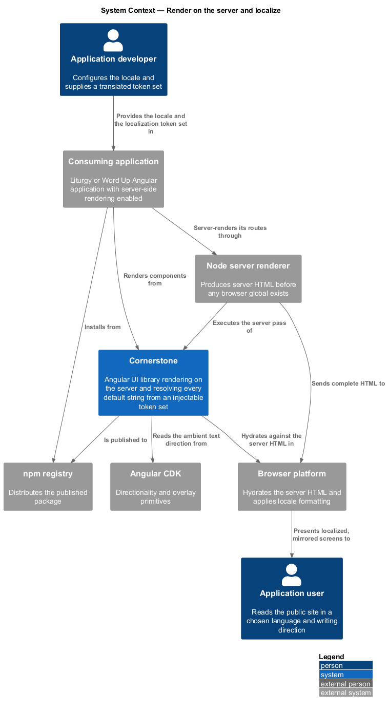
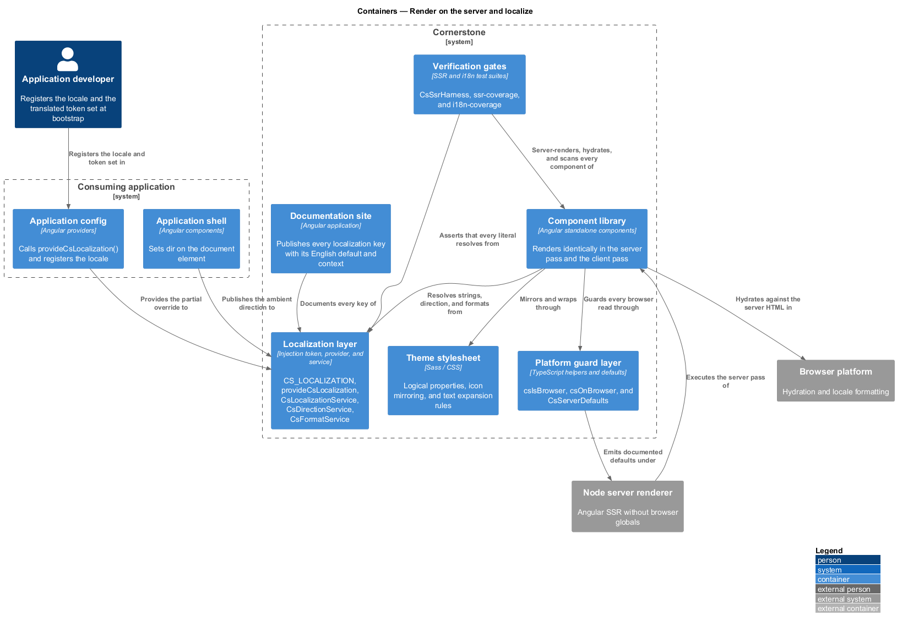
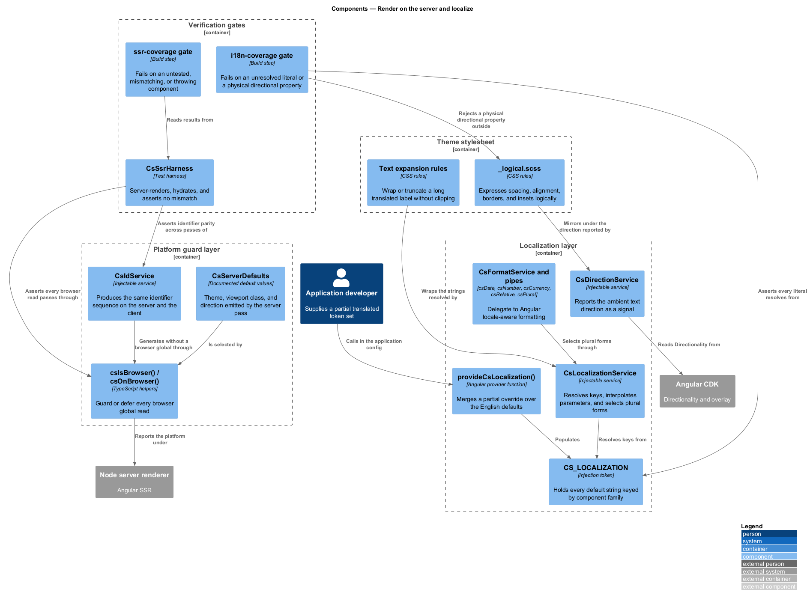
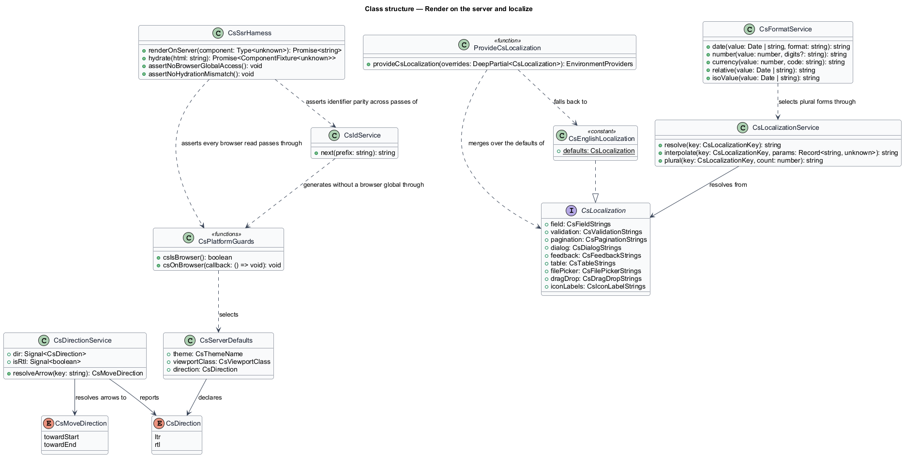
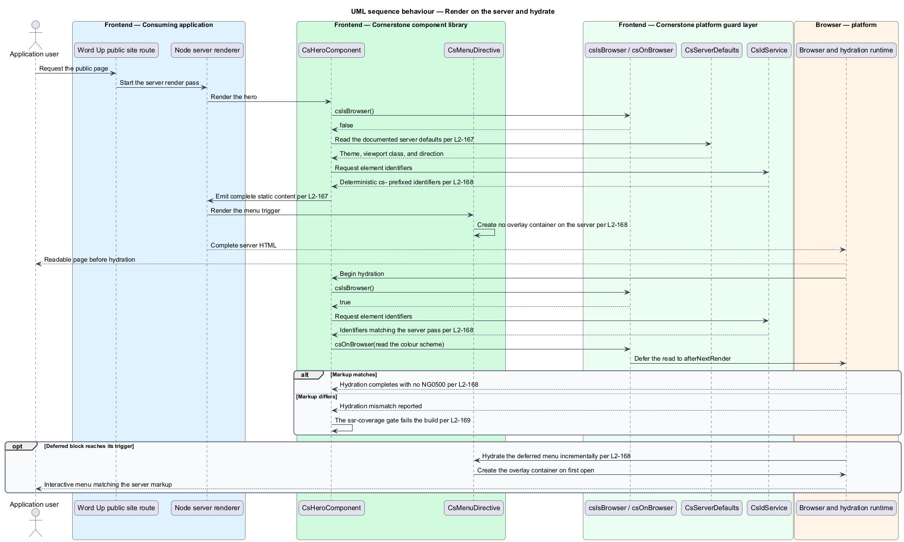
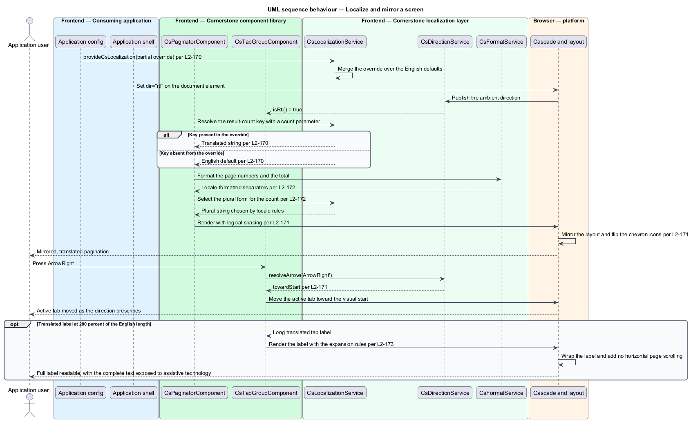

# Render on the server and localize

## Overview

Cornerstone is the Angular user-interface library published as `@quinntyne/cornerstone`.
It supplies the components that the Liturgy and Word Up applications compose
their screens from. Word Up's public site is server-rendered so that its pages
reach search engines and slow connections as complete HTML, and both
applications serve communities that read in more than one language and in more
than one writing direction.

**server-side rendering** — production of a component's HTML in a Node process
before any browser global exists

**hydration** — attachment of the client Angular application to server-rendered
DOM without rebuilding it

This feature covers the two concerns that decide whether a component works away
from a single English, left-to-right browser: whether it renders and hydrates on
the server, and whether every string, date, number, and layout direction it
produces can be changed without forking the library.

**localization token set** — injectable map of every default user-visible string
the library produces, with English defaults and a documented context per key

The library embeds no untranslatable English. Every string a component renders
that the consuming application did not supply comes from the localization token
set, and that includes text an assistive technology reads but a sighted reader
does not see.

**logical property** — CSS property expressed relative to the writing direction
rather than to the physical screen, such as `margin-inline-start`

The feature sits beneath every component in the catalog. It draws its
directionality primitive from Angular CDK, its formatting from Angular's
locale-aware mechanisms, and its identifier generation from the shared
`CsIdService` (L2-012), which produces the same sequence on the server and on the
client so hydration matches.

## Description

The feature is a horizontal slice made of platform guards, an injectable string
set, a direction service, formatting helpers, style rules, and two verification
gates.

- **`csIsBrowser()` and `csOnBrowser()`** — the platform guards. The first wraps
  `isPlatformBrowser` for a conditional read; the second defers a callback to
  `afterNextRender` so a browser global is touched only after the first client
  render. No component reads `window`, `document`, `navigator`, `localStorage`,
  or `matchMedia` outside one of the two.
- **`CsServerDefaults`** — the documented values components emit under a server
  renderer in place of a browser query: the theme (L2-033), the viewport class
  (L2-030), and the text direction. Each default is documented per component so
  the server HTML is complete rather than blank.
- **`CS_LOCALIZATION`** — the injection token holding a `CsLocalization` object.
  It carries a key for every default string the library produces, grouped by
  component family: field and validation text, pagination and result counts,
  dialog and drawer labels, toast and alert labels, table and sort labels,
  file-picker text, drag-and-drop announcements, and the accessible names of
  every icon-only control.
- **`provideCsLocalization()`** — the provider function an application calls in
  its application config to supply a partial override. Keys the application omits
  fall back to the English defaults, so a partial translation renders.
- **`CsLocalizationService`** — the runtime that resolves a key to a string and
  interpolates its documented parameters. It resolves plural forms through
  Angular's locale-aware plural rules rather than by string concatenation.
- **`CsDirectionService`** — the adapter over the CDK `Directionality`. It
  exposes a `dir` signal holding `'ltr'` or `'rtl'`, and composites resolve
  arrow-key direction and overlay positioning against it, so `ArrowRight` moves
  toward the visual start under `dir="rtl"`.
- **`CsFormatService` and the `csDate`, `csNumber`, `csCurrency`, `csRelative`,
  and `csPlural` pipes** — the formatting surface. Each one delegates to
  Angular's locale-aware formatting, and every rendered date carries an ISO-8601
  machine-readable value on the element in addition to its formatted text.
- **`_logical.scss`** — the shared style rules that express spacing, alignment,
  borders, and insets as logical properties. Directional icons such as chevrons
  and back arrows carry a `cs-mirror-in-rtl` class that flips them under
  `dir="rtl"`.
- **Text expansion rules** — the layout rules that let a translated string longer
  than its English default wrap rather than clip. A control with a fixed width
  truncates visually and keeps the full text available to assistive technology; a
  button grows or wraps rather than clipping its label.
- **`CsSsrHarness`** — the test harness that server-renders a component in a Node
  environment, hydrates it, and asserts that no browser-global reference error
  and no `NG0500` hydration mismatch occurred.
- **`ssr-coverage` and `i18n-coverage` gates** — the build steps that fail when a
  public component has no server-render and hydration test, when a hydration
  mismatch or a server-render exception occurs, when a template holds a
  user-visible literal that neither originates from an input nor resolves from
  the token set, or when a physical directional property appears outside a
  documented exception.

No component creates an overlay container during server rendering, so a
component with an anchored surface hydrates without a stray container in the
server HTML.

The list of documented exceptions permitting a physical directional property is
`<TO SUPPLY>`.

The expansion factor the text-expansion test applies to each default string is
200 percent of the English length.

## Requirements

The feature realizes the following level-2 (L2) requirements. Each L2 requirement
refines a level-1 (L1) requirement, cited by identifier.

| L2 ID | Refines (L1) | Requirement |
|-------|--------------|-------------|
| `L2-167` | `L1-020` | Every component shall render on the server without accessing a browser-only global and shall produce complete, meaningful server HTML. |
| `L2-168` | `L1-020` | Every component shall hydrate without mismatch and shall be compatible with incremental hydration. |
| `L2-169` | `L1-020` | Server rendering and hydration shall be verified automatically for every component. |
| `L2-170` | `L1-021` | Every user-visible string the library produces shall be consumer-supplied or overridable through a documented, injectable localization token set with English defaults. |
| `L2-171` | `L1-021` | Every component shall render and operate correctly under `dir="rtl"`, using logical properties and mirroring directional icons and arrow-key movement. |
| `L2-172` | `L1-021` | All dates, times, numbers, currencies, relative times, and pluralized strings shall be formatted through Angular's locale-aware mechanisms. |
| `L2-173` | `L1-021` | Layouts shall tolerate translated strings substantially longer than the English defaults without clipping, overlap, or horizontal page scrolling. |

## Diagrams

### System context

Word Up's public site is server-rendered and read in more than one language and
writing direction. Cornerstone produces the server HTML, hydrates against it, and
resolves every default string and format through the application's locale
configuration.

### Containers

The server renderer and the browser render the same component library. The
platform guard layer keeps browser globals out of the server pass, and the
localization token set is provided from the application config so both passes
resolve the same strings.

### Components

`csIsBrowser()` and `csOnBrowser()` guard every browser read, `CsServerDefaults`
supplies what the server pass emits instead, and `CS_LOCALIZATION`,
`CsDirectionService`, and `CsFormatService` supply the strings, direction, and
formats. Two gates hold the result.

### Class structure

`CsLocalization` names every default string key, `provideCsLocalization()` merges
a partial override over the English defaults, and `CsLocalizationService`
resolves keys and plural forms. `CsDirectionService` and `CsFormatService` carry
the direction and format surfaces.

### Behaviour — render on the server and hydrate

A public-site page renders on the server with the documented defaults and no
browser global. The client hydrates against that markup; identifiers match, no
overlay container was created, and a deferred block hydrates on its trigger.

### Behaviour — localize and mirror a screen

An application provides a partial Arabic token set and sets `dir="rtl"`. Strings
resolve from the token set with English fallbacks, logical properties mirror the
layout, arrow-key movement reverses, and a 200 percent longer label wraps rather
than clipping.

