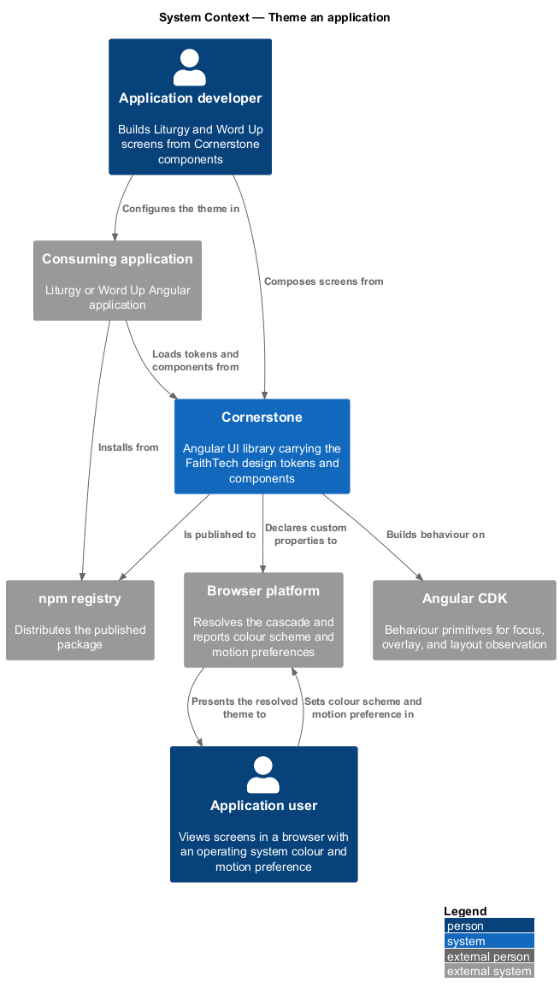
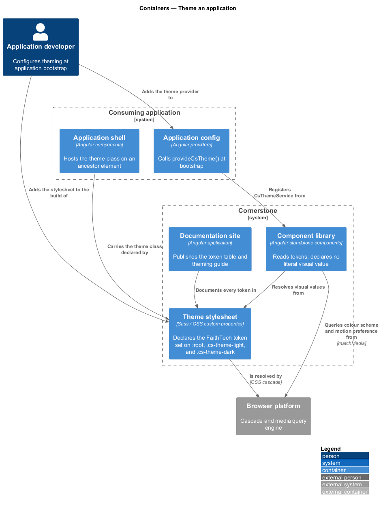
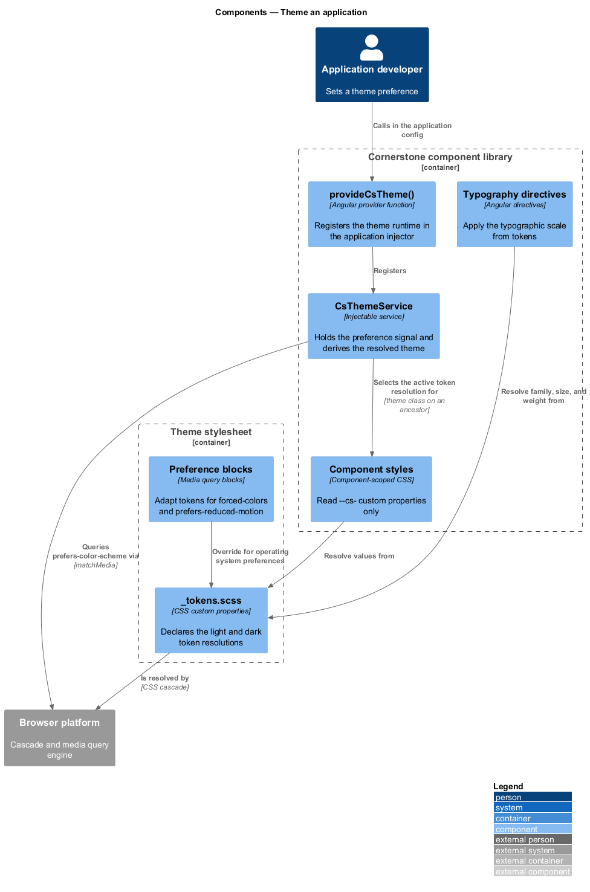
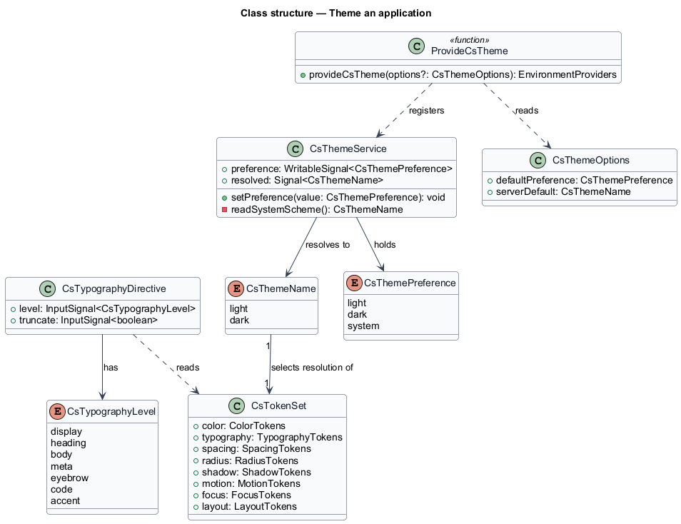
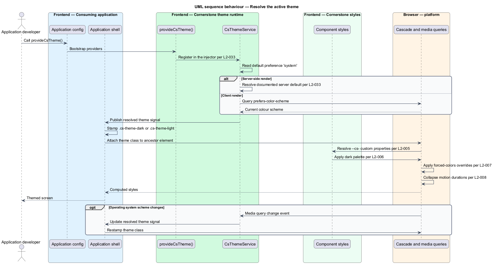
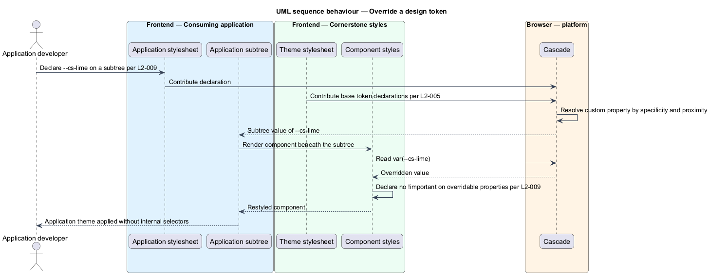

# Theme an application

## Overview

Cornerstone is the Angular user-interface library published as `@quinntyne/cornerstone`.
It supplies the components that the Liturgy and Word Up applications compose
their screens from, and it carries the FaithTech visual language that makes those
screens look like one product family.

**design token** — named value standing for a single visual decision, such as a
colour, a spacing step, or a motion duration

This feature covers the token layer itself: how Cornerstone declares its visual
decisions, how an application resolves them to a light, dark, high-contrast, or
reduced-motion presentation, and how an application restyles the library without
reaching into component internals.

The token layer sits beneath every other feature in the library. No component
declares a literal colour, spacing, radius, shadow, duration, or font family; each
one reads a token instead. That indirection is what lets a single class on an
ancestor element re-resolve an entire screen, and what lets an application change
the product's appearance without forking component styles.

**theme** — coherent resolution of the full token set, selected by a class on an
ancestor element

Cornerstone ships two themes, `light` and `dark`, and adapts both to two operating
system preferences: forced colours and reduced motion. An application selects a
theme explicitly, or delegates the choice to the operating system.

## Description

The feature is a vertical slice from the application's bootstrap configuration
down to the computed style of a rendered element. It spans a stylesheet layer and
a small Angular runtime.

- **`theme.scss`** — the published stylesheet entry point. It declares the token
  set as CSS custom properties on `:root` and `.cs-theme-light`, and the dark
  resolution on `.cs-theme-dark`. An application loads it through the
  `@quinntyne/cornerstone/styles/theme.scss` export subpath.
- **`_tokens.scss`** — the token declarations themselves, under the `--cs-`
  prefix. The set covers the ink scale, `--cs-paper`, the sand and grey scales,
  the FaithTech accent colours (`--cs-lime`, `--cs-sky`, `--cs-teal`,
  `--cs-tomato`, `--cs-green`, `--cs-amber`, `--cs-yellow`), the semantic
  success, warning, error, and info colours with their soft variants, the three
  font families, the spacing scale, the radius scale, the shadow scale, the
  motion durations, `--cs-focus`, and `--cs-container`.
- **`provideCsTheme()`** — the provider function an application calls in its
  application config. It registers `CsThemeService` and the token layer.
- **`CsThemeService`** — the runtime that reports and sets the active theme. It
  exposes a writable `preference` signal holding `light`, `dark`, or `system`,
  and a read-only `resolved` signal holding the theme in force. When the
  preference is `system`, `resolved` tracks the operating system colour scheme;
  when the preference is explicit, `resolved` follows the preference and ignores
  the operating system.
- **`CsThemeName`** — union type of the theme identifiers: `'light' | 'dark'`.
- **`CsThemePreference`** — union type of the values an application may set:
  `'light' | 'dark' | 'system'`.
- **Typography styles and directives** — the typographic scale, published as both
  stylesheet classes and directives. The scale covers display headings, section
  headings, body, small and meta text, eyebrow, monospace, the accent scripture
  face, links, and truncation. Each level resolves its family, size, line height,
  letter spacing, and weight from tokens, and display sizes interpolate between a
  documented minimum and maximum across the viewport range.
- **Public class hooks** — the `cs-` prefixed classes that an application may
  target. The set is documented and stable across patch releases; component DOM
  structure outside that set is private.

The service reads no browser global during server-side rendering. Under a server
renderer it resolves the documented default and defers the operating system query
until the first client render.

The token override contract runs the other way: an application declares a `--cs-`
custom property on `:root` or on any subtree, and every component beneath that
element resolves the new value. No component declares `!important` on a property
an application is documented to override, so a plain declaration wins.

The exact metric-adjusted fallback tolerance for the FaithTech display face when
no licensed font is available is `<TO SUPPLY>`.

## Requirements

The feature realizes the following level-2 (L2) requirements. Each L2 requirement
refines a level-1 (L1) requirement, cited by identifier.

| L2 ID | Refines (L1) | Requirement |
|-------|--------------|-------------|
| `L2-005` | `L1-002` | The theme stylesheet shall declare the complete FaithTech token set as CSS custom properties under the `--cs-` prefix, covering colour, typography, spacing, radius, shadow, motion, focus, and container bounds, and every token shall be documented. |
| `L2-006` | `L1-002` | Applying `.cs-theme-dark` to an element shall resolve the token set to the dark FaithTech palette for that element and its descendants, and every component shall remain contrast-compliant under it. |
| `L2-007` | `L1-002` | Every component shall remain usable under `forced-colors: active`, retaining visible boundaries, focus indication, and state differentiation. |
| `L2-008` | `L1-002` | Every transition, animation, and programmatic scroll shall collapse to a non-moving equivalent when `prefers-reduced-motion: reduce` is set, without removing the state change. |
| `L2-009` | `L1-002` | An application shall be able to restyle the library through public tokens and documented public class hooks alone, and no component shall require an application to target its internal DOM structure. |
| `L2-010` | `L1-002` | The library shall provide a typographic scale as stylesheet classes and directives, with fluid responsive sizing and a readable prose measure. |
| `L2-033` | `L1-007` | The library shall expose a `CsTheme` provider and service that registers the token layer, reports the resolved theme, allows an application to set it, and is safe to call during server-side rendering. |

## Diagrams

### System context

An application developer builds screens against Cornerstone. Cornerstone draws
its behaviour from Angular CDK, publishes to the npm registry, and reads the
operating system's colour scheme and motion preferences through the browser.

### Containers

The consuming application loads two artefacts from the published package: the
theme stylesheet that declares the tokens, and the component library that reads
them. The theme service runs inside the application's Angular injector.

### Components

`provideCsTheme()` registers `CsThemeService`, which resolves a preference
against the browser's colour-scheme query and drives the theme class on the host
element. Component styles read the resulting custom properties; they never query
the service.

### Class structure

`CsThemeService` holds a `preference` signal and derives `resolved` from it and
from the media query. `CsTokenSet` names the token groups that `theme.scss`
declares, and the typography directives read the same set.

### Behaviour — resolve the active theme

The application sets a preference of `system`; the service subscribes to the
colour-scheme query, resolves a theme, and stamps the theme class. Component
styles then resolve their tokens against that class.

### Behaviour — override a token

An application declares a `--cs-` custom property on a subtree. The cascade
re-resolves every component beneath it without any component code running.

