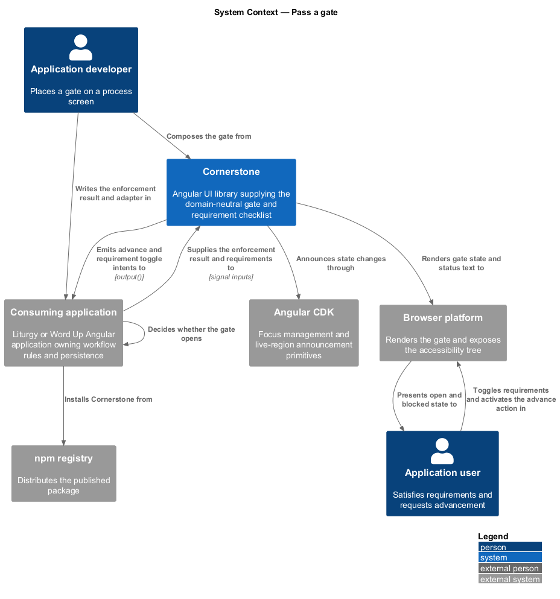
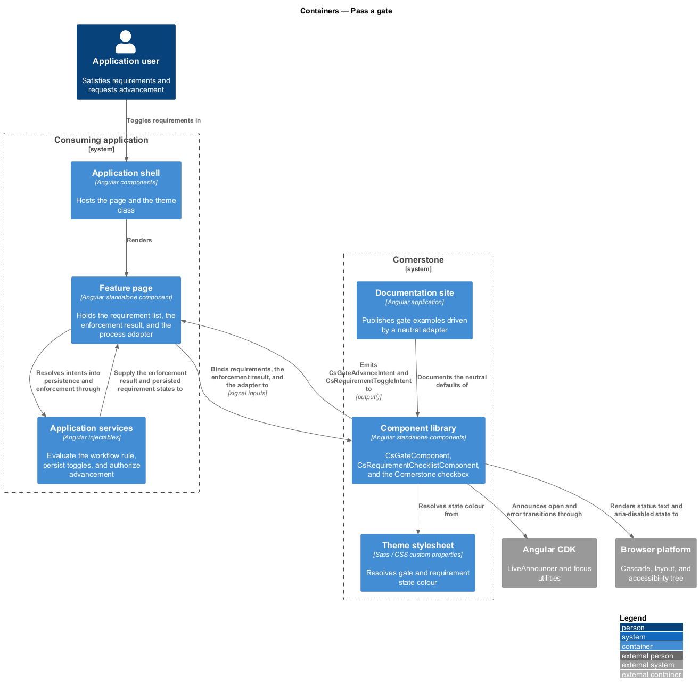
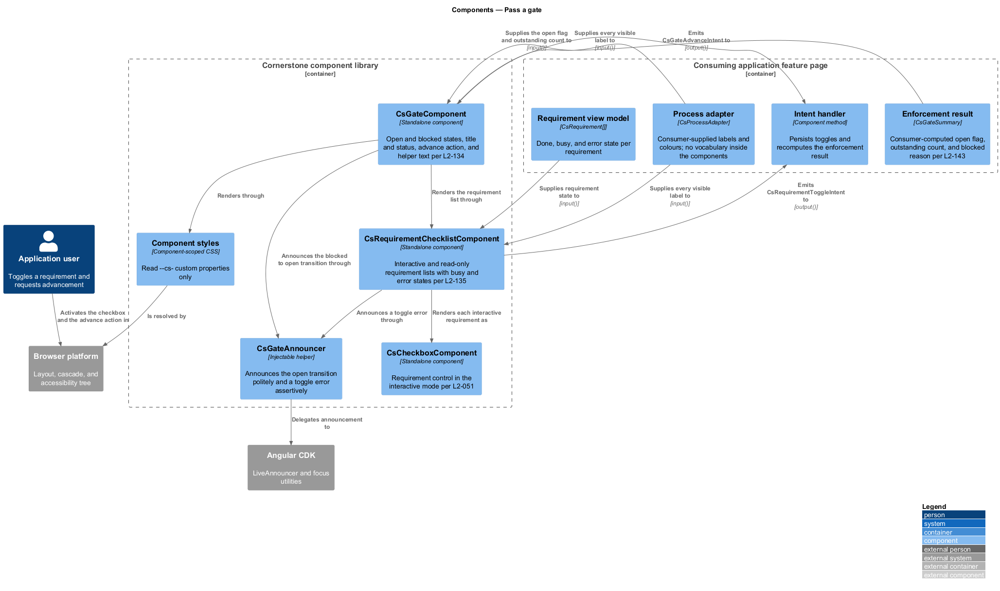
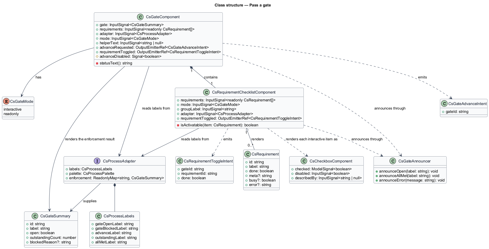
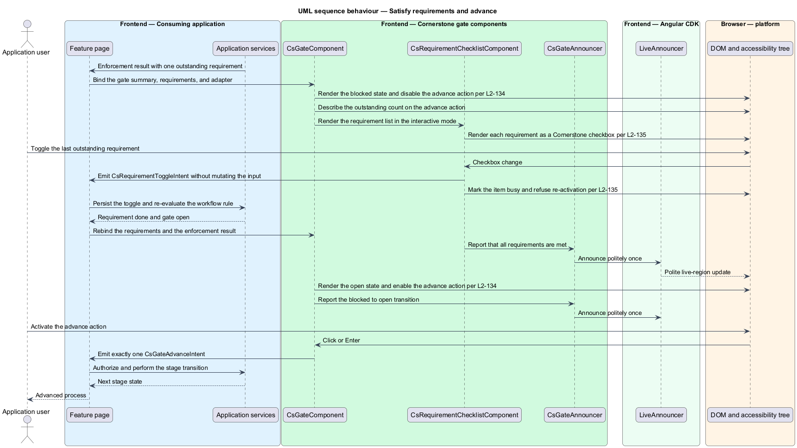
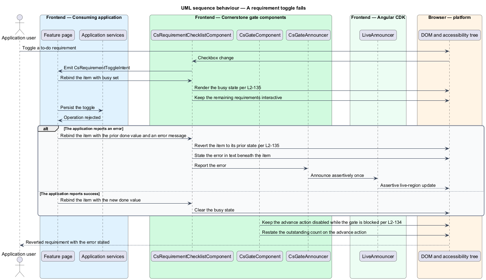

# Pass a gate

## Overview

Cornerstone is the Angular user-interface library published as `@quinntyne/cornerstone`.
It supplies the components that the Liturgy and Word Up applications compose
their screens from. The process subsystem holds the workflow components that
Liturgy previously owned as `lit-` prefixed application code, generalized so that
no workflow vocabulary belongs to any one application.

**gate** — checkpoint between two stages of a process that admits passage only
when its requirements are satisfied

**requirement** — named condition attached to a gate, holding a done or to-do
state and optional metadata

**enforcement result** — consumer-supplied verdict stating whether a gate is open
and, when it is blocked, how many requirements remain outstanding

**intent** — typed output describing what an application user asked for, leaving
the decision and the persistence to the consuming application

This feature covers the gate panel and the requirement checklist it contains. The
gate replaces Liturgy's `lit-gate`; the checklist replaces the Liturgy
`checklist` and `check` markup and builds on the Cornerstone checkbox (L2-051).

The decisive property of both components is that they hold no rule. The gate does
not evaluate whether its requirements are met; it renders the enforcement result
that the adapter supplies (L2-143). The checklist does not mutate the requirement
list it receives; it emits a toggle intent and waits for the application to send
a new list back. That separation is what keeps a single gate usable for a Liturgy
4D phase transition and a Word Up assignment submission alike, and it keeps every
authorization decision in the application layer.

The gate is rendered by the process rail and the process journey as their
inter-step panel, and it is also usable on its own within a stage page.

## Description

The feature is a vertical slice from an application's enforcement result down to
the announced state change on the advance action. It introduces two components,
their intents, and the requirement view model.

- **`GateComponent`** — the gate panel, selector `cs-gate`. Inputs:
  `gate: InputSignal<GateSummary>`, `requirements: InputSignal<readonly
  CsRequirement[]>`, `adapter: InputSignal<CsProcessAdapter>`,
  `mode: InputSignal<GateMode>` holding `'interactive'` or `'readonly'`, and
  `helperText: InputSignal<string | null>`. Outputs:
  `advanceRequested: OutputEmitterRef<GateAdvanceIntent>` and
  `requirementToggled: OutputEmitterRef<CsRequirementToggleIntent>`. States:
  open and blocked. When blocked, the advance action is disabled, carries
  `aria-disabled="true"`, and its accessible description states the outstanding
  count. When the gate transitions from blocked to open, the component announces
  the change politely once through a live region.
- **`RequirementChecklistComponent`** — the checklist, selector
  `cs-requirement-checklist`. Inputs: `requirements`, `mode`,
  `groupLabel: InputSignal<string>`, and `adapter`. Output:
  `requirementToggled`. In the interactive mode each requirement renders as a
  Cornerstone checkbox (L2-051) inside a labelled group; in the read-only mode
  each state is conveyed as text and icon, and no control is focusable as an
  input.
- **`CsRequirement`** — the requirement view model: `id`, `label`, `done`,
  optional `meta`, optional `busy`, and optional `error`. The `busy` flag marks a
  caller-supplied operation as pending; the `error` field carries the message to
  state in text.
- **`GateSummary`** — the enforcement result: `id`, `label`, `open`,
  `outstandingCount`, and optional `blockedReason`. The consuming application
  computes every field.
- **`GateMode`** — union type of the interaction modes: `'interactive' |
  'readonly'`.
- **`GateAdvanceIntent`** — the intent emitted when the advance action is
  activated, carrying `gateId`. The component emits it exactly once per
  activation and makes no enforcement decision.
- **`CsRequirementToggleIntent`** — the intent emitted when a requirement is
  toggled, carrying `requirementId`, `gateId`, and the requested `done` value.
- **`GateAnnouncer`** — the internal live-region helper that announces the open
  transition politely and a toggle error assertively, each once per occurrence.

A requirement marked busy is not re-activatable while the flag holds, and the
remaining requirements stay interactive. When a toggle reports an error, the item
reverts to its prior state, states the error in text, and announces it
assertively once. When the last outstanding requirement completes, the checklist
announces politely that all requirements are met.

The debounce applied before re-announcing a rapid sequence of toggle results is
`<TO SUPPLY>`, pending the screen-reader verification pass.

## Requirements

The feature realizes the following level-2 (L2) requirements. Each L2 requirement
refines a level-1 (L1) requirement, cited by identifier.

| L2 ID | Refines (L1) | Requirement |
|-------|--------------|-------------|
| `L2-134` | `L1-014` | The library shall provide a gate carrying open and blocked states, a title and status, a requirement checklist, a locked or available advance action, and helper text, emitting requirement and advance intents only, replacing Liturgy's `lit-gate`. |
| `L2-135` | `L1-014` | The library shall provide interactive and read-only requirement lists with done and to-do states, metadata, busy and error states, and keyboard and focus behaviour appropriate to each mode. |

## Diagrams

### System context

An application developer places a gate on a process screen. The consuming
application computes the enforcement result and passes it in; Cornerstone renders
it and emits intents back.

### Containers

Application services own the workflow rule and the persistence of a requirement
toggle. The component library renders the resulting state and returns typed
intents to the feature page.

### Components

`GateComponent` composes `RequirementChecklistComponent` and the Cornerstone
checkbox. The adapter and the enforcement result are the only inputs that carry
application vocabulary or verdicts into either component.

### Class structure

`GateSummary` carries the enforcement result, `CsRequirement` carries per-item
state including busy and error, and each component emits one typed intent per
interaction.

### Behaviour — satisfy requirements and advance

A user toggles the last outstanding requirement, the application persists it and
recomputes the enforcement result, the gate re-renders as open, and the advance
action becomes available.

### Behaviour — a requirement toggle fails

The application reports an error for a pending toggle. The item reverts to its
prior state, states the error in text, and announces it assertively once while
the rest of the checklist stays interactive.

