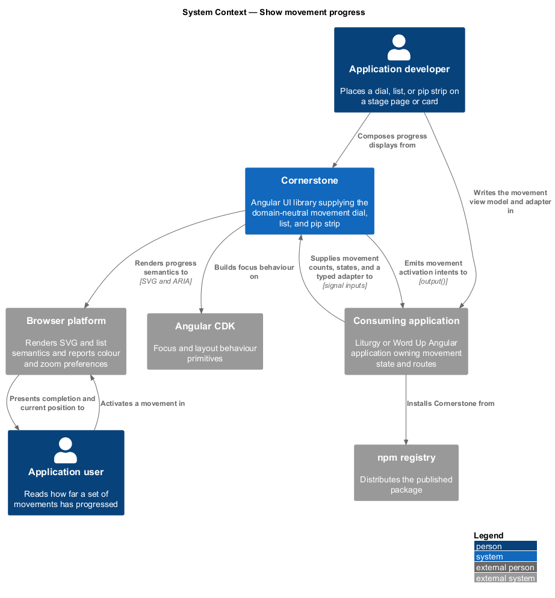
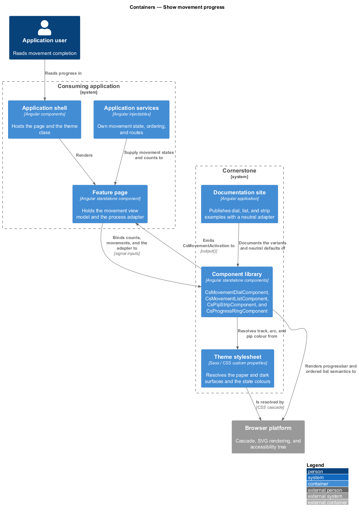
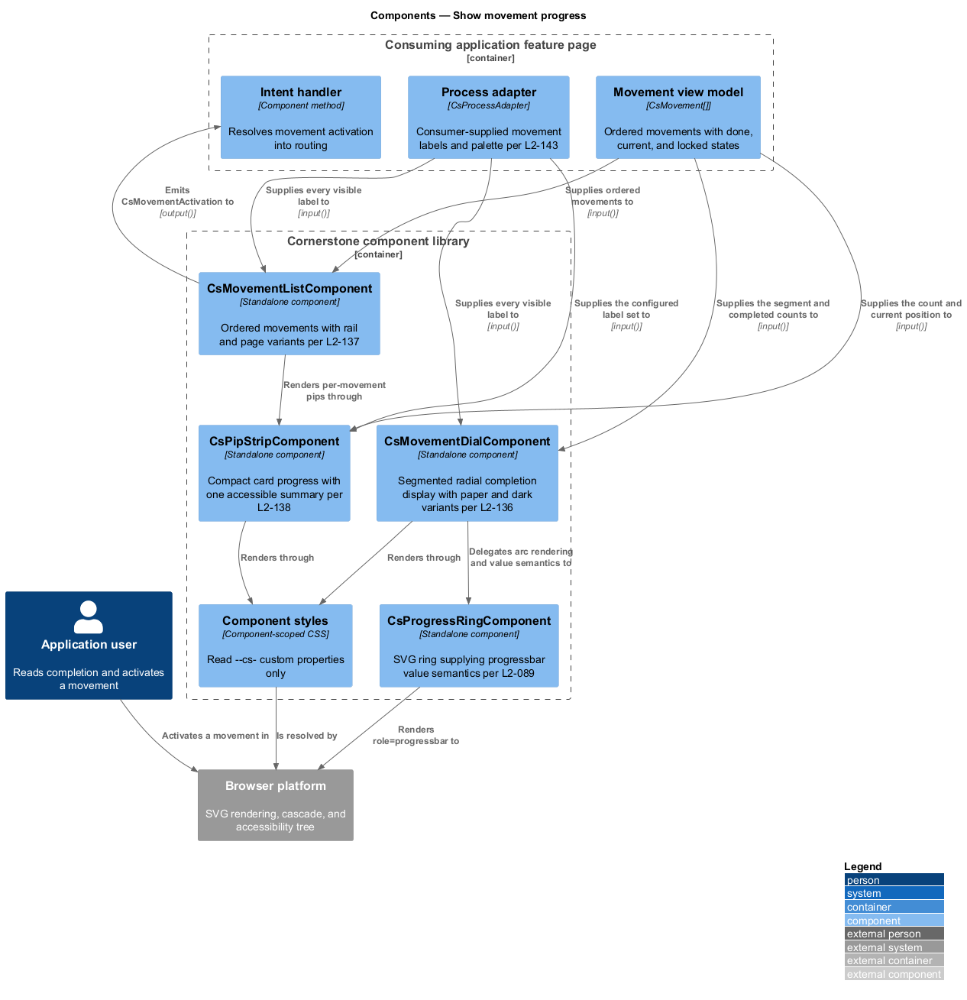
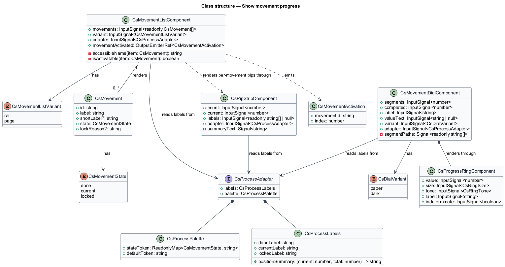
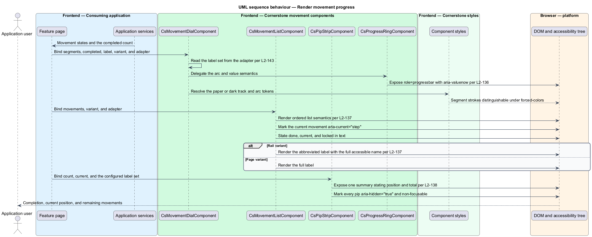
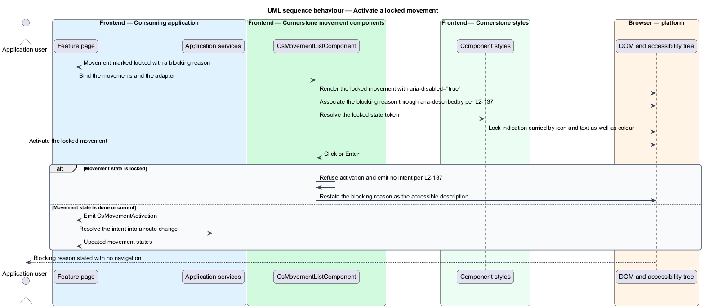

# Show movement progress

## Overview

Cornerstone is the Angular user-interface library published as `@quinntyne/cornerstone`.
It supplies the components that the Liturgy and Word Up applications compose
their screens from. The process subsystem holds the workflow components that
Liturgy previously owned as `lit-` prefixed application code, generalized so that
no workflow vocabulary belongs to any one application.

**movement** — named unit of work inside a stage of a process, carrying a done,
current, or locked state

**segment** — one movement's share of a radial completion display

**pip** — small non-focusable mark standing for one movement in a compact strip

This feature covers the three components that state how far a set of movements
has progressed: a radial dial, an ordered list, and a compact strip sized for a
card. The dial replaces Liturgy's `lit-dial`, the list replaces `lit-rlist`, and
the strip replaces `lit-pip-strip`.

All three are read-only presentations of a movement count and a current position.
None of them names a movement itself: labels arrive through the adapter (L2-143),
so the same dial states a Liturgy 5R loop and a Word Up lesson sequence. The dial
builds on the progress ring primitive (L2-089) rather than drawing its own arc,
so accessible value semantics are declared in one place.

The strip is embedded by the work item card of the kanban feature; the dial and
the list appear on stage pages beside the process rail.

## Description

The feature is a vertical slice from a movement view model down to the announced
progress summary. It introduces three components and the types they share.

- **`MovementDialComponent`** — the radial dial, selector `cs-movement-dial`.
  Inputs: `segments: InputSignal<number>`, `completed: InputSignal<number>`,
  `label: InputSignal<string>`, `valueText: InputSignal<string | null>`,
  `variant: InputSignal<DialVariant>` holding `'paper'` or `'dark'`, and
  `adapter: InputSignal<CsProcessAdapter>`. It renders through
  `ProgressRingComponent` (L2-089), which supplies `role="progressbar"`,
  `aria-valuenow`, `aria-valuemin`, `aria-valuemax`, and the accessible name.
  Completed, current, and remaining segments differ in stroke pattern as well as
  in colour, so they stay distinguishable under `forced-colors: active`. A
  completed count of `0` and a completed count equal to `segments` each render
  without a visual artifact.
- **`MovementListComponent`** — the ordered movement list, selector
  `cs-movement-list`. Inputs: `movements: InputSignal<readonly Movement[]>`,
  `variant: InputSignal<MovementListVariant>` holding `'rail'` or `'page'`,
  and `adapter`. Output:
  `movementActivated: OutputEmitterRef<MovementActivation>`. The list renders
  an `<ol>`; the current movement carries `aria-current="step"` and is
  distinguished by an icon and a state word as well as by colour. In the `rail`
  variant the visible label may be abbreviated while the accessible name stays
  complete. Activating a locked movement emits no intent and exposes the blocking
  reason as an accessible description.
- **`PipStripComponent`** — the compact strip, selector `cs-pip-strip`.
  Inputs: `count: InputSignal<number>`, `current: InputSignal<number>`,
  `labels: InputSignal<readonly string[] | null>`, and `adapter`. The strip
  exposes one accessible summary stating the current position and the total; each
  pip carries `aria-hidden="true"` and is not focusable. Pip states differ by
  shape and fill as well as by colour, so they remain distinguishable under
  `forced-colors: active` and at 200% zoom.
- **`Movement`** — the movement view model: `id`, `label`, optional
  `shortLabel`, `state`, and optional `lockReason`.
- **`MovementState`** — union type of the movement states: `'done' | 'current'
  | 'locked'`.
- **`DialVariant`** — union type of the dial surfaces: `'paper' | 'dark'`. The
  dark variant resolves a track and arc pair holding at least 3:1 contrast
  against the dark surface.
- **`MovementListVariant`** — union type of the list presentations: `'rail' |
  'page'`.
- **`MovementActivation`** — the intent emitted when an unlocked movement is
  activated, carrying `movementId` and `index`.

Every visible string in the three components resolves from
`adapter.labels.movement`, and each component falls back to its documented
neutral default when the adapter omits an optional label.

The stroke-dash ratio that separates adjacent dial segments at the smallest
documented ring size is `<TO SUPPLY>`, pending the visual review against the
progress ring size scale.

## Requirements

The feature realizes the following level-2 (L2) requirements. Each L2 requirement
refines a level-1 (L1) requirement, cited by identifier.

| L2 ID | Refines (L1) | Requirement |
|-------|--------------|-------------|
| `L2-136` | `L1-014` | The library shall provide a segmented radial completion display built on `CsProgressRing`, carrying a label and value and paper and dark variants, replacing Liturgy's `lit-dial`. |
| `L2-137` | `L1-014` | The library shall provide an ordered list of named movements with done, current, and locked pips in compact rail and full-page variants, replacing Liturgy's `lit-rlist`. |
| `L2-138` | `L1-014` | The library shall provide a compact accessible movement progress indicator for cards with configurable labels, count, and current state, replacing Liturgy's `lit-pip-strip`. |

## Diagrams

### System context

An application developer places a progress display on a stage page or a card. The
consuming application supplies the movement count, the current position, and the
adapter; Cornerstone renders the progress semantics.

### Containers

The feature page holds the movement view model. The component library renders it,
and the theme stylesheet resolves the paper and dark surfaces the dial variants
name.

### Components

The dial delegates its accessible value semantics to `ProgressRingComponent`.
All three components read their labels from the adapter, which is the only path
by which application vocabulary enters them.

### Class structure

`Movement` carries a state and an optional short label; the dial reads counts,
the list reads movements, and the strip reads a count and a current position.

### Behaviour — render movement progress

The application binds a movement set. The dial renders segments through the
progress ring, the list renders ordered semantics with the current movement
marked, and the strip exposes a single summary rather than announcing each pip.

### Behaviour — activate a locked movement

A user activates a movement the application has marked locked. The list emits no
intent and exposes the blocking reason as an accessible description.

