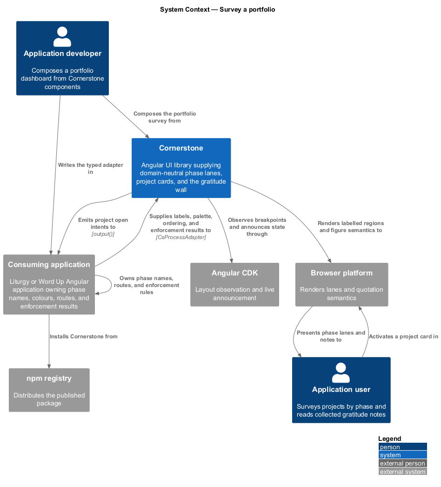
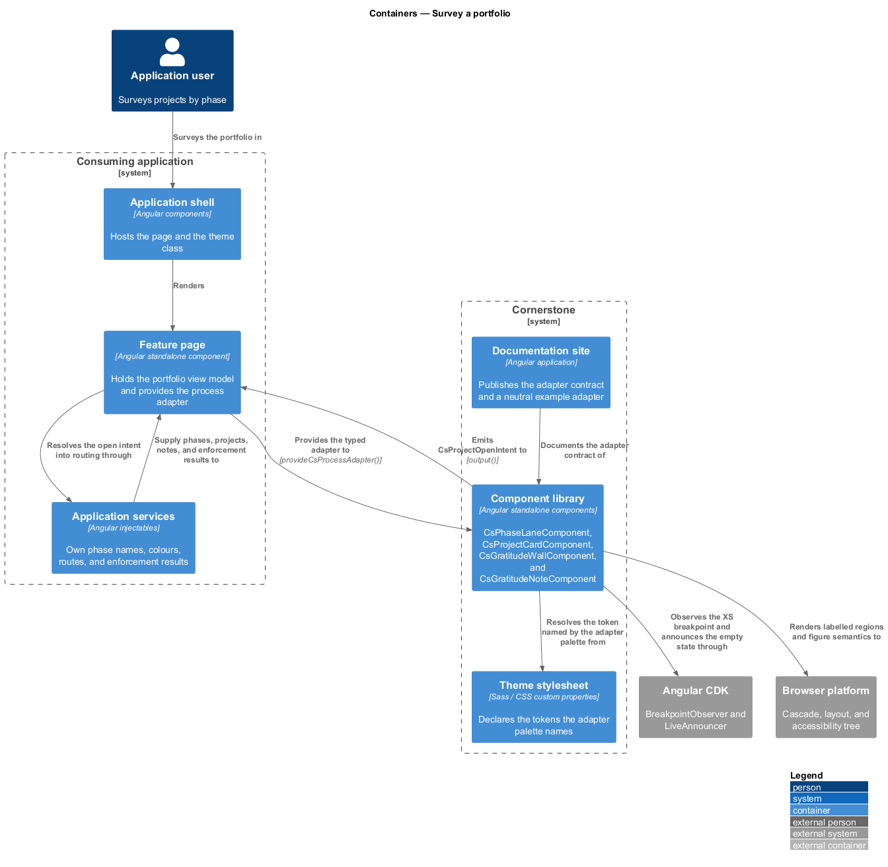
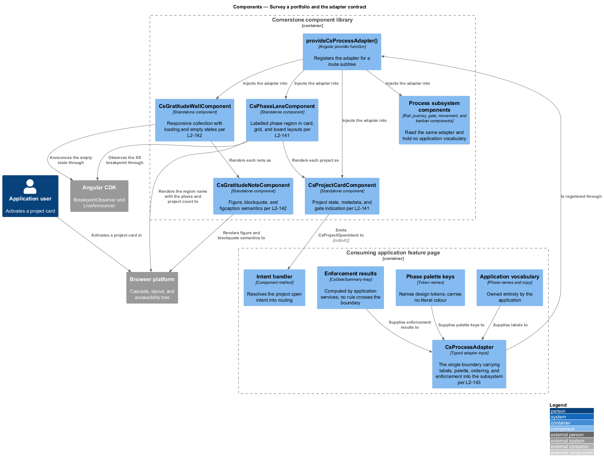
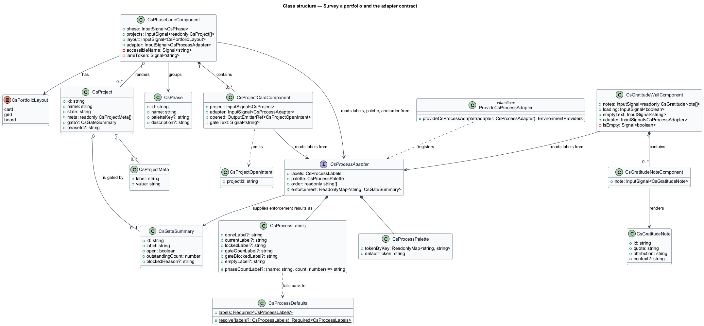
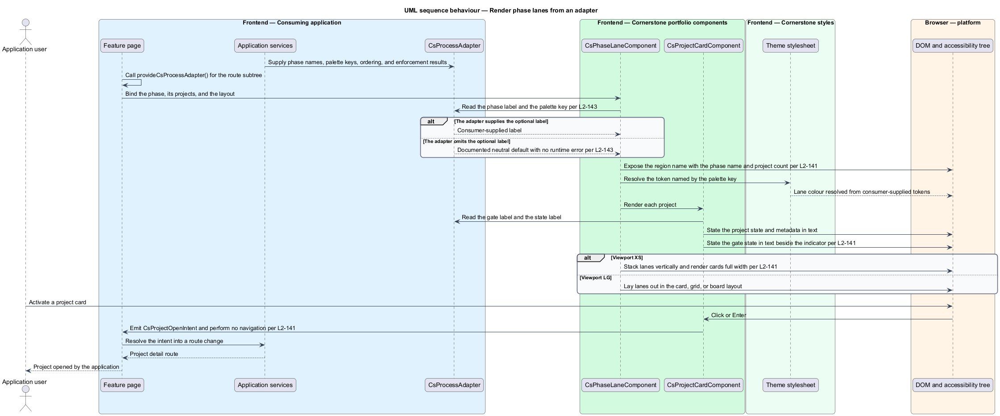
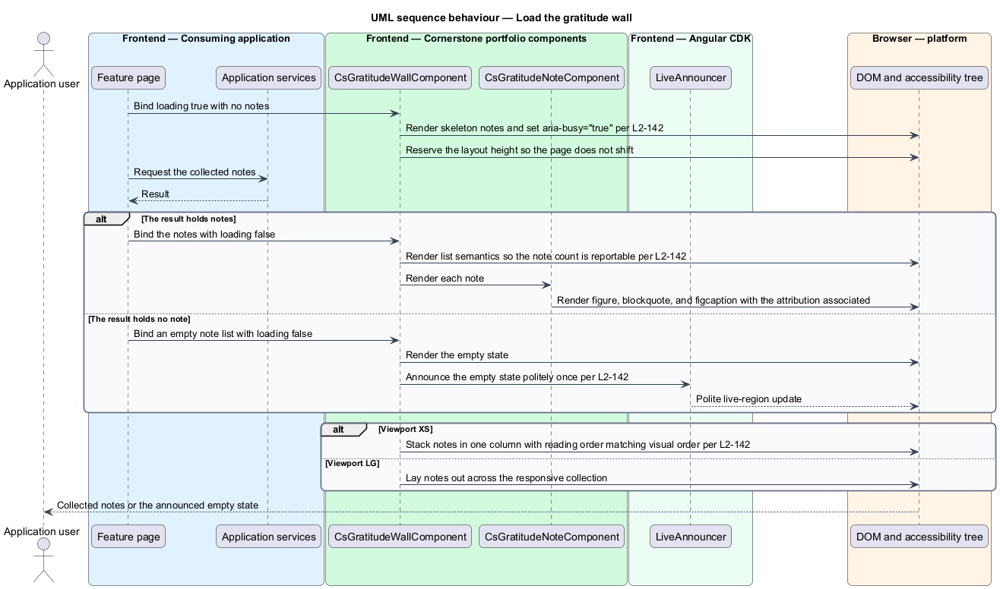

# Survey a portfolio

## Overview

Cornerstone is the Angular user-interface library published as `@quinntyne/cornerstone`.
It supplies the components that the Liturgy and Word Up applications compose
their screens from. The process subsystem holds the workflow components that
Liturgy previously owned as `lit-` prefixed application code, generalized so that
no workflow vocabulary belongs to any one application.

**portfolio** — collection of projects surveyed together, grouped by the phase
each one currently occupies

**phase** — named grouping of a portfolio, standing for one stage of the process
the projects share

**project** — unit of work tracked across a portfolio, carrying a state, metadata,
and the gate that stands in front of it

**gratitude note** — short attributed quotation collected as an outcome of
completed work

**adapter contract** — set of typed inputs through which a consuming application
supplies labels, colours, ordering, and enforcement results to a domain-neutral
component

This feature covers the portfolio survey — phase lanes and project cards — and
the gratitude wall that reports the outcomes of finished work. Both are new
components generalized from the Liturgy dashboard and the Liturgy Demonstrate
wall.

This feature also owns the adapter contract itself (L2-143). The contract is the
single mechanism by which every component of the process subsystem receives
application vocabulary. The process rail, the gate, the movement displays, and
the kanban board all read the same `CsProcessAdapter` type defined here, and no
component in the subsystem holds a phase name, a phase colour, a route path, or
an enforcement rule of its own.

## Description

The feature is a vertical slice from a portfolio view model down to a rendered
lane, and it declares the adapter types the whole subsystem reads.

- **`PhaseLaneComponent`** — the phase grouping, selector `cs-phase-lane`.
  Inputs: `phase: InputSignal<Phase>`,
  `projects: InputSignal<readonly Project[]>`,
  `layout: InputSignal<PortfolioLayout>` holding `'card'`, `'grid'`, or
  `'board'`, and `adapter: InputSignal<CsProcessAdapter>`. Each lane is a
  labelled region whose accessible name combines the phase name and the project
  count. The lane resolves its colour from `adapter.palette`; it holds no phase
  name and no colour value in its own source. At viewport XS the lanes stack
  vertically and the cards become full-width.
- **`ProjectCardComponent`** — the project tile, selector `cs-project-card`.
  Inputs: `project: InputSignal<Project>` and `adapter`. Output:
  `opened: OutputEmitterRef<ProjectOpenIntent>`. The card states the project
  state, its metadata, and its gate state in text; the gate indicator is never
  the sole conveyance. Activation emits one typed open intent and performs no
  navigation.
- **`GratitudeWallComponent`** — the collection layout, selector
  `cs-gratitude-wall`. Inputs: `notes: InputSignal<readonly GratitudeNote[]>`,
  `loading: InputSignal<boolean>`, `emptyText: InputSignal<string>`, and
  `adapter`. The wall uses list semantics so assistive technology can report the
  note count. In the loading state it renders skeleton notes, sets
  `aria-busy="true"`, and reserves the layout height. When it holds no note it
  renders the empty state and announces it politely once. At viewport XS the
  notes stack in one column and reading order matches visual order.
- **`GratitudeNoteComponent`** — the note, selector `cs-gratitude-note`.
  Inputs: `note: InputSignal<GratitudeNote>`. It renders `<figure>`,
  `<blockquote>`, and `<figcaption>`, associating the attribution with the
  quotation.
- **`Phase`** — the phase view model: `id`, `name`, optional `paletteKey`, and
  optional `description`.
- **`Project`** — the project view model: `id`, `name`, `state`, `meta` as an
  ordered list of label and value pairs, optional `gate` holding a
  `GateSummary`, and optional `phaseId`.
- **`GratitudeNote`** — the note view model: `id`, `quote`, `attribution`, and
  optional `context`.
- **`PortfolioLayout`** — union type of the layouts: `'card' | 'grid' |
  'board'`.
- **`ProjectOpenIntent`** — the intent emitted when a project card is
  activated, carrying `projectId`.
- **`CsProcessAdapter`** — the adapter contract (L2-143). It holds `labels` of
  type `CsProcessLabels`, `palette` of type `CsProcessPalette`, `order` naming
  the phase or stage sequence, and `enforcement` mapping a gate identifier to a
  `GateSummary`. Every field is consumer-supplied and typed.
- **`CsProcessLabels`** — the label set. Every field is optional; each component
  falls back to its documented neutral default when a label is absent, and no
  runtime error occurs.
- **`CsProcessPalette`** — the colour map. It names design tokens by key; it
  carries no literal colour value, so an application changes portfolio colour
  through the token layer (L2-005).
- **`GateSummary`** — the enforcement result the application computes and the
  gate renders.
- **`provideCsProcessAdapter()`** — the provider function that registers a
  default adapter for a route subtree, so a page composes the subsystem's
  components without rebinding the adapter on each one.

Every component in the process subsystem satisfies the contract by construction:
its source names no phase, no route, and no rule, and a scan of the subsystem
source for application-specific vocabulary returns no match outside documentation
examples.

The column count of the gratitude wall at each breakpoint is `<TO SUPPLY>`,
pending the responsive audit of the Liturgy Demonstrate wall.

## Requirements

The feature realizes the following level-2 (L2) requirements. Each L2 requirement
refines a level-1 (L1) requirement, cited by identifier.

| L2 ID | Refines (L1) | Requirement |
|-------|--------------|-------------|
| `L2-141` | `L1-014` | The library shall provide phase grouping and project tiles carrying state, metadata, and gate indication, in card, grid, and board layouts, emitting a typed open intent and performing no navigation. |
| `L2-142` | `L1-014` | The library shall provide a responsive collection layout with quotation and citation semantics and empty and loading states. |
| `L2-143` | `L1-014` | The process components shall be domain-neutral at their core, expressed in terms of process, stage, movement, gate, and work item, with application labels, colours, ordering, and enforcement results supplied through typed adapter inputs. |

## Diagrams

### System context

An application developer surveys a portfolio through Cornerstone. The consuming
application owns the phase names, the colours, the routes, and the enforcement
results, and passes them in through the adapter.

### Containers

The feature page holds the portfolio view model and the adapter. The component
library renders lanes, cards, and notes; the theme stylesheet resolves the tokens
the palette names.

### Components

The adapter boundary sits between the application's vocabulary and every
component of the subsystem. `PhaseLaneComponent`, `ProjectCardComponent`, and
the gratitude components read it, and so does every other process component.

### Class structure

`CsProcessAdapter` composes the label set, the palette, the ordering, and the
enforcement map; the lane, card, wall, and note types read it and emit typed
intents.

### Behaviour — render phase lanes from an adapter

The application supplies phases, projects, and an adapter. Each lane resolves its
name and colour from the adapter, states each project's gate in text, and emits
one open intent when a card is activated.

### Behaviour — load the gratitude wall

The wall renders skeleton notes while the application loads, then either renders
the notes with quotation and citation semantics or renders and announces the
empty state.

