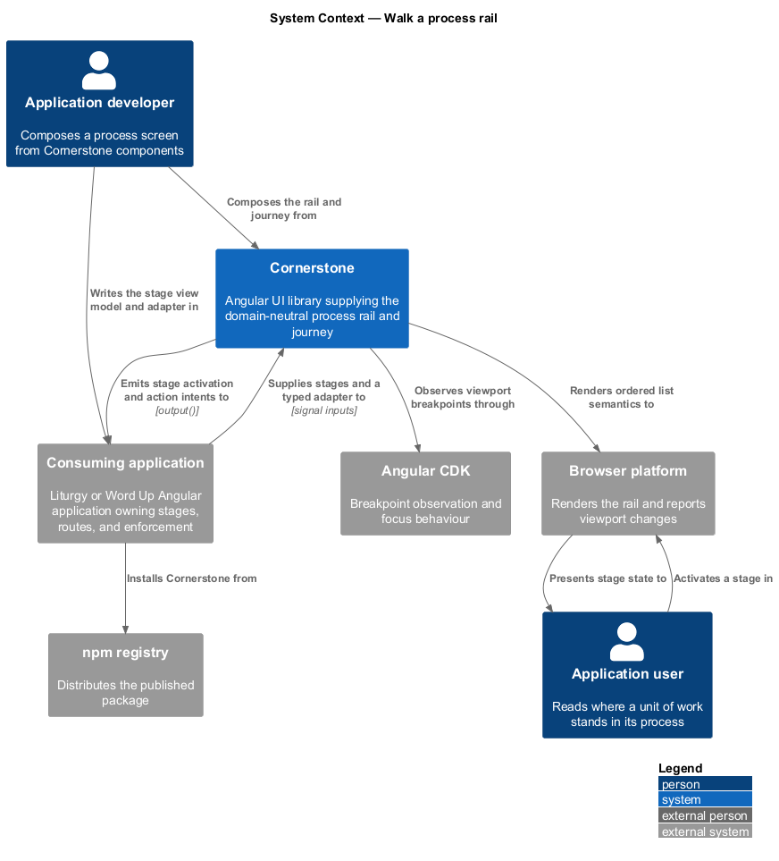
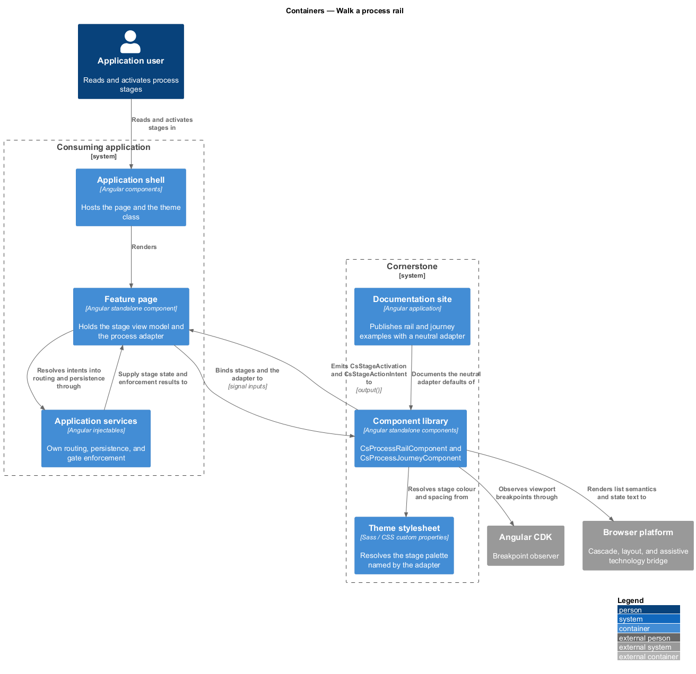
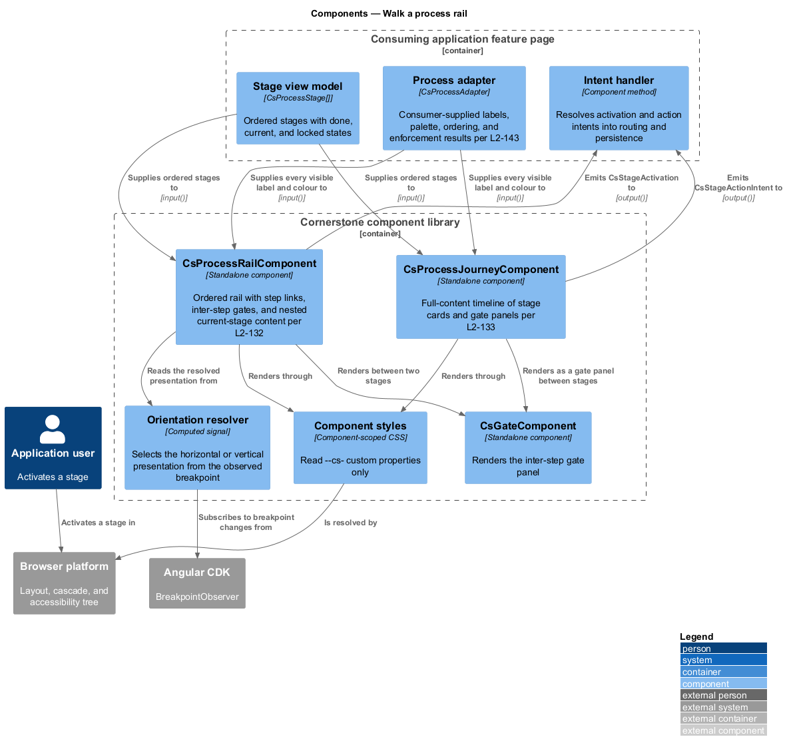
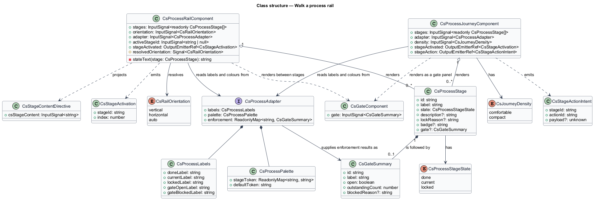
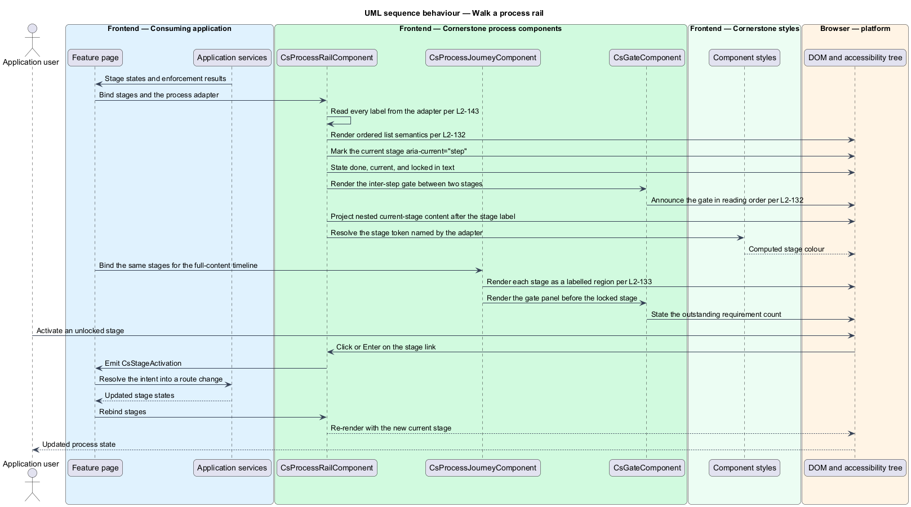
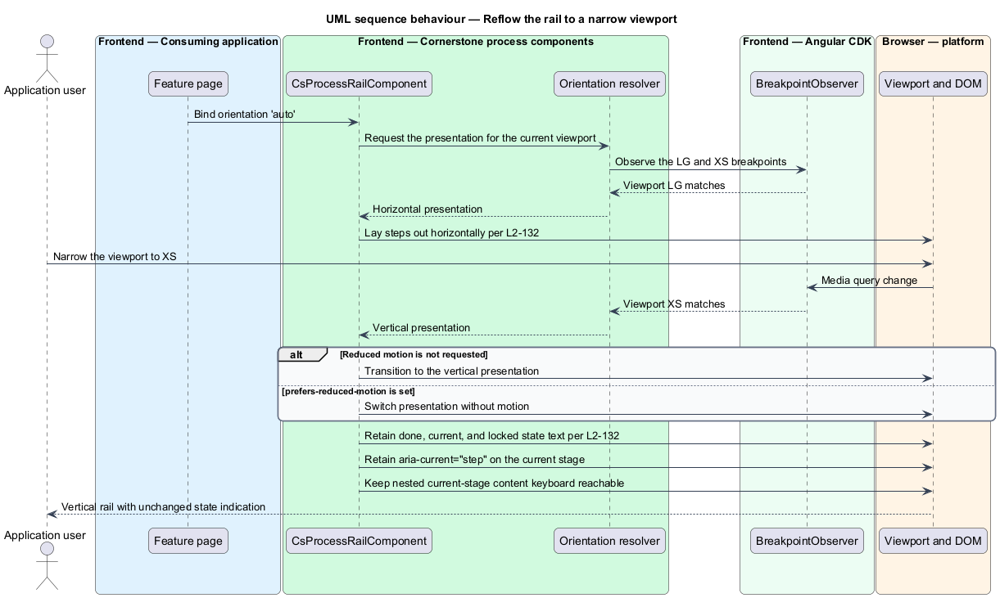

# Walk a process rail

## Overview

Cornerstone is the Angular user-interface library published as `@quinntyne/cornerstone`.
It supplies the components that the Liturgy and Word Up applications compose
their screens from. The process subsystem holds the workflow components that
Liturgy previously owned as `lit-` prefixed application code, generalized so that
no workflow vocabulary belongs to any one application.

**process** — ordered sequence of stages that a unit of work passes through from
start to completion

**stage** — named position within a process, carrying its own state, content, and
optional actions

**gate** — checkpoint sitting between two stages that admits passage only when
its requirements are satisfied

**adapter** — typed input that carries a consuming application's labels, colours,
ordering, and enforcement results into a domain-neutral component

This feature covers the two components that render a process end to end: a
compact rail that states where the work stands, and a full-content journey that
gives each stage a card of its own. The rail replaces Liturgy's
`lit-rhythm-rail`; the journey replaces the Liturgy `phase-row` journey and
extends the `CsStepper` primitive.

Both components are presentational. They receive a stage list and an adapter,
render state, and emit typed intents. Neither one navigates, persists, decides
authorization, nor evaluates whether a gate opens. The consuming application owns
every one of those decisions and feeds the result back in through the adapter, so
that the same rail renders a Liturgy 4D project journey and a Word Up learning
journey without a source change (L2-143).

The rail sits above the gate feature, which supplies `GateComponent` for the
inter-step gate slot, and above the movement feature, which supplies the progress
indicators a stage card may embed.

## Description

The feature is a vertical slice from an application's stage view model down to
the rendered list item and its accessible state text. It introduces two
components and the types they read.

- **`ProcessRailComponent`** — the compact ordered rail, selector
  `cs-process-rail`. Inputs: `stages: InputSignal<readonly CsProcessStage[]>`,
  `orientation: InputSignal<RailOrientation>` holding `'vertical'`,
  `'horizontal'`, or `'auto'`, `adapter: InputSignal<CsProcessAdapter>`, and
  `activeStageId: InputSignal<string | null>`. Output:
  `stageActivated: OutputEmitterRef<CsStageActivation>`. The rail renders an
  `<ol>`; each stage is an `<li>` carrying its state as text alongside its icon.
  The current stage carries `aria-current="step"`. A locked stage is not
  activatable, carries `aria-disabled="true"`, and exposes its blocking reason
  through `aria-describedby`.
- **`ProcessJourneyComponent`** — the full-content timeline, selector
  `cs-process-journey`. Inputs: `stages`, `adapter`, and
  `density: InputSignal<CsJourneyDensity>` holding `'comfortable'` or
  `'compact'`. Outputs: `stageActivated` and
  `stageAction: OutputEmitterRef<StageActionIntent>`. Each stage renders as a
  labelled region with a heading, a state line, and a projected content slot; a
  gate panel renders between a completed stage and the locked stage that follows
  it.
- **`CsProcessStage`** — the stage view model: `id`, `label`, `state`, optional
  `description`, optional `lockReason`, optional `gate` describing the gate that
  follows the stage, and optional `badge`.
- **`CsProcessStageState`** — union type of the stage states: `'done' |
  'current' | 'locked'`.
- **`RailOrientation`** — union type of the layout modes: `'vertical' |
  'horizontal' | 'auto'`. Under `'auto'` the rail observes its container through
  the CDK breakpoint observer and presents horizontally at viewport LG and
  vertically at viewport XS.
- **`CsStageActivation`** — the intent emitted when a stage label is activated,
  carrying `stageId` and `index`.
- **`StageActionIntent`** — the intent emitted when a stage card action is
  activated, carrying `stageId`, `actionId`, and the action's `payload`.
- **`CsProcessAdapter`** — the adapter input defined by the adapter contract
  (L2-143). It carries the label set, the stage palette, and the enforcement
  result for each gate. Every visible string in both components resolves through
  it or falls back to the documented neutral default.
- **`csStageContent`** — the structural directive that marks the content a
  consuming application nests inside the current stage. The rail projects it
  inside the current stage's list item, immediately after the stage label, so
  that it is reachable by keyboard in reading order.

The rail states every stage state in text as well as in colour and icon, so that
state survives `forced-colors: active` and greyscale rendering. Nested content
never introduces a second tab stop ahead of the stage label it belongs to.

The documented minimum readable stage width in horizontal mode is `<TO SUPPLY>`,
pending the responsive audit of the Liturgy 4D journey at viewport MD.

## Requirements

The feature realizes the following level-2 (L2) requirements. Each L2 requirement
refines a level-1 (L1) requirement, cited by identifier.

| L2 ID | Refines (L1) | Requirement |
|-------|--------------|-------------|
| `L2-132` | `L1-014` | The library shall provide a generic ordered process rail carrying done, current, and locked steps, step links, inter-step gates, nested current-stage content, and a responsive horizontal mode, replacing Liturgy's `lit-rhythm-rail`. |
| `L2-133` | `L1-014` | The library shall provide a full-content process timeline of stage cards and gate panels, presenting current, completed, and locked states, emitting typed intents and performing no navigation. |

## Diagrams

### System context

An application developer composes a process screen from Cornerstone. The
consuming application supplies the stage list and the adapter; Cornerstone reads
CDK breakpoint observation and renders through the browser to the application
user.

### Containers

The feature page holds the stage view model and the adapter. The component
library renders them, and the theme stylesheet resolves the stage palette that
the adapter names.

### Components

`ProcessRailComponent` and `ProcessJourneyComponent` read the same stage list
and the same adapter. The adapter boundary is the only path by which application
vocabulary, colour, and enforcement results enter either component.

### Class structure

`CsProcessStage` carries state and an optional gate summary; both components hold
a stage list and an adapter, and emit typed activation and action intents.

### Behaviour — walk the rail

The application supplies stages and an adapter, the rail renders ordered list
semantics with the current stage marked, and activating a stage emits one typed
intent that the application resolves into a route change.

### Behaviour — reflow to a narrow viewport

Under the `auto` orientation the rail observes the breakpoint change and switches
from the horizontal presentation to the vertical one, keeping every state
indication and every accessible name.

