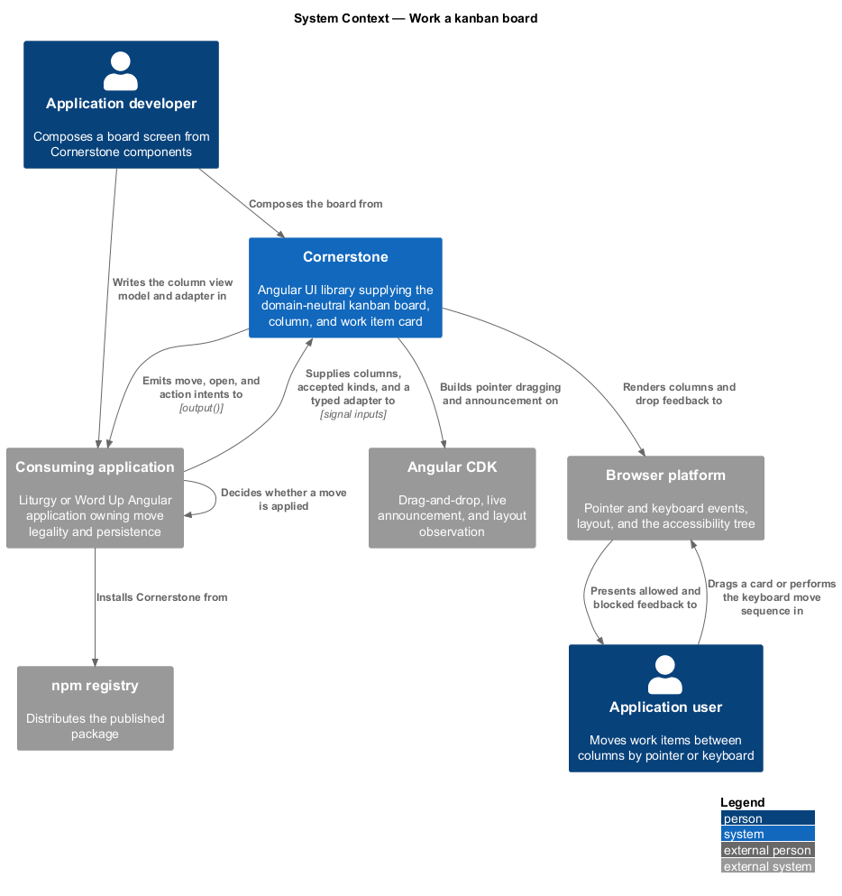
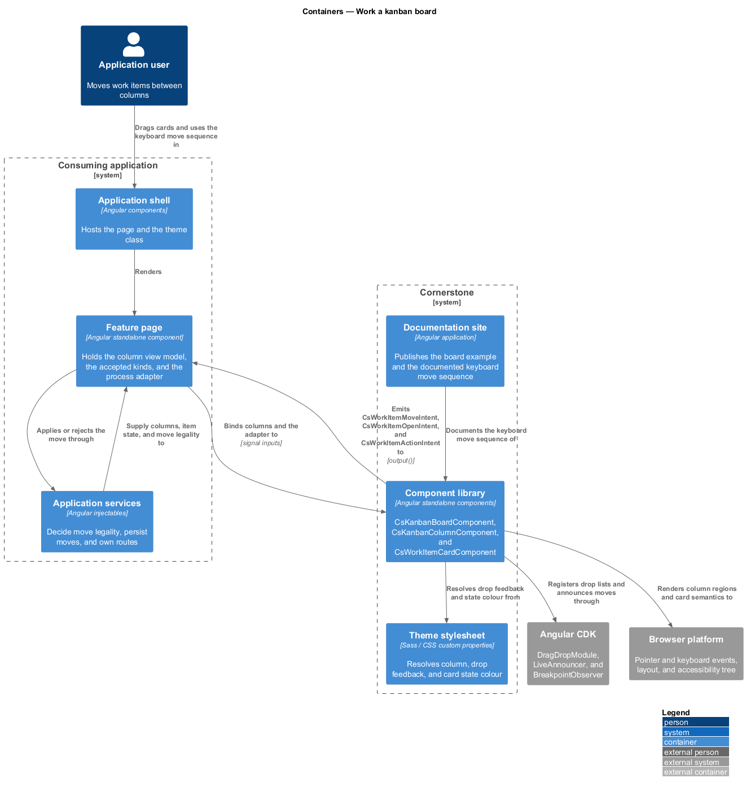
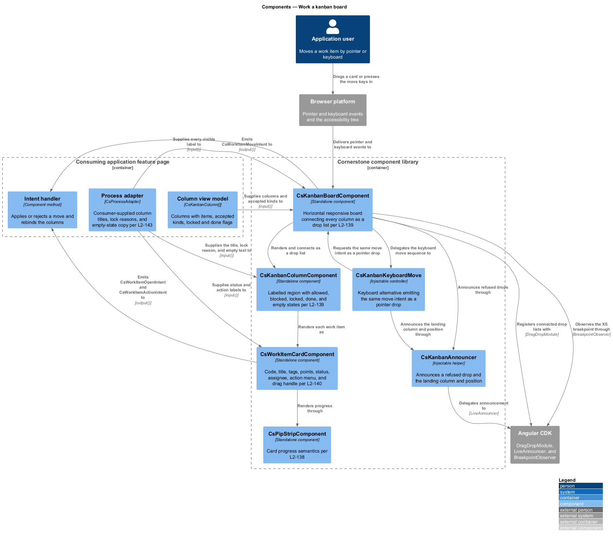
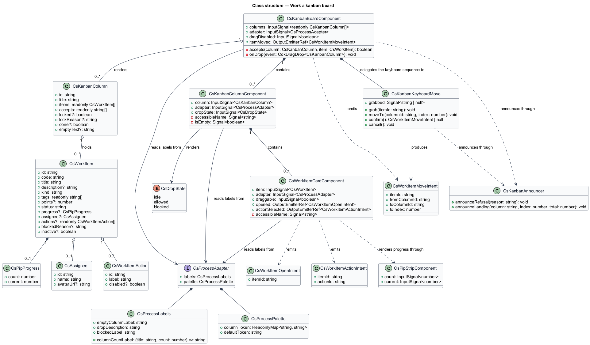
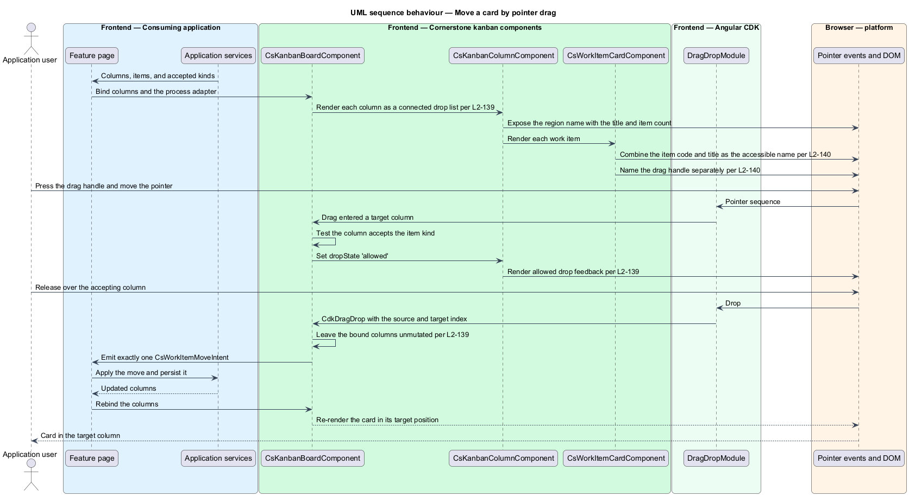
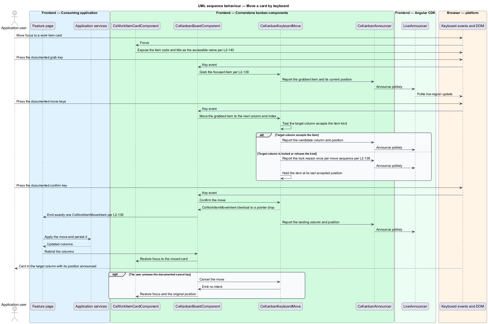
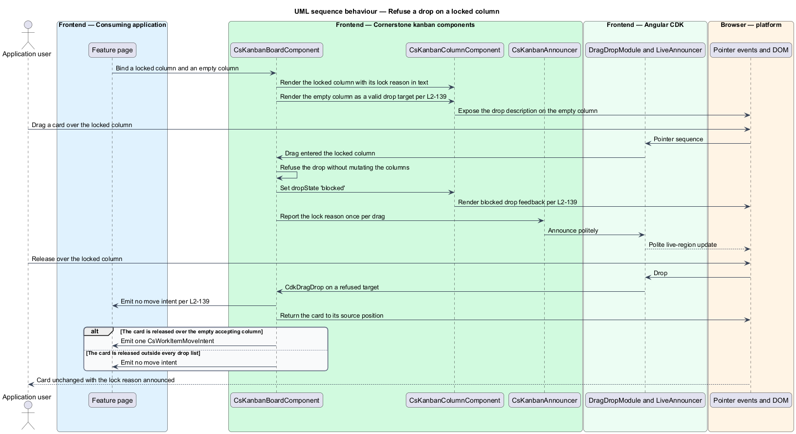

# Work a kanban board

## Overview

Cornerstone is the Angular user-interface library published as `@quinntyne/cornerstone`.
It supplies the components that the Liturgy and Word Up applications compose
their screens from. The process subsystem holds the workflow components that
Liturgy previously owned as `lit-` prefixed application code, generalized so that
no workflow vocabulary belongs to any one application.

**board** — horizontal arrangement of columns across which work items move

**column** — labelled region of a board holding an ordered set of work items and
declaring which items it accepts

**work item** — discrete unit of work that occupies one position in one column

**move intent** — typed output naming a work item, its source column, its target
column, and its target index

This feature covers the board, its columns, and the card that represents a work
item. The board and columns are new; the card replaces Liturgy's `lit-work-card`.
The board builds on the CDK drag-and-drop module for pointer dragging and adds a
keyboard move sequence that reaches the same outcome without a pointer (L2-139).

The board holds no rule about which move is legal. A column declares what it
accepts through its view model, and the application computes that declaration;
the board renders allowed and blocked feedback from it and emits a move intent
that the application either applies or rejects. The board never mutates its own
input. Column titles, lock reasons, and empty-state copy arrive through the
adapter (L2-143), so the same board serves a Liturgy Develop loop and a Word Up
assignment queue.

The work item card embeds the pip strip from the movement feature for its
progress display.

## Description

The feature is a vertical slice from a column view model down to an announced
move. It introduces three components, the drag behaviour, and the intents.

- **`KanbanBoardComponent`** — the board, selector `cs-kanban-board`. Inputs:
  `columns: InputSignal<readonly KanbanColumn[]>`,
  `adapter: InputSignal<CsProcessAdapter>`, and
  `dragDisabled: InputSignal<boolean>`. Output:
  `itemMoved: OutputEmitterRef<WorkItemMoveIntent>`. The board lays columns out
  horizontally and scrolls horizontally at viewport XS, with keyboard scrolling
  available and each column held at or above the documented minimum readable
  width. It registers every column as a CDK drop list within one connected group.
- **`KanbanColumnComponent`** — the column, selector `cs-kanban-column`.
  Inputs: `column: InputSignal<KanbanColumn>`, `adapter`, and
  `dropState: InputSignal<DropState>` holding `'idle'`, `'allowed'`, or
  `'blocked'`. Each column is a labelled region whose accessible name combines
  the column title and its item count. A locked column refuses every drop and
  states its lock reason. An empty column renders the empty state and stays a
  valid drop target with an accessible drop description.
- **`WorkItemCardComponent`** — the card, selector `cs-work-item-card`.
  Inputs: `item: InputSignal<WorkItem>`, `adapter`, and
  `draggable: InputSignal<boolean>`. Outputs:
  `opened: OutputEmitterRef<WorkItemOpenIntent>` and
  `actionSelected: OutputEmitterRef<WorkItemActionIntent>`. The accessible name
  combines the item code and title. `Enter` on the card emits the open intent and
  starts no drag. The drag handle carries its own accessible name, and the action
  menu trigger's accessible name includes the item code. A blocked item states its
  blocked state and reason in text and exposes the reason as an accessible
  description; an inactive item is de-emphasized while holding AA text contrast.
  Progress renders through `PipStripComponent` (L2-138).
- **`KanbanColumn`** — the column view model: `id`, `title`, `items`,
  `accepts` listing the item kinds the column takes, optional `locked`, optional
  `lockReason`, optional `done`, and optional `emptyText`.
- **`WorkItem`** — the item view model: `id`, `code`, `title`, optional
  `description`, `tags`, optional `points`, `status`, optional `progress`,
  optional `assignee`, optional `actions`, optional `blockedReason`, and optional
  `inactive`.
- **`DropState`** — union type of the drop feedback states: `'idle' | 'allowed'
  | 'blocked'`.
- **`WorkItemMoveIntent`** — the move intent: `itemId`, `fromColumnId`,
  `toColumnId`, and `toIndex`. The board emits it exactly once per completed
  move and emits none for a refused drop.
- **`WorkItemOpenIntent`** — the open intent: `itemId`.
- **`WorkItemActionIntent`** — the action-menu intent: `itemId` and `actionId`.
- **`KanbanKeyboardMove`** — the internal controller for the keyboard
  alternative. It holds a grab state, moves the grabbed card between columns and
  positions, emits the same `WorkItemMoveIntent` as a pointer drop, and
  announces the resulting column and position politely.
- **`KanbanAnnouncer`** — the internal live-region helper. It announces a
  refused drop once per drag and announces the landing column and position after
  a keyboard move.

The documented keyboard move sequence, the minimum readable column width at
viewport XS, and the drag-handle activation delay on touch pointers are each
`<TO SUPPLY>`, pending the accessible drag-and-drop pattern review.

## Requirements

The feature realizes the following level-2 (L2) requirements. Each L2 requirement
refines a level-1 (L1) requirement, cited by identifier.

| L2 ID | Refines (L1) | Requirement |
|-------|--------------|-------------|
| `L2-139` | `L1-014` | The library shall provide a CDK drag-and-drop board with a horizontal responsive layout, allowed and blocked drop feedback, locked and done columns, a keyboard move alternative, and empty columns that remain valid drop targets. |
| `L2-140` | `L1-014` | The library shall provide a work item card carrying code, title, and description, tags, points, and status, progress pips, an assignee, an action menu, blocked and inactive states, a drag handle, and an open intent, replacing Liturgy's `lit-work-card`. |

## Diagrams

### System context

An application developer composes a board from Cornerstone. The consuming
application owns which moves are legal and what happens after one; Cornerstone
owns the drag behaviour, the keyboard alternative, and the announcements.

### Containers

The feature page holds the column view model and applies moves. The component
library renders the board on the CDK drag-and-drop module and returns move, open,
and action intents.

### Components

The board composes columns, each column composes work item cards, and the
keyboard move controller emits the same intent as a pointer drop. The adapter is
the only path by which application vocabulary reaches any of the three
components.

### Class structure

`KanbanColumn` declares what it accepts and whether it is locked;
`WorkItem` carries the card's content and state; both the pointer drop and the
keyboard move produce one `WorkItemMoveIntent`.

### Behaviour — move a card by pointer drag

A user drags a card to an accepting column. The board renders allowed feedback
during the hover, emits one move intent on drop, and leaves the input untouched
until the application rebinds it.

### Behaviour — move a card by keyboard

A user grabs a focused card with the documented keyboard sequence, moves it
across columns, and confirms. The board emits the same move intent as a pointer
drop and announces the landing column and position politely.

### Behaviour — refuse a drop

A card is dragged over a locked column, or over a column that does not accept it.
The board renders blocked feedback, refuses the drop, emits no intent, and
announces the lock reason once per drag.

