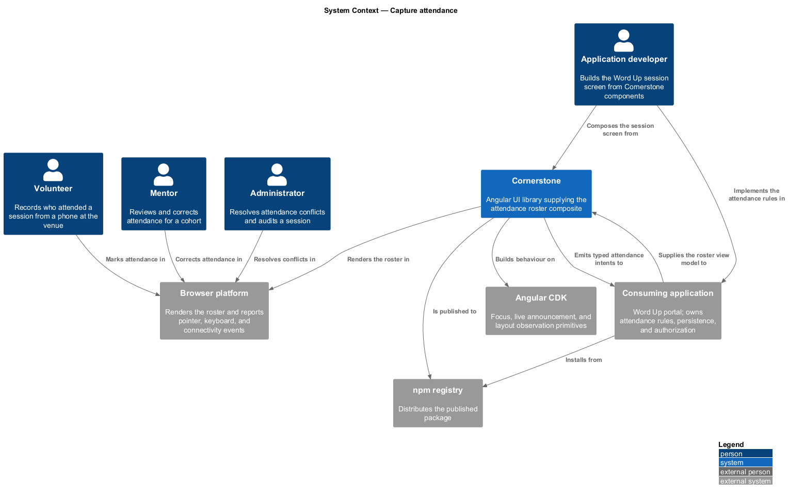
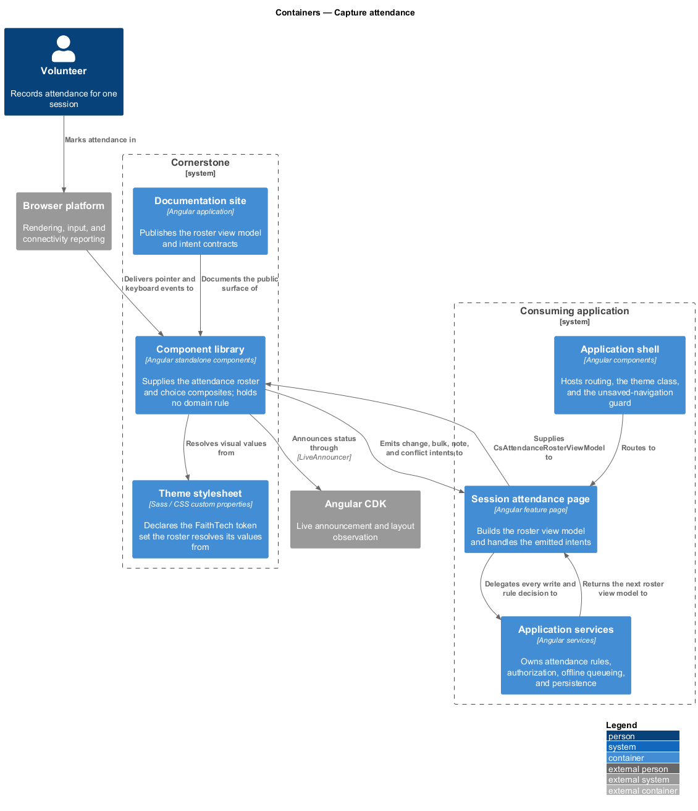
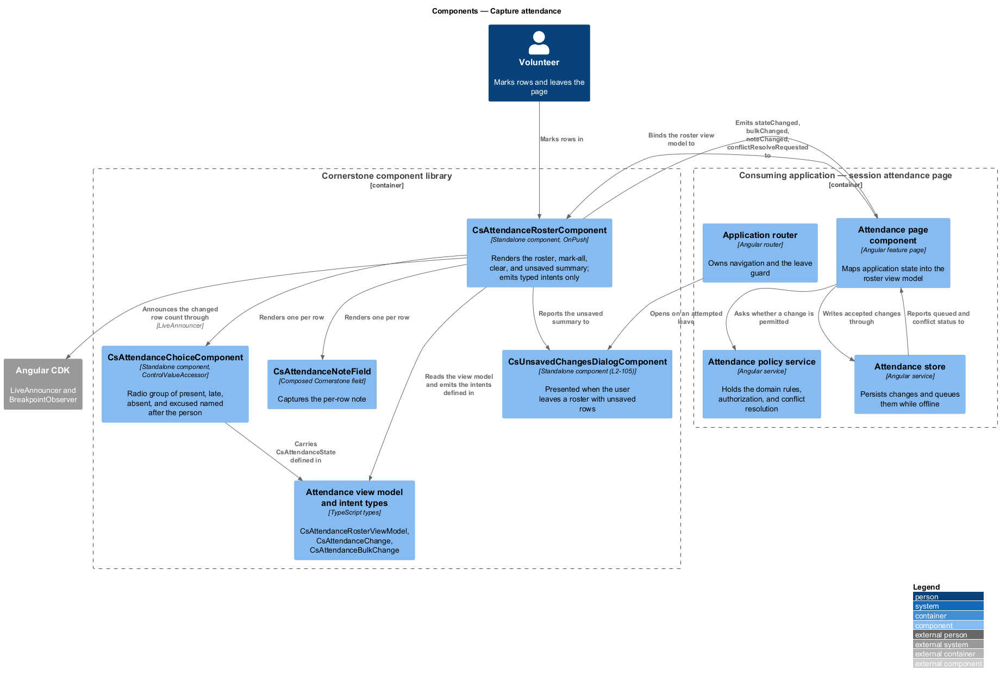
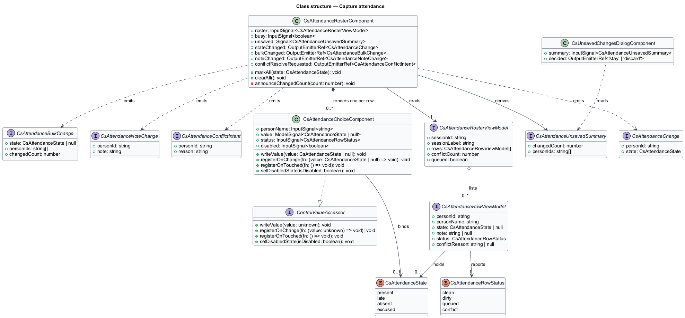
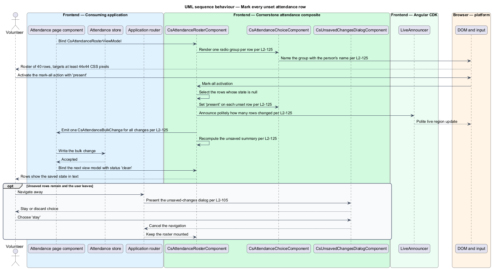
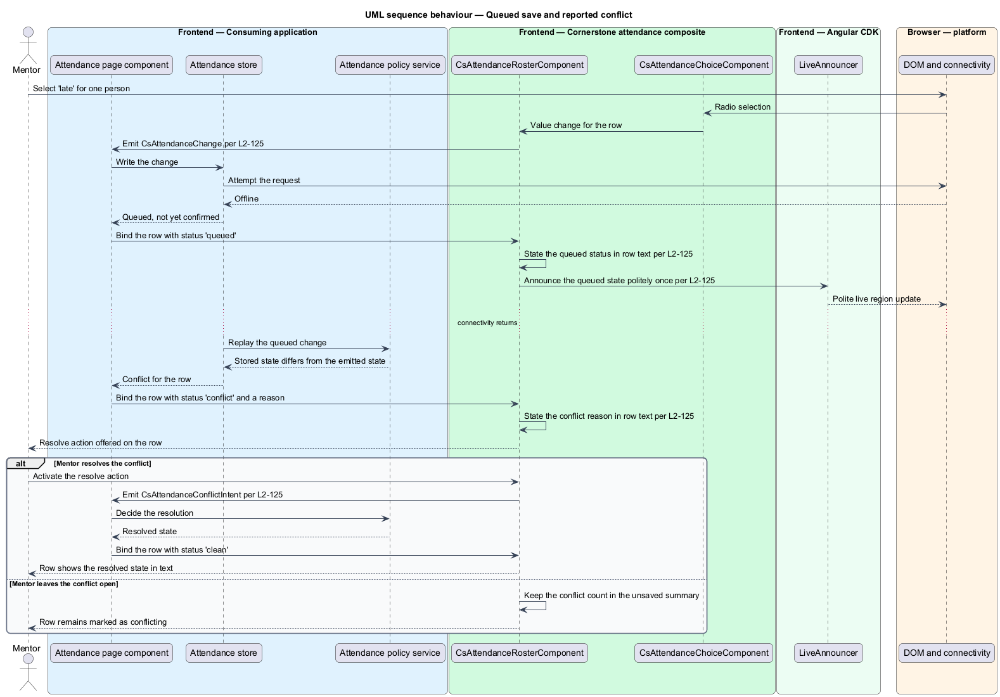

# Capture attendance

## Overview

Cornerstone is the Angular user-interface library published as `@quinntyne/cornerstone`.
It supplies the components that the Liturgy and Word Up applications compose
their screens from, and it carries the FaithTech visual language that makes those
screens look like one product family.

This feature covers the screen on which a volunteer, a mentor, or an
administrator records who came to a session. It presents one row per expected
person, offers four attendance choices per row, supports bulk marking, and
reports what remains unsaved.

**roster** — ordered list of the people expected at one session, each row
carrying one attendance state

**attendance state** — one of present, late, absent, or excused, held against one
person for one session

**mark-all action** — bulk operation that sets every unset row of a roster to one
chosen attendance state

**queued save** — attendance change the consuming application has accepted but
has not yet confirmed against its server

**conflict** — report from the consuming application that a row's stored
attendance state differs from the state the roster last emitted

**unsaved summary** — count of rows whose attendance state or note differs from
the supplied view model

The feature sits in the workflows subsystem, alongside the learning, people, and
operational composites. The Word Up application consumes it on its volunteer,
mentor, and administrator session screens. Liturgy does not consume it.

The roster is a composite. It accepts a typed view model and emits typed intents.
It holds no domain rules, no persistence, no authorization, and no routing. The
consuming application decides whether a change is permitted, writes it, resolves
conflicts, and supplies the next view model. Every diagram in this document draws
that boundary as a line between the Cornerstone components and the application
services beside them.

## Description

The feature is a vertical slice from an application-supplied roster view model
down to a radio group per person and a set of typed intents travelling back.

- **`AttendanceRosterComponent`** — the composite, selector `cs-attendance-roster`.
  It takes `roster: InputSignal<AttendanceRosterViewModel>` and
  `busy: InputSignal<boolean>`, derives `unsaved: Signal<CsAttendanceUnsavedSummary>`,
  and emits `stateChanged`, `bulkChanged`, `noteChanged`, and
  `conflictResolveRequested`. It renders one row per person, a mark-all control, a
  clear control, and a summary of unsaved rows. Its states are clean, dirty,
  queued, and conflict; each state is stated in text on the affected row.
- **`AttendanceChoiceComponent`** — the per-person control, selector
  `cs-attendance-choice`. It implements `ControlValueAccessor` and holds
  `value: ModelSignal<CsAttendanceState | null>`,
  `personName: InputSignal<string>`, `status: InputSignal<CsAttendanceRowStatus>`,
  and `disabled: InputSignal<boolean>`. It renders the four choices as one radio
  group whose accessible name includes the person's name, and each choice target
  measures at least 44 by 44 CSS pixels.
- **`AttendanceRosterViewModel`** — the input type. It carries the session
  identifier, the session label, the row list, the conflict count, and a queued
  flag.
- **`AttendanceRowViewModel`** — one row: the person identifier, the person
  name, the current attendance state or `null`, the note or `null`, the row
  status, and the conflict reason or `null`.
- **`CsAttendanceState`** — union type of the four choices:
  `'present' | 'late' | 'absent' | 'excused'`.
- **`CsAttendanceRowStatus`** — union type of the row states:
  `'clean' | 'dirty' | 'queued' | 'conflict'`.
- **`AttendanceChange`** — intent carrying one person identifier and the new
  attendance state.
- **`AttendanceBulkChange`** — intent carrying every row the mark-all or clear
  action changed, emitted once per action rather than once per row.
- **`AttendanceNoteChange`** — intent carrying one person identifier and the
  new note text.
- **`AttendanceConflictIntent`** — intent asking the application to resolve a
  reported conflict on one row.
- **`CsAttendanceUnsavedSummary`** — derived value holding the changed-row count
  and the changed person identifiers.

The composite announces through the CDK `LiveAnnouncer` (L2-012). The mark-all
action announces the count of rows changed; a queued save announces the queued state
once for the affected rows; a conflict is stated in row text rather than by
announcement alone.

Two neighbouring components complete the slice and are owned elsewhere in the
library. The unsaved-changes dialog (L2-105) is presented when the user attempts
to leave a roster carrying unsaved rows. The confirm dialog (L2-103) is not used
here, because clearing a roster is reversible before the application writes it.

At viewport XS the roster stacks each row into a labelled card. The four choices
stay on one line and remain reachable without horizontal page scrolling for a
40-person roster.

The debounce interval applied to note editing before `noteChanged` is emitted is
`<TO SUPPLY>`.

## Requirements

The feature realizes the following level-2 (L2) requirements. Each L2 requirement
refines a level-1 (L1) requirement, cited by identifier.

| L2 ID | Refines (L1) | Requirement |
|-------|--------------|-------------|
| `L2-125` | `L1-013` | The library shall provide an attendance roster with present, late, absent, and excused choices per person, mark-all and clear actions, per-row notes, conflict and queued status, and an unsaved summary. Each row's choices shall form a radio group named after the person, mark-all shall emit one intent carrying every change, and unsaved changes shall be guarded by the dialog in `L2-105`. |

## Diagrams

### System context

A volunteer, a mentor, or an administrator records attendance in the Word Up
application. That application composes the screen from Cornerstone, which builds
its behaviour on Angular CDK and is installed from the npm registry.

### Containers

The Word Up feature page holds the roster view model and the services that write
attendance. Cornerstone supplies the component library and the theme stylesheet;
neither container reaches the application's data.

### Components

`AttendanceRosterComponent` renders one `AttendanceChoiceComponent` per row
and emits typed intents across the boundary to the application's attendance
service. The domain rules, the persistence, and the authorization sit on the
application side of that boundary.

### Class structure

The roster component reads one `AttendanceRosterViewModel`, composes one choice
component per `AttendanceRowViewModel`, and emits four intent types. The choice
component realizes `ControlValueAccessor` so an application may bind it to a
form control.

### Behaviour — mark every unset row

The volunteer chooses a state for the mark-all action. The roster sets every
unset row, announces the changed count, and emits one bulk intent. The
application writes the change and returns a new view model.

### Behaviour — queued save and reported conflict

A save is queued while the device is offline. The roster states the queued status
on the affected rows. When the application later reports a conflict on one row,
the roster states the reason in text and offers a resolve intent.

