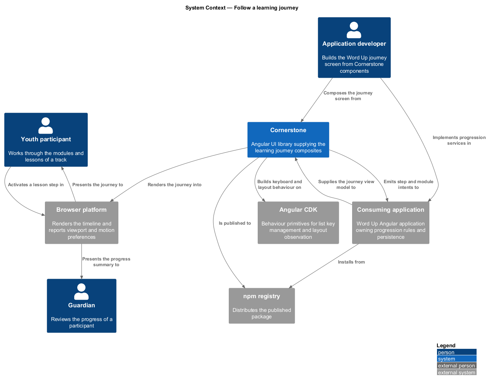
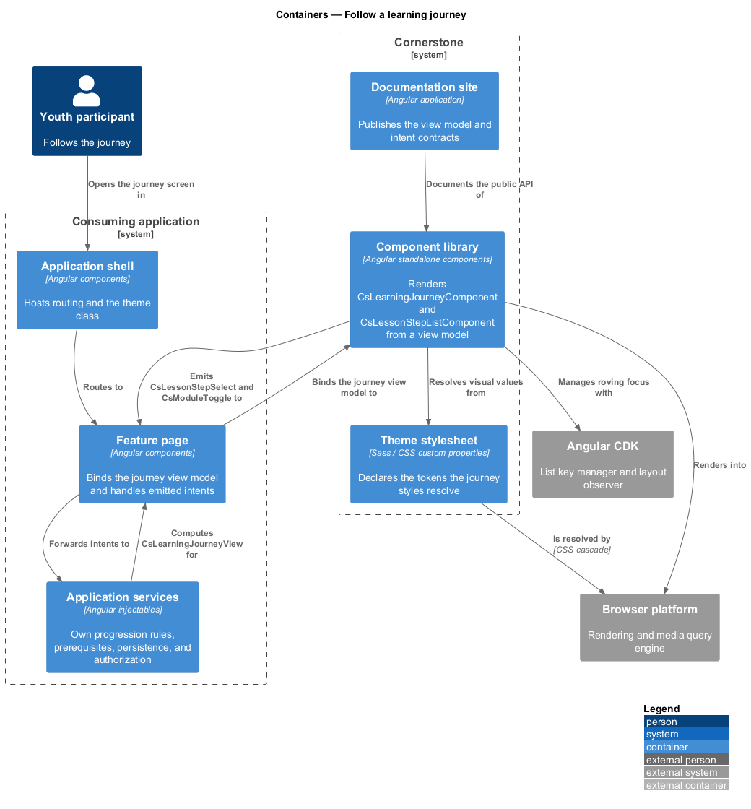
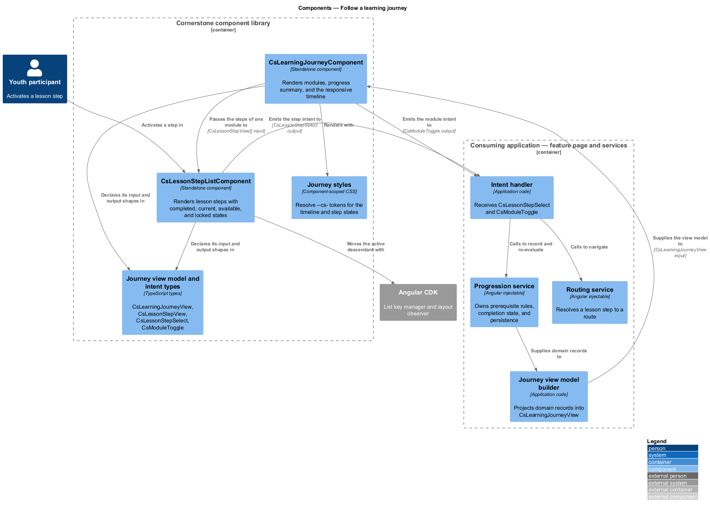
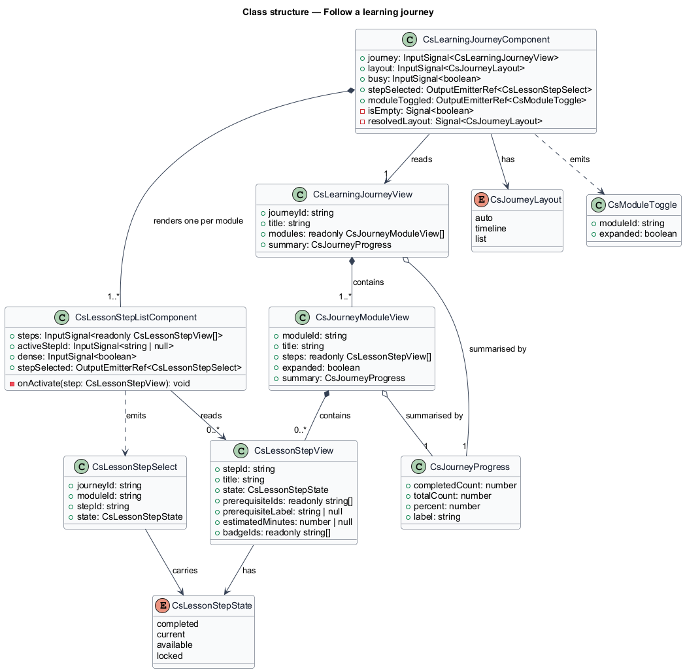
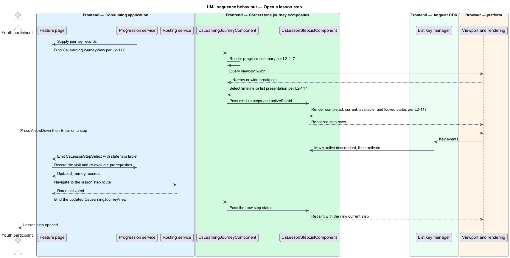
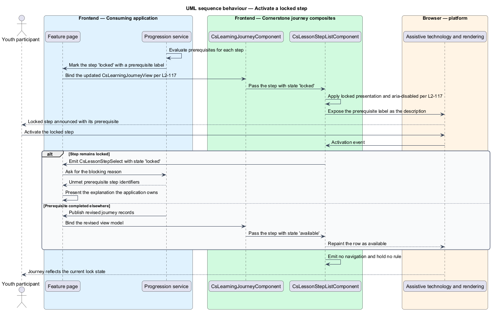

# Follow a learning journey

## Overview

Cornerstone is the Angular user-interface library published as `@quinntyne/cornerstone`.
It supplies the components that the Liturgy and Word Up applications compose
their screens from. This feature belongs to the workflows subsystem, the layer of
compound components that present a whole task rather than a single control.

Word Up presents curriculum to a participant as an ordered path. A participant
sees what is finished, what is open now, and what is still shut. A guardian sees
the same path to judge progress. This feature covers the two components that
render that path.

**learning journey** — ordered sequence of modules and lessons that a participant
works through to complete a track

**module** — named grouping of lessons within a learning journey, carrying its own
completion summary

**lesson step** — single unit of work within a lesson, carrying a completion state
and zero or more prerequisites

**prerequisite** — lesson step whose completion releases another step from the
locked state

**view model** — read-only data structure describing what a composite renders,
computed by the consuming application

**intent** — typed output event naming what a user asked for, stating nothing about
how the application satisfies it

The two components are composites. They accept a typed view model input and emit
typed intents. They hold no domain rules: they do not decide whether a step is
locked, do not compute a completion percentage from raw records, do not read or
write persistence, do not authorize, and do not route. Word Up's application
services own each of those decisions and supply the result as the view model.
A component renders the state it is given and reports what the user did.

The consuming application is Word Up, in the youth and guardian roles.

## Description

The feature is a vertical slice from a Word Up feature page down to the rendered
timeline. It introduces two components, their view model types, and their intent
types.

- **`LearningJourneyComponent`** — the outer composite, selector
  `cs-learning-journey`. It renders the modules of a journey and the progress
  summary above them. Inputs: `journey: InputSignal<LearningJourneyView>`,
  `layout: InputSignal<JourneyLayout>` defaulting to `'auto'`, and
  `busy: InputSignal<boolean>`. Outputs: `stepSelected:
  OutputEmitterRef<LessonStepSelect>` and `moduleToggled:
  OutputEmitterRef<ModuleToggle>`. States: loading, populated, and empty.
  Under `layout` of `'auto'` the component renders a vertical timeline at the
  narrow breakpoint and a two-column timeline at and above the wide breakpoint;
  the breakpoint value is `<TO SUPPLY>`.
- **`LessonStepListComponent`** — the inner composite, selector
  `cs-lesson-step-list`. It renders the steps of one module as a single-select
  list. Inputs: `steps: InputSignal<readonly LessonStepView[]>`,
  `activeStepId: InputSignal<string | null>`, and `dense:
  InputSignal<boolean>`. Output: `stepSelected:
  OutputEmitterRef<LessonStepSelect>`. Each row carries one of four states:
  completed, current, available, or locked.
- **`LearningJourneyView`** — view model of the whole path. Fields:
  `journeyId`, `title`, `modules`, and `summary`.
- **`JourneyModuleView`** — view model of one module. Fields: `moduleId`,
  `title`, `steps`, `expanded`, and `summary`.
- **`LessonStepView`** — view model of one step. Fields: `stepId`, `title`,
  `state`, `prerequisiteIds`, `prerequisiteLabel`, `estimatedMinutes`, and
  `badgeIds`.
- **`LessonStepState`** — union type of the four step states: `'completed' |
  'current' | 'available' | 'locked'`.
- **`JourneyProgress`** — view model of the progress summary. Fields:
  `completedCount`, `totalCount`, `percent`, and `label`. The component renders
  the supplied `percent`; it does not derive one.
- **`LessonStepSelect`** — intent emitted when a user activates a step. Fields:
  `journeyId`, `moduleId`, `stepId`, and `state`. A locked step emits the intent
  with `state` of `'locked'` so the application can explain the block; the
  component itself neither navigates nor suppresses the emission.
- **`ModuleToggle`** — intent emitted when a user expands or collapses a
  module. Fields: `moduleId` and `expanded`.
- **`JourneyLayout`** — union type of the layout selections: `'auto' |
  'timeline' | 'list'`.

Both components are standalone and use `OnPush` change detection. Keyboard
interaction on the step list follows the CDK list-key-manager pattern: arrow keys
move the active descendant, `Home` and `End` jump to the ends, and `Enter` or
`Space` emits `stepSelected`. A locked step stays focusable and carries
`aria-disabled="true"` with its `prerequisiteLabel` as the accessible
description, so the reason for the block reaches assistive technology.

The progress summary renders as a labelled `progressbar` role with
`aria-valuenow`, `aria-valuemin`, and `aria-valuemax`. Under
`prefers-reduced-motion: reduce` the fill changes without transition.

## Requirements

The feature realizes the following level-2 (L2) requirements. Each L2 requirement
refines a level-1 (L1) requirement, cited by identifier.

| L2 ID | Refines (L1) | Requirement |
|-------|--------------|-------------|
| `L2-117` | `L1-013` | The library shall provide module and lesson progression with completed, current, and locked states, prerequisite indication, a progress summary, and a responsive timeline or list presentation. |

## Diagrams

### System context

A youth participant follows a journey and a guardian reviews it. Word Up composes
both screens from Cornerstone, which draws its behaviour from Angular CDK and
reaches the participant through the browser.

### Containers

The Word Up feature page holds the journey screen; application services compute
the view model and act on the emitted intents. The Cornerstone component library
renders the path and reads its visual values from the theme stylesheet.

### Components

`LearningJourneyComponent` receives `LearningJourneyView` from Word Up's
progression service and emits `LessonStepSelect` back to it. The boundary is
one-directional in data and one-directional in intent: no Cornerstone component
calls a service, and no Cornerstone component decides a lock.

### Class structure

`LearningJourneyComponent` composes one `LessonStepListComponent` per module.
The view model types are read-only records; the intent types carry identifiers
only.

### Behaviour — open a lesson step

A participant activates an available step. The list emits `LessonStepSelect`,
Word Up's progression service resolves the route and records the visit, and the
updated view model flows back down.

### Behaviour — activate a locked step

A participant activates a step whose prerequisite is unmet. The component emits
the same intent with a `'locked'` state and renders the prerequisite label; the
application decides what to show and supplies the explanation.

