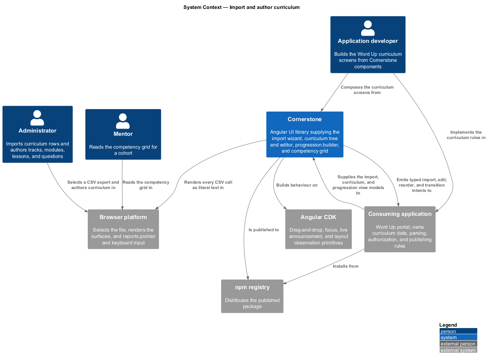
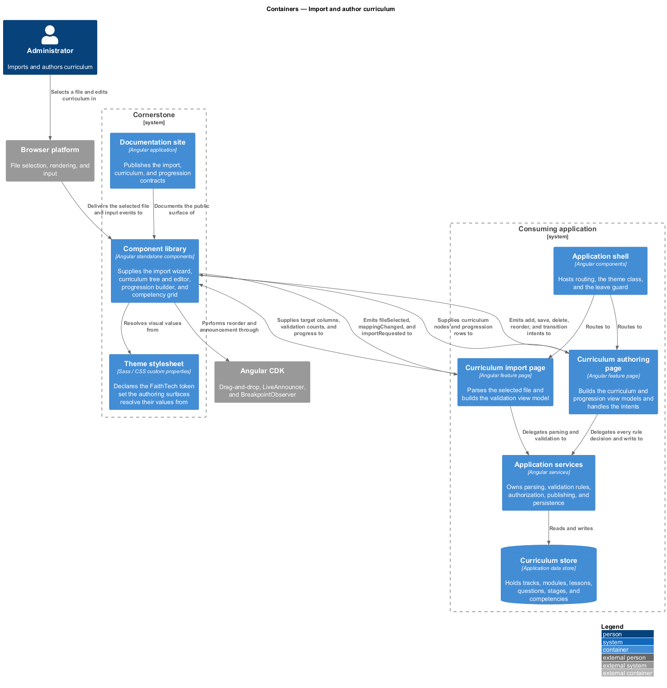
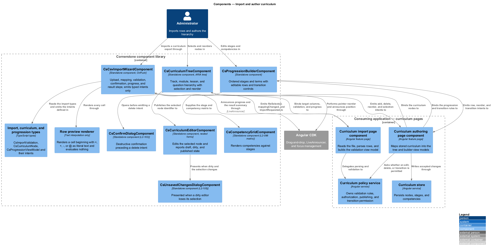
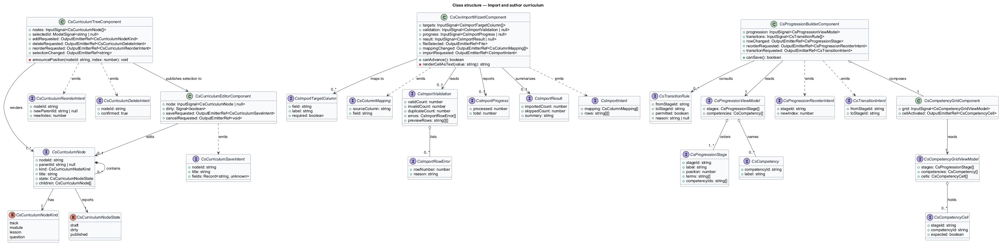
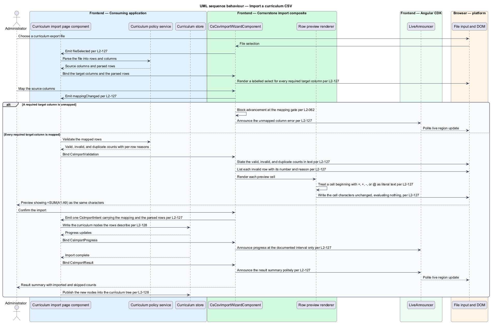
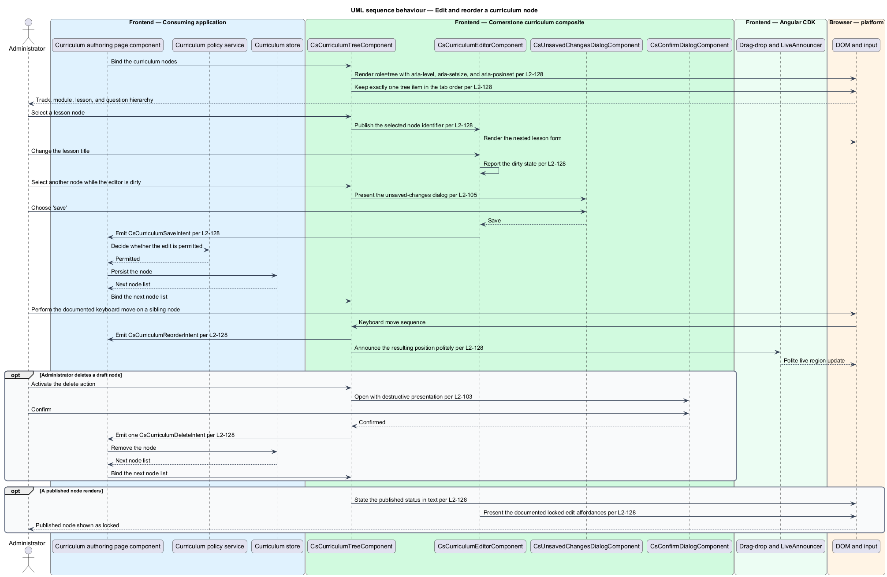
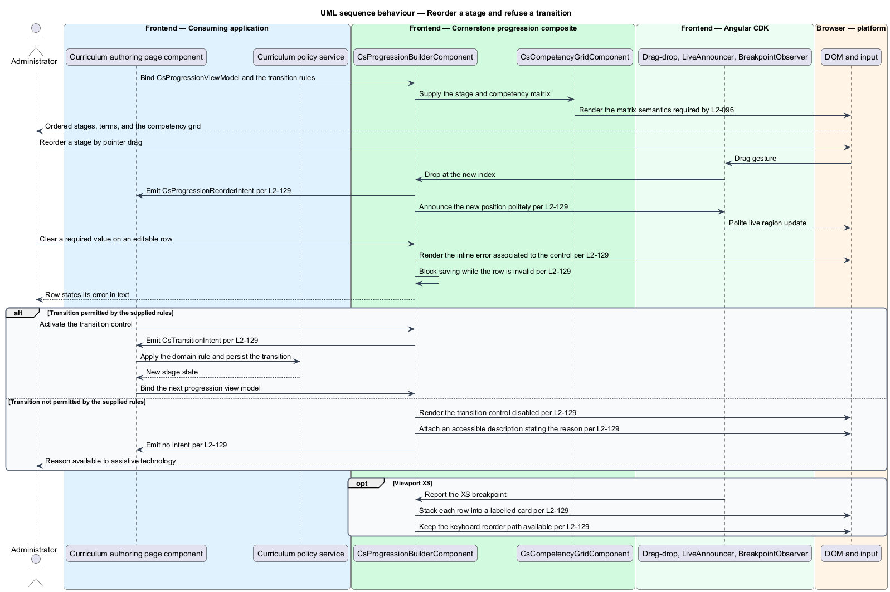

# Import and author curriculum

## Overview

Cornerstone is the Angular user-interface library published as `@quinntyne/cornerstone`.
It supplies the components that the Liturgy and Word Up applications compose
their screens from, and it carries the FaithTech visual language that makes those
screens look like one product family.

This feature covers the administrator's authoring surface: the wizard that brings
curriculum rows in from a spreadsheet export, the tree and editor that shape
those rows into a teaching hierarchy, and the builder and grid that describe how
a young person progresses through it.

**curriculum** — hierarchy of tracks, modules, lessons, and questions that
defines what is taught and in what order

**track** — outermost curriculum node, holding modules

**module** — curriculum node holding lessons within one track

**lesson** — curriculum node holding questions within one module

**question** — innermost curriculum node, carrying the prompt a young person
answers

**draft state** — curriculum node saved but not yet released for teaching

**published state** — curriculum node released for teaching, whose edit
affordances follow the documented locked presentation

**dirty state** — curriculum node holding editor changes not yet saved

**column mapping** — correspondence between a source spreadsheet column and a
target curriculum field

**stage** — ordered step of a progression, holding the terms and competencies
expected at that step

**competency** — named skill or understanding assessed against a stage

The feature sits in the workflows subsystem, alongside the learning, people, and
operational composites. The Word Up application consumes it on its administrator
curriculum and progression screens; the competency grid is also consumed on the
mentor's cohort screen. Liturgy does not consume it.

Every component in the feature is a composite. Each accepts a typed view model
and emits typed intents. None holds domain rules, persistence, authorization, or
routing. The wizard parses nothing into the application's data model, the tree
performs no reorder of its own input, and the builder decides no transition; each
reports what the user asked for and waits for the next view model.

One parsing rule belongs to the library rather than the application. A CSV cell
whose value begins with `=`, `+`, `-`, or `@` is a formula in a spreadsheet
program, and rendering such a value as anything but text invites a spreadsheet
injection. The wizard renders every cell as literal text. It never evaluates a
cell, never treats a leading `=`, `+`, `-`, or `@` as an operator, and never
places cell content anywhere a formula could be interpreted.

## Description

The feature is a vertical slice from a spreadsheet file selected in the browser
through to a curriculum hierarchy and a progression matrix, and back out as typed
intents.

- **`CsvImportWizardComponent`** — the import composite, selector
  `cs-csv-import-wizard`. It takes `targets: InputSignal<ImportTargetColumn[]>`,
  `validation: InputSignal<CsImportValidation | null>`, and
  `progress: InputSignal<CsImportProgress | null>`, and it emits `fileSelected`,
  `mappingChanged`, and `importRequested`. Its five steps are upload, mapping,
  validation, confirmation, and result. It uses the wizard behaviour of L2-062,
  including the validation gate between steps.
- **`ImportCellText`** — the rendering rule applied to every preview cell. The
  wizard binds cell values through text interpolation only. A value beginning
  with `=`, `+`, `-`, or `@` renders as the same characters the file holds, and
  the wizard performs no evaluation, no expression parsing, and no formula
  detection that would change the rendered characters.
- **`CurriculumTreeComponent`** — the hierarchy composite, selector
  `cs-curriculum-tree`. It takes `nodes: InputSignal<CsCurriculumNode[]>` and
  `selectedId: ModelSignal<string | null>`, and emits `addRequested`,
  `deleteRequested`, `reorderRequested`, and `selectionChanged`. It implements
  the ARIA tree pattern with `role="tree"`, `role="treeitem"`, `aria-expanded`,
  `aria-level`, `aria-setsize`, and `aria-posinset`, and it keeps exactly one
  item in the tab order.
- **`CurriculumEditorComponent`** — the node editor, selector
  `cs-curriculum-editor`. It takes `node: InputSignal<CsCurriculumNode | null>`,
  holds `dirty: Signal<boolean>`, and emits `saveRequested` and `cancelRequested`.
  It presents nested forms for a track, a module, a lesson, or a question
  according to the selected node's kind.
- **`ProgressionBuilderComponent`** — the progression composite, selector
  `cs-progression-builder`. It takes
  `progression: InputSignal<CsProgressionViewModel>` and
  `transitions: InputSignal<CsTransitionRule[]>`, and emits `rowChanged`,
  `reorderRequested`, and `transitionRequested`. A transition the supplied rules
  do not permit renders as a disabled control carrying an accessible description
  stating why.
- **`CompetencyGridComponent`** — the matrix composite, selector
  `cs-competency-grid`. It takes `grid: InputSignal<CsCompetencyGridViewModel>`
  and emits `cellActivated`. It satisfies the matrix semantics of L2-096.
- **`CsCurriculumNode`** — one node: the identifier, the kind, the title, the
  child list, the lifecycle state, and the parent identifier.
- **`CsCurriculumNodeKind`** — union type of the four levels:
  `'track' | 'module' | 'lesson' | 'question'`.
- **`CsCurriculumNodeState`** — union type of the lifecycle states:
  `'draft' | 'dirty' | 'published'`.
- **`ImportTargetColumn`**, **`CsColumnMapping`**, **`CsImportValidation`**,
  **`CsImportRowError`**, **`CsImportProgress`**, **`CsImportResult`** — the
  import types, carrying the target field list, the chosen mapping, the valid,
  invalid, and duplicate counts, the per-row errors with row number and reason,
  the progress value, and the completion summary.
- **`CsCurriculumReorderIntent`**, **`CsCurriculumDeleteIntent`**,
  **`CsCurriculumSaveIntent`**, **`CsImportIntent`**,
  **`CsProgressionReorderIntent`**, **`CsTransitionIntent`** — the typed intents
  the five components emit.

Reordering runs through CDK drag-and-drop (L2-014) for pointer input and through
the documented keyboard move sequence for keyboard input. Both paths emit the
same reorder intent and announce the resulting position politely through the CDK
`LiveAnnouncer` (L2-012).

Deleting a node opens the destructive confirm dialog (L2-103) before a single
delete intent is emitted. Selecting another node while the editor is dirty opens
the unsaved-changes dialog (L2-105).

At viewport XS the progression builder stacks each row into a labelled card, and
reorder stays available from the keyboard.

The documented interval at which import progress is announced is `<TO SUPPLY>`.
The keystroke sequence that performs a keyboard move in the tree and the builder
is `<TO SUPPLY>`.

## Requirements

The feature realizes the following level-2 (L2) requirements. Each L2 requirement
refines a level-1 (L1) requirement, cited by identifier.

| L2 ID | Refines (L1) | Requirement |
|-------|--------------|-------------|
| `L2-127` | `L1-013` | The library shall provide a CSV import wizard covering upload, column mapping, validation counts, row preview with per-row errors, confirmation, progress, and a result summary, gated between steps per `L2-062`. It shall emit one import intent carrying the mapping and the parsed rows, and shall render a cell beginning with `=`, `+`, `-`, or `@` as literal text without ever evaluating it. |
| `L2-128` | `L1-013` | The library shall provide a curriculum tree and node editor covering the track, module, lesson, and question hierarchy with add, edit, delete, and reorder operations, selection, nested forms, and draft, dirty, and published states. The tree shall implement the ARIA tree pattern, pointer and keyboard reorder shall emit the same typed intent, deletion shall be preceded by the confirm dialog in `L2-103`, and leaving a dirty editor shall be guarded by the dialog in `L2-105`. |
| `L2-129` | `L1-013` | The library shall provide a progression builder and competency grid covering ordered stages, terms, and competencies with editable rows, state transitions, validation, and matrix visualization. A cleared required value shall report an associated inline error and block saving, an impermissible transition shall render disabled with an accessible reason, and the grid shall satisfy the matrix semantics in `L2-096`. |

## Diagrams

### System context

An administrator imports a curriculum export and then authors the hierarchy and
the progression; a mentor reads the resulting competency grid. The Word Up
application owns the curriculum data and every rule about it.

### Containers

The Word Up curriculum pages build the view models for the wizard, the tree, the
editor, the builder, and the grid. Cornerstone supplies the components and the
theme stylesheet; the file the administrator selects is read in the browser and
its rows leave the library only inside an import intent.

### Components

The five composites sit inside the component library boundary and emit intents
across it. The parsing rule, the persistence, the authorization, and the
publishing decision all sit on the application side; the wizard's preview
renderer is the one place the library applies a rule of its own, and that rule is
to render every cell as literal text.

### Class structure

The import types feed the wizard, the curriculum node type feeds both the tree
and the editor, and the progression types feed the builder and the grid. Every
component emits intent types and holds no store.

### Behaviour — import a curriculum CSV

The administrator selects a file, maps the columns, reads the validation counts
and the row preview, and confirms. A preview cell beginning with `=` renders as
literal text at every step, and the confirmed rows leave the wizard as one
intent.

### Behaviour — edit and reorder a curriculum node

The administrator selects a node, edits it, reorders a sibling by keyboard, and
deletes another. Each operation emits one intent, and the dirty editor and the
delete action are each guarded by a dialog.

### Behaviour — reorder a stage and refuse a transition

The administrator reorders a progression stage, clears a required value, and
attempts a transition the supplied rules do not permit. The builder reports the
inline error, blocks the save, and renders the transition control disabled with a
stated reason.

