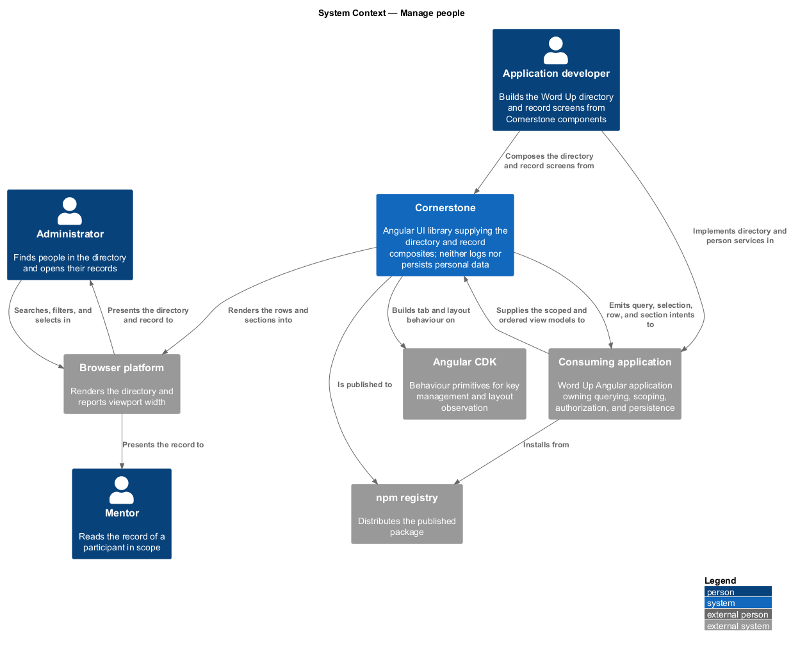
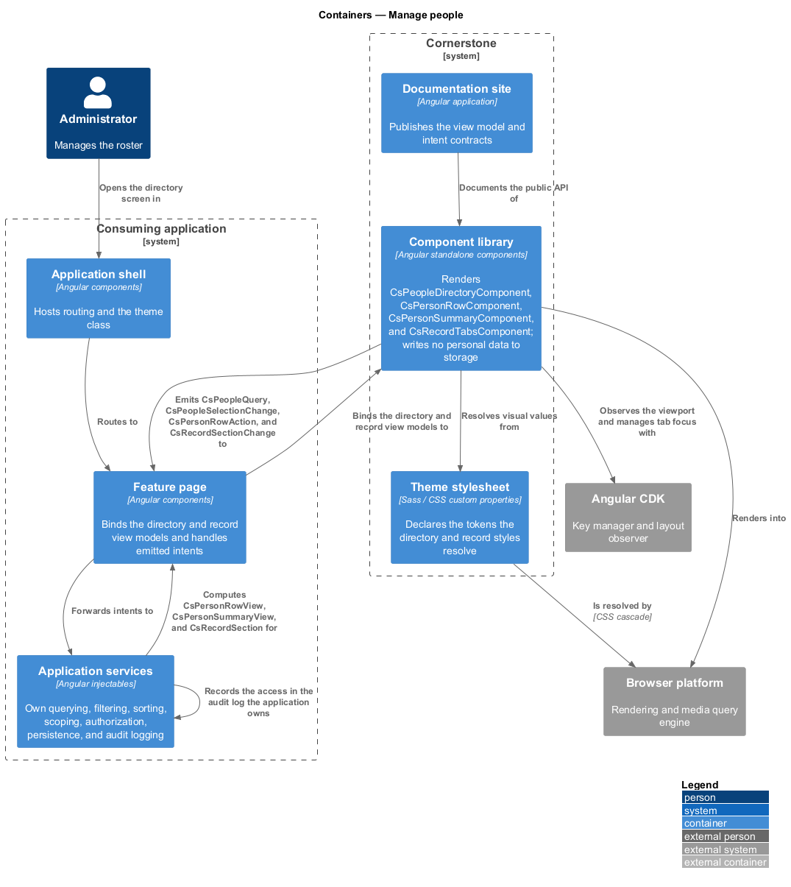
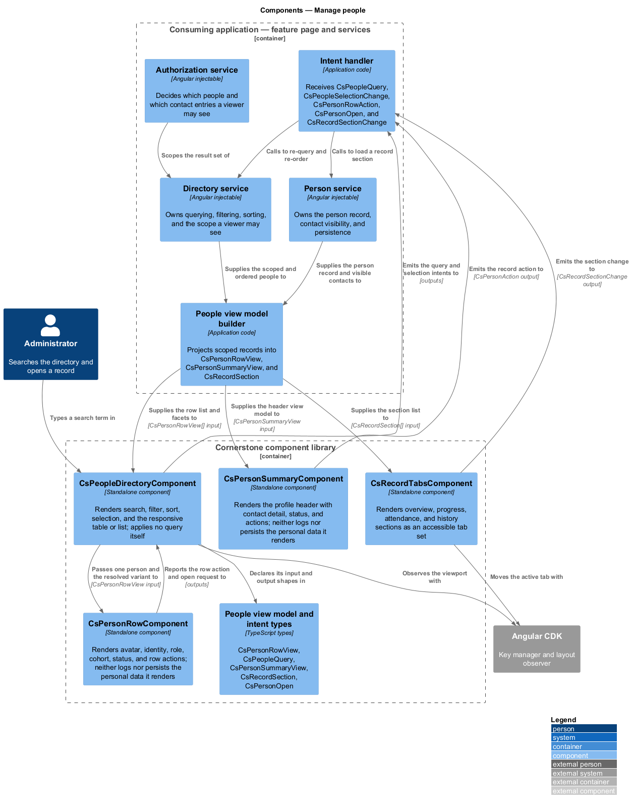
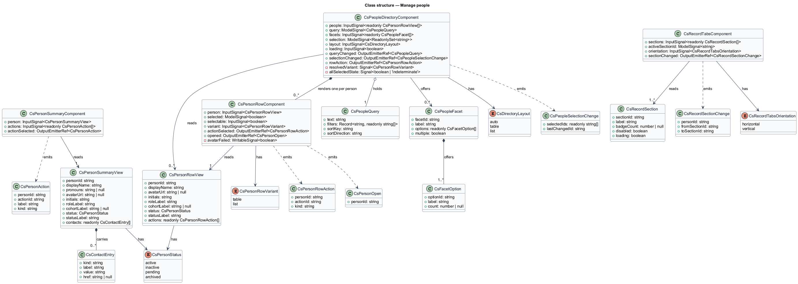
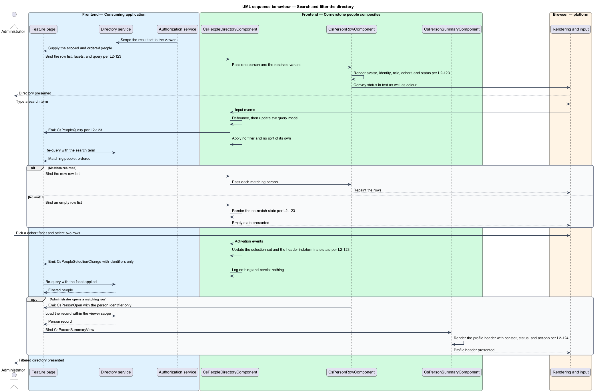
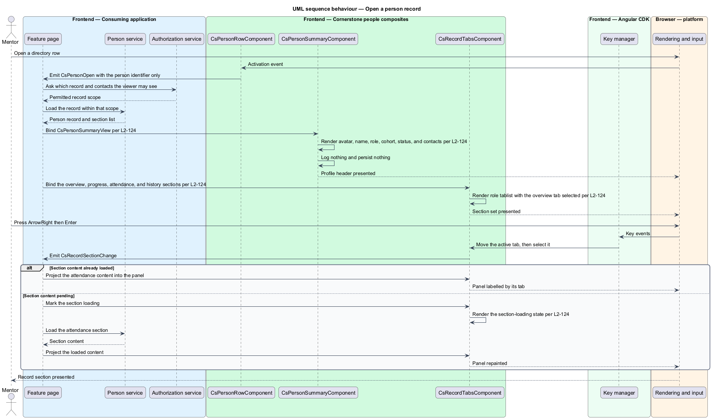
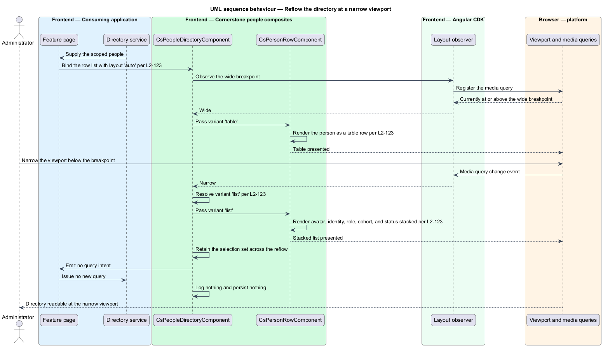

# Manage people

## Overview

Cornerstone is the Angular user-interface library published as `@quinntyne/cornerstone`.
It supplies the components that the Liturgy and Word Up applications compose
their screens from. This feature belongs to the workflows subsystem, the layer of
compound components that present a whole task rather than a single control.

Word Up gives administrators and mentors a roster of the people in a programme
and a record for each one. An administrator finds a person, opens the record, and
reads the sections that describe that person's participation. This feature covers
the four components that present the directory and the record.

**directory** — searchable, filterable, sortable presentation of the people in
scope for the current viewer

**person row** — single entry in a directory, carrying identity, role, cohort, and
status

**cohort** — named group a person belongs to for the length of a programme

**person record** — full presentation of one person, comprising a summary header
and a set of sections

**record section** — one named area of a person record, such as overview,
progress, attendance, or history

**view model** — read-only data structure describing what a composite renders,
computed by the consuming application

**intent** — typed output event naming what a user asked for, stating nothing about
how the application satisfies it

The four components are composites. They accept a typed view model input and emit
typed intents. They hold no domain rules: they do not query, do not filter or
sort the underlying data, do not decide which people a viewer may see, do not
read or write persistence, do not authorize, and do not route. Word Up's
application services own each of those decisions and supply the already-scoped,
already-ordered result as the view model.

These components render personal data: names, avatars, roles, cohorts, statuses,
and participation history. The components neither log nor persist that data. They
hold it in component state for the lifetime of the rendered view only, write no
copy to storage of any kind, emit no telemetry, and send it nowhere. Every intent
they emit carries identifiers and view-level selections, never the personal
fields themselves.

The consuming application is Word Up, in the administrator and mentor roles for
the directory and in all roles for the record.

## Description

The feature is a vertical slice from a Word Up directory page and record page
down to the rendered row and section surfaces. It introduces four components,
their view model types, and their intent types.

- **`PeopleDirectoryComponent`** — the directory composite, selector
  `cs-people-directory`. It renders the search field, the filter and sort
  controls, the rows, and the selection summary. Inputs: `people:
  InputSignal<readonly PersonRowView[]>`, `query: ModelSignal<PeopleQuery>`,
  `facets: InputSignal<readonly PeopleFacet[]>`, `selection:
  ModelSignal<ReadonlySet<string>>`, `layout: InputSignal<DirectoryLayout>`
  defaulting to `'auto'`, and `loading: InputSignal<boolean>`. Outputs:
  `queryChanged: OutputEmitterRef<PeopleQuery>`, `selectionChanged:
  OutputEmitterRef<PeopleSelectionChange>`, and `rowAction:
  OutputEmitterRef<PersonRowAction>`. States: loading, populated, empty, and
  no-match.
- **`PersonRowComponent`** — the row composite, selector `cs-person-row`. It
  renders one person's avatar, identity, role, cohort, and status, along with the
  row actions open to the viewer. Inputs: `person:
  InputSignal<PersonRowView>`, `selected: ModelSignal<boolean>`,
  `selectable: InputSignal<boolean>`, and `variant:
  InputSignal<PersonRowVariant>`. Outputs: `actionSelected:
  OutputEmitterRef<PersonRowAction>` and `opened:
  OutputEmitterRef<CsPersonOpen>`. States: default, selected, and inactive.
- **`PersonSummaryComponent`** — the header composite, selector
  `cs-person-summary`. It renders the profile header: avatar, name, pronouns when
  supplied, role, cohort, status, contact entries, and the record-level actions.
  Inputs: `person: InputSignal<PersonSummaryView>` and `actions:
  InputSignal<readonly PersonAction[]>`. Output: `actionSelected:
  OutputEmitterRef<PersonAction>`. States: active, inactive, and archived.
- **`RecordTabsComponent`** — the section composite, selector
  `cs-record-tabs`. It renders the record sections as an accessible tab set and
  projects the active section's content. Inputs: `sections:
  InputSignal<readonly RecordSection[]>`, `activeSectionId:
  ModelSignal<string>`, and `orientation:
  InputSignal<RecordTabsOrientation>`. Output: `sectionChanged:
  OutputEmitterRef<RecordSectionChange>`. States: idle and section-loading.
- **`PersonRowView`** — view model of one directory entry. Fields: `personId`,
  `displayName`, `avatarUrl`, `initials`, `roleLabel`, `cohortLabel`, `status`,
  `statusLabel`, and `actions`.
- **`PersonStatus`** — union type of the statuses: `'active' | 'inactive' |
  'pending' | 'archived'`.
- **`PeopleQuery`** — view model of the current search, filter, and sort
  selection. Fields: `text`, `filters`, `sortKey`, and `sortDirection`. The
  component holds this as a `model()` signal and emits it; it applies none of it
  to the row list.
- **`PeopleFacet`** — view model of one filter facet. Fields: `facetId`,
  `label`, `options`, and `multiple`.
- **`DirectoryLayout`** — union type of the layout selections: `'auto' |
  'table' | 'list'`. Under `'auto'` the directory renders a table at and above
  the wide breakpoint and a stacked list below it; the breakpoint value is
  `<TO SUPPLY>`.
- **`PersonRowVariant`** — union type of the row presentations: `'table' |
  'list'`.
- **`PeopleSelectionChange`** — intent emitted when the selected set changes.
  Fields: `selectedIds` and `lastChangedId`.
- **`PersonRowAction`** — intent emitted when a viewer picks a row action.
  Fields: `personId`, `actionId`, and `kind`.
- **`CsPersonOpen`** — intent emitted when a viewer opens a person. Field:
  `personId`.
- **`PersonSummaryView`** — view model of a record header. Fields: `personId`,
  `displayName`, `pronouns`, `avatarUrl`, `initials`, `roleLabel`,
  `cohortLabel`, `status`, `statusLabel`, and `contacts`.
- **`ContactEntry`** — view model of one contact entry. Fields: `kind`,
  `label`, `value`, and `href`. The application decides which entries a viewer
  may see; the component renders the list it is given.
- **`PersonAction`** — intent naming a record-level action. Fields: `personId`,
  `actionId`, `label`, and `kind`.
- **`RecordSection`** — view model of one section. Fields: `sectionId`,
  `label`, `badgeCount`, `disabled`, and `loading`.
- **`RecordSectionChange`** — intent emitted on a section change. Fields:
  `personId`, `fromSectionId`, and `toSectionId`.
- **`RecordTabsOrientation`** — union type of the tab orientations:
  `'horizontal' | 'vertical'`.

All four components are standalone and use `OnPush` change detection.
`PeopleDirectoryComponent` composes one `PersonRowComponent` per entry and
passes the `variant` its resolved layout calls for.

`RecordTabsComponent` implements the ARIA tabs pattern over the CDK key
manager: the tab list carries `role="tablist"`, arrow keys move the active tab,
`Home` and `End` jump to the ends, and each panel carries `role="tabpanel"`
labelled by its tab. A disabled section stays focusable and carries
`aria-disabled="true"`. The section content is projected by the consuming
application; the component renders no personal field of its own inside a panel.

The directory search field debounces before it emits `queryChanged`; the debounce
interval is `<TO SUPPLY>`. Row selection uses a checkbox per row with an accessible
name naming the person, and the header checkbox reports an indeterminate state
when the selection is partial. Status is conveyed in text as well as in colour.
Avatars fall back to the supplied `initials` when `avatarUrl` is absent or fails
to load, and the component requests no image from any other origin.

## Requirements

The feature realizes the following level-2 (L2) requirements. Each L2 requirement
refines a level-1 (L1) requirement, cited by identifier.

| L2 ID | Refines (L1) | Requirement |
|-------|--------------|-------------|
| `L2-123` | `L1-013` | The library shall provide search, filter, and sort controls, avatar, identity, role, cohort, and status presentation, selection, row actions, and a responsive list or table layout. |
| `L2-124` | `L1-013` | The library shall provide a profile header with contact detail, status, and actions, and accessible overview, progress, attendance, and history sections. |

## Diagrams

### System context

An administrator finds a person and a mentor reads the record. Word Up owns the
query, the scoping, and the authorization; Cornerstone renders the directory and
the record and holds no personal data beyond the rendered view.

### Containers

The Word Up directory page and record page bind view models and forward intents
to application services. The Cornerstone component library renders the rows and
sections and reads its visual values from the theme stylesheet.

### Components

Word Up's directory and person services build the view models and receive the
intents. `PeopleDirectoryComponent` neither filters nor sorts, and neither it
nor `PersonSummaryComponent` logs or persists the personal fields it renders.

### Class structure

The directory composite holds a `PeopleQuery` and a selection set as `model()`
signals and passes each row its own view model. The record composites sit over a
separate summary and section family.

### Behaviour — search and filter the directory

An administrator types a search term and picks a facet. The directory emits the
query, the application returns a scoped and ordered list, and the rows re-render.

### Behaviour — open a person record

A viewer opens a row. The application resolves the record it is authorized to
show, the summary header renders it, and the tab set moves between sections.

### Behaviour — reflow the directory at a narrow viewport

The viewport crosses below the wide breakpoint. The directory switches from a
table to a stacked list and passes each row the matching variant, without
re-querying the application.

