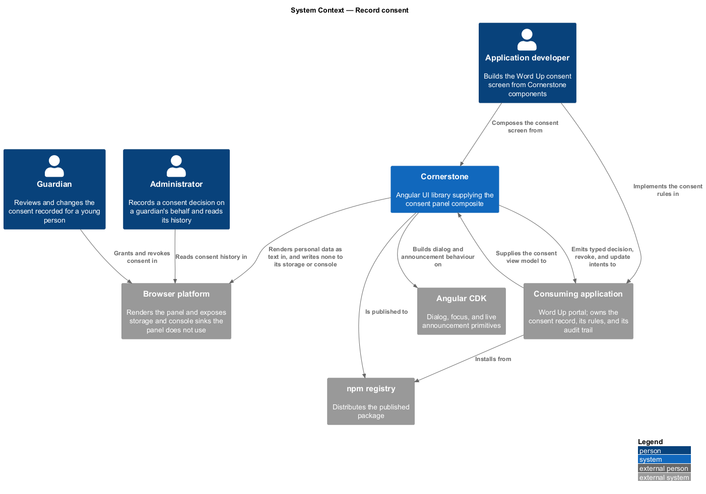
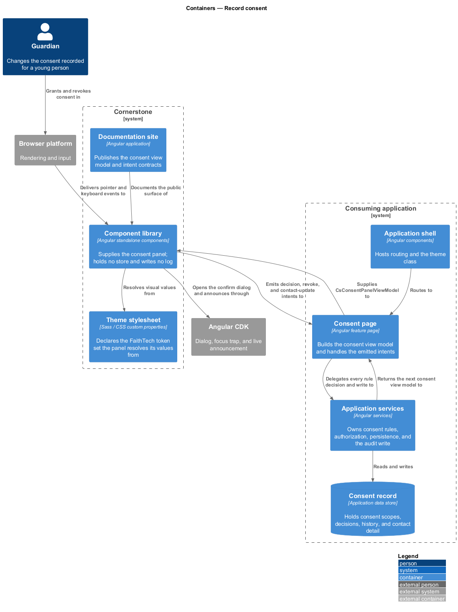
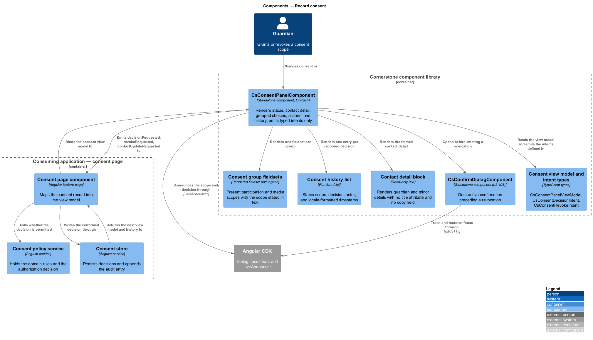
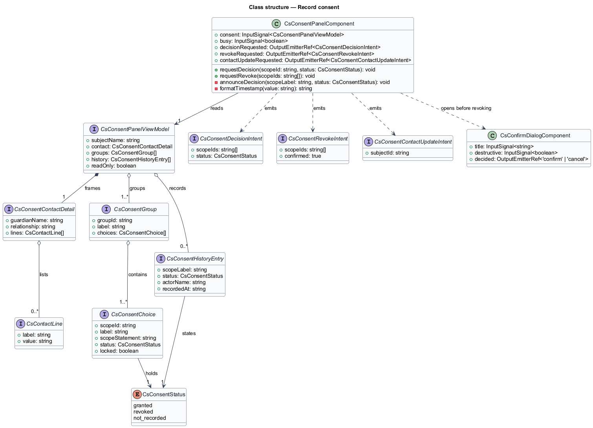
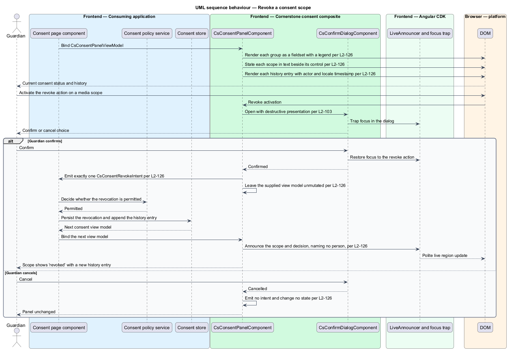
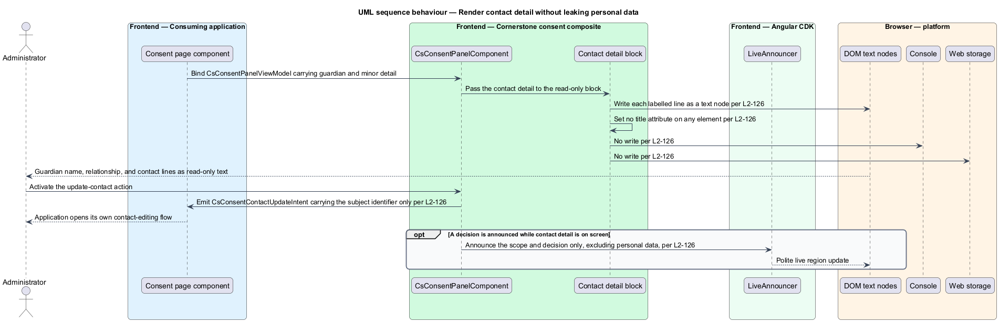

# Record consent

## Overview

Cornerstone is the Angular user-interface library published as `@quinntyne/cornerstone`.
It supplies the components that the Liturgy and Word Up applications compose
their screens from, and it carries the FaithTech visual language that makes those
screens look like one product family.

This feature covers the panel on which a guardian or an administrator reads what
a young person is currently consented to, grants or revokes a consent, and
inspects the history of every decision already made.

**consent scope** — single named permission a decision applies to, such as
participation in an off-site activity or use of a photograph

**consent group** — labelled set of related scopes presented together, such as
the participation group or the media group

**consent decision** — grant or revocation recorded against one scope, by one
actor, at one instant

**consent history** — ordered list of the decisions already recorded for a
person, each stating its scope, decision, actor, and timestamp

**contact detail framing** — presentation of a guardian's or a minor's contact
information as labelled read-only text, with no copy of that text held outside
the rendered element

The feature sits in the workflows subsystem, alongside the learning, people, and
operational composites. The Word Up application consumes it on its guardian and
administrator record screens. Liturgy does not consume it.

The panel is a composite. It accepts a typed view model and emits typed intents.
It holds no domain rules, no persistence, no authorization, and no routing. The
consuming application decides whether a decision is permitted, writes it, and
supplies the next view model.

The panel renders personal data: the names, relationships, and contact details of
guardians and minors. That data is neither logged nor persisted by the library.
The panel writes nothing to the console, to `localStorage`, to `sessionStorage`,
to `IndexedDB`, or to a DOM `title` attribute. Personal values live in the
component's rendered text nodes and nowhere else, and they leave the component
only inside an intent the application asked for.

## Description

The feature is a vertical slice from an application-supplied consent view model
down to grouped fieldsets, a history list, and a set of typed intents travelling
back.

- **`ConsentPanelComponent`** — the composite, selector `cs-consent-panel`. It
  takes `consent: InputSignal<ConsentPanelViewModel>` and
  `busy: InputSignal<boolean>`, and emits `decisionRequested`,
  `revokeRequested`, and `contactUpdateRequested`. It renders the current status,
  the contact detail block, one fieldset per consent group, the revoke and update
  actions, and the history list.
- **`ConsentPanelViewModel`** — the input type. It carries the subject's
  display name, the contact detail block, the consent groups, the history
  entries, and a read-only flag.
- **`ConsentGroup`** — one labelled fieldset: the group identifier, the group
  label, and the choices it contains. Each group renders as a `fieldset` with a
  `legend`, so the group label reaches assistive technology as part of each
  choice's accessible name.
- **`ConsentChoice`** — one scope: the scope identifier, the scope label, the
  scope statement, the current decision, and whether the choice is locked. The
  scope statement is rendered as text beside the control rather than carried by a
  heading alone, so the scope is readable without heading navigation.
- **`ConsentStatus`** — union type of the decision states:
  `'granted' | 'revoked' | 'not-recorded'`.
- **`ConsentHistoryEntry`** — one recorded decision: the scope label, the
  decision, the actor's display name, and the timestamp. The panel renders the
  timestamp with locale-aware formatting beside a machine-readable value.
- **`ConsentContactDetail`** — the labelled contact block: the guardian name,
  the relationship, and the contact lines. Every field is rendered as read-only
  text.
- **`ConsentDecisionIntent`** — intent carrying the changed scopes and the
  decision applied to them. Exactly one intent is emitted per confirmed action,
  whatever set of scopes that action covers.
- **`ConsentRevokeIntent`** — intent carrying the scopes a revocation covers,
  emitted only after the destructive confirm dialog resolves.
- **`ConsentContactUpdateIntent`** — intent asking the application to open its
  own contact-editing flow. The panel edits no contact field itself.

A revocation passes through the confirm dialog (L2-103) in its destructive
presentation before any intent is emitted. Cancelling the dialog emits nothing
and leaves the supplied view model untouched, because the panel treats that view
model as read-only and never mutates it in place.

The panel announces a recorded decision politely through the CDK `LiveAnnouncer`
(L2-012). The announcement names the scope and the decision. It does not name the
person, so no personal data reaches a live region that other screen content
shares.

The retention rule the consuming application applies to revoked history entries
is `<TO SUPPLY>`.

## Requirements

The feature realizes the following level-2 (L2) requirements. Each L2 requirement
refines a level-1 (L1) requirement, cited by identifier.

| L2 ID | Refines (L1) | Requirement |
|-------|--------------|-------------|
| `L2-126` | `L1-013` | The library shall provide a consent panel presenting consent status and history, framed contact details, grouped participation and media choices as labelled fieldsets, and revoke and update actions. It shall emit exactly one typed intent per confirmed decision, shall perform no persistence, shall route revocation through the destructive confirm dialog in `L2-103`, and shall not write personal data to logs, to storage, or to a DOM `title` attribute. |

## Diagrams

### System context

A guardian reviews and changes consent for a young person; an administrator does
the same on their behalf. The Word Up application owns the consent record;
Cornerstone renders it and reports the decisions back.

### Containers

The Word Up consent page builds the view model and handles the emitted intents.
The Cornerstone component library renders the panel and writes to no storage
container of its own.

### Components

`ConsentPanelComponent` composes a contact block, one fieldset per consent
group, and a history list, and it emits intents across the boundary to the
application's consent service. The rules, the audit write, and the storage sit on
the application side of that boundary; no Cornerstone component holds a store.

### Class structure

The panel reads one `ConsentPanelViewModel` composed of contact detail, consent
groups, and history entries, and emits three intent types. No type in the slice
carries a persistence or logging method.

### Behaviour — revoke a consent scope

The guardian revokes a media scope. The panel opens the destructive confirm
dialog, emits one intent on confirmation, and waits for the application to supply
the next view model and the new history entry.

### Behaviour — render contact detail without leaking personal data

The panel receives guardian contact detail, renders it as labelled read-only
text, and takes no other action with it. Each candidate sink for personal data is
shown refusing the value.

