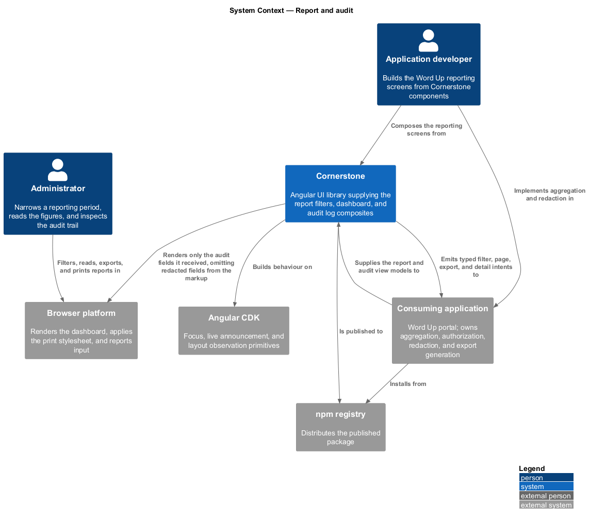
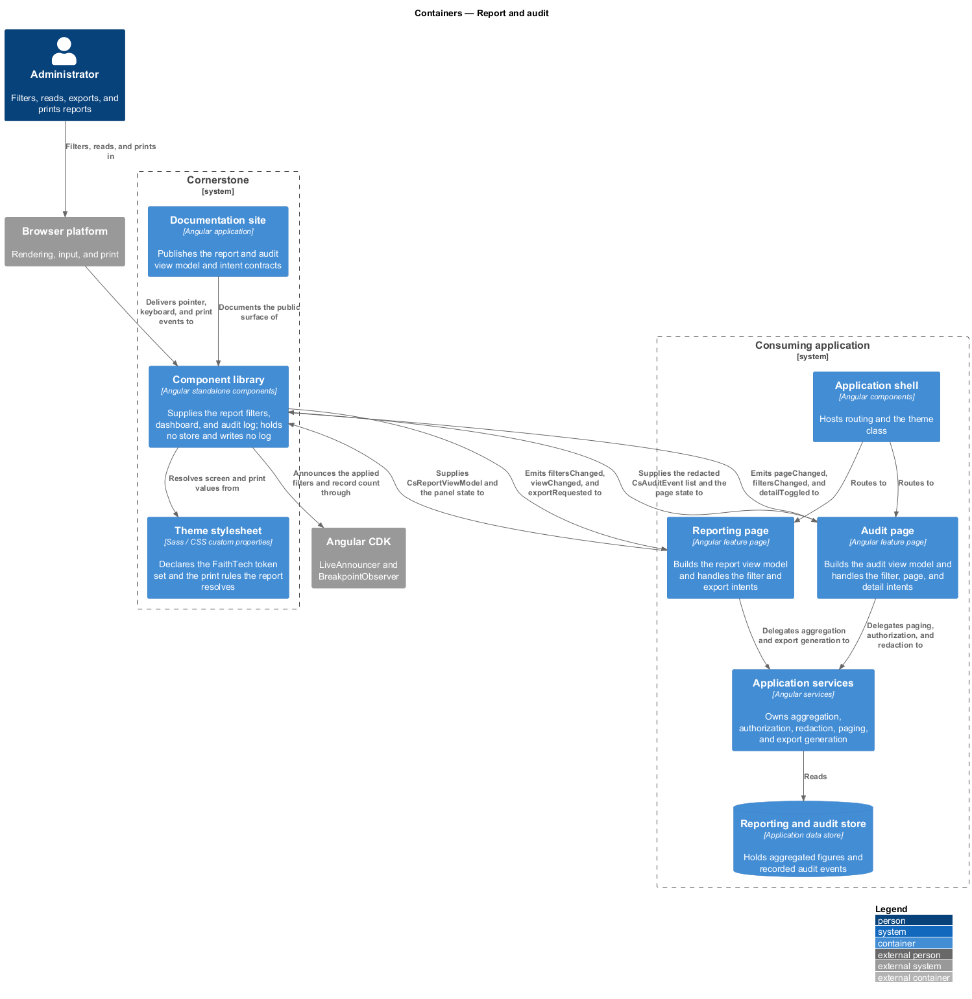
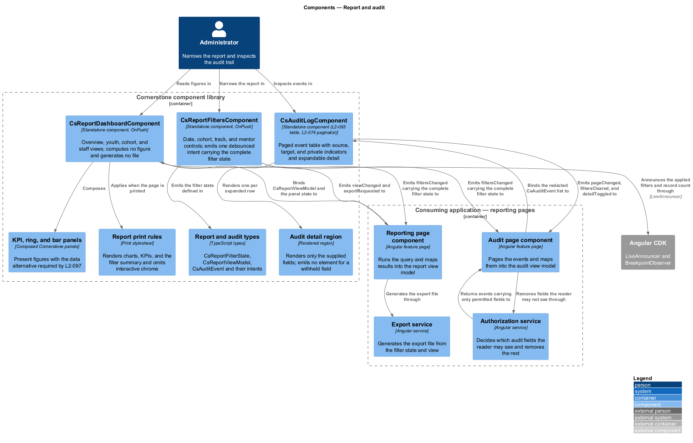
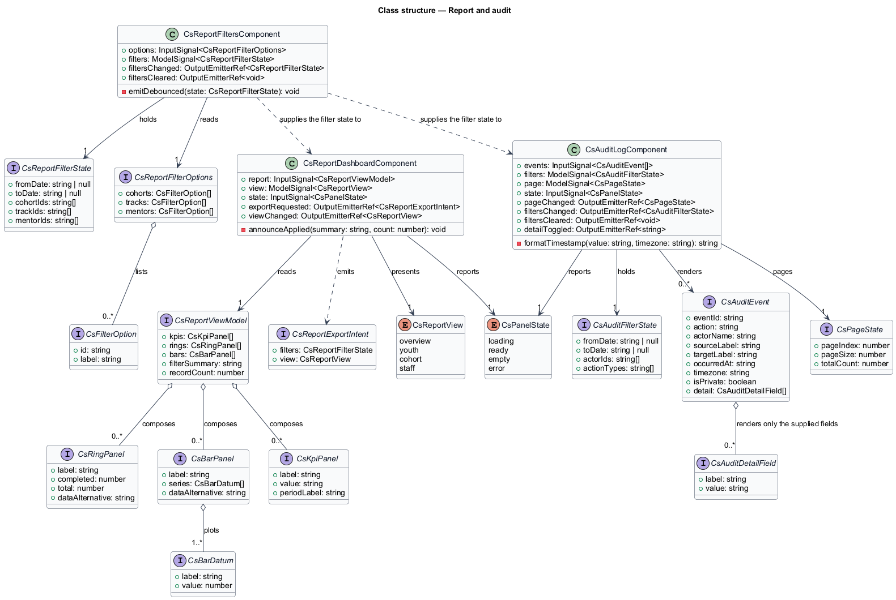
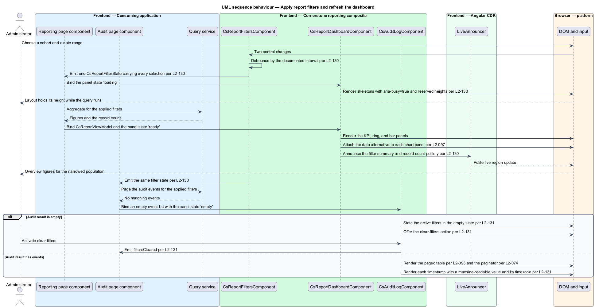
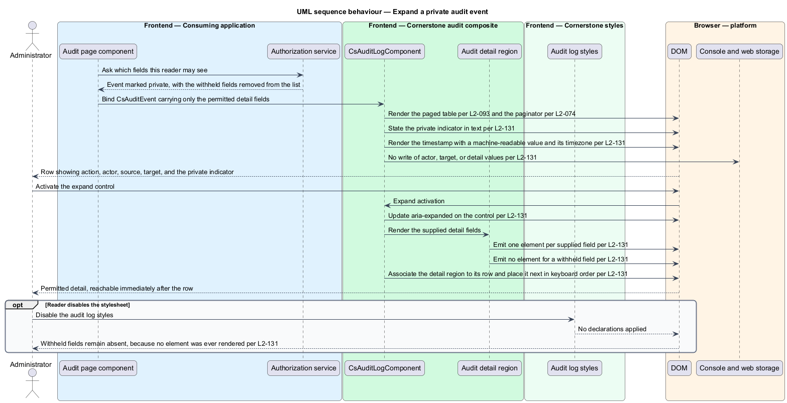
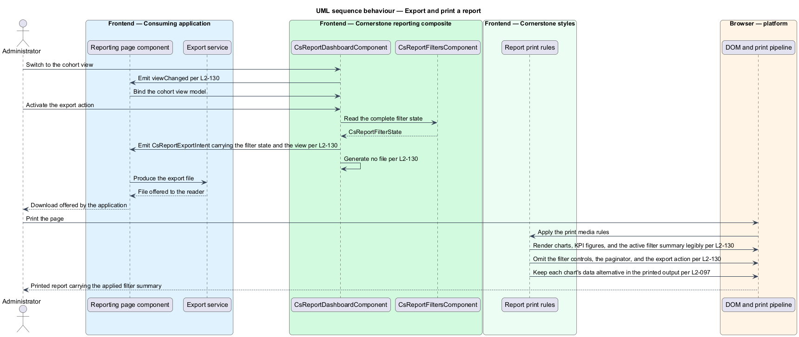

# Report and audit

## Overview

Cornerstone is the Angular user-interface library published as `@quinntyne/cornerstone`.
It supplies the components that the Liturgy and Word Up applications compose
their screens from, and it carries the FaithTech visual language that makes those
screens look like one product family.

This feature covers the administrator's reporting surface: the filter bar that
narrows a reporting period and population, the dashboard that presents the
resulting figures, and the audit log that lists what was done in the system and
by whom.

**report filter state** — complete set of the date range, cohort, track, and
mentor selections in force for a report

**report view** — one of the four framings the dashboard presents: overview,
youth, cohort, or staff

**KPI panel** — dashboard panel stating one headline figure with its label and
period

**ring panel** — dashboard panel presenting a proportion as a radial arc with a
text alternative

**bar panel** — dashboard panel presenting a comparison as bars with a text
alternative

**audit event** — recorded action, carrying an actor, a source, a target, a
timestamp, and optional detail

**private event** — audit event whose detail fields the application has
determined the reader is not entitled to see

**redacted field** — audit event field the application has withheld, absent from
the rendered markup rather than present and visually hidden

The feature sits in the workflows subsystem, alongside the learning, people, and
operational composites. The Word Up application consumes it on its administrator
reporting and audit screens. Liturgy does not consume it.

All three components are composites. Each accepts a typed view model and emits
typed intents. None holds domain rules, persistence, authorization, or routing.
The filter bar computes no figures, the dashboard queries no data and generates
no file, and the audit log decides nothing about who may read what. Redaction is
an authorization decision, and it is made by the application before the view
model reaches the library.

The audit log renders personal data: actor names, target names, and the detail of
what was changed. That data is neither logged nor persisted by the library. The
log writes nothing to the console, to `localStorage`, to `sessionStorage`, to
`IndexedDB`, or to a DOM `title` attribute. A redacted field is absent from the
DOM: the component renders no element for it, so it cannot be recovered by
disabling a stylesheet, by reading the accessibility tree, or by copying the
rendered region.

## Description

The feature is a vertical slice from an application-supplied filter state and
report view model down to rendered panels, a paged event table, and a set of
typed intents travelling back.

- **`ReportFiltersComponent`** — the filter bar, selector `cs-report-filters`.
  It takes `options: InputSignal<CsReportFilterOptions>` and
  `filters: ModelSignal<ReportFilterState>`, and emits `filtersChanged` and
  `filtersCleared`. A change to any control emits exactly one intent carrying the
  complete filter state, debounced by the documented interval, rather than one
  intent per control.
- **`ReportDashboardComponent`** — the dashboard, selector
  `cs-report-dashboard`. It takes `report: InputSignal<ReportViewModel>`,
  `view: ModelSignal<ReportView>`, and `state: InputSignal<PanelState>`, and
  emits `exportRequested` and `viewChanged`. In the loading state each panel
  shows a skeleton, the dashboard region carries `aria-busy="true"`, and panel
  heights are reserved so the layout does not shift when figures arrive.
- **`ReportView`** — union type of the four framings:
  `'overview' | 'youth' | 'cohort' | 'staff'`.
- **`PanelState`** — union type of the panel states:
  `'loading' | 'ready' | 'empty' | 'error'`.
- **`ReportFilterState`** — the filter type: the date range, the cohort
  identifiers, the track identifiers, and the mentor identifiers.
- **`ReportViewModel`** — the dashboard input: the KPI panels, the ring panels,
  the bar panels, the applied filter summary, and the resulting record count.
- **`ReportExportIntent`** — intent carrying the complete filter state and the
  active view. The dashboard generates no file; the application produces the
  export.
- **`AuditLogComponent`** — the audit log, selector `cs-audit-log`. It takes
  `events: InputSignal<AuditEvent[]>`, `page: ModelSignal<CsPageState>`,
  `filters: ModelSignal<CsAuditFilterState>`, and `state: InputSignal<PanelState>`,
  and emits `pageChanged`, `filtersChanged`, `filtersCleared`, and
  `detailToggled`. It satisfies the table semantics of L2-093 and the paginator
  behaviour of L2-074.
- **`AuditEvent`** — one event: the event identifier, the action label, the
  actor name, the source label, the target label, the timestamp, the private
  flag, and the detail fields the application chose to supply.
- **`AuditDetailField`** — one detail field: the label and the value. A
  withheld field is not represented in this list at all, so the component has no
  value to render and no placeholder element to emit.

Each chart panel carries the accessible data alternative required by L2-097, so
the ring and bar panels remain readable without colour or shape perception. Each
timestamp renders with locale-aware formatting beside a machine-readable value,
and states its timezone.

Expanding an audit event updates `aria-expanded` on the expand control,
associates the detail region to its row, and places the detail immediately after
the row in keyboard order.

The print stylesheet renders the charts, the KPI figures, and the active filter
summary legibly, and omits interactive-only chrome such as the filter controls,
the paginator, and the export action.

The debounce interval applied before `filtersChanged` is emitted is
`<TO SUPPLY>`.

## Requirements

The feature realizes the following level-2 (L2) requirements. Each L2 requirement
refines a level-1 (L1) requirement, cited by identifier.

| L2 ID | Refines (L1) | Requirement |
|-------|--------------|-------------|
| `L2-130` | `L1-013` | The library shall provide report filters covering date, cohort, track, and mentor, and a dashboard presenting overview, youth, cohort, and staff views composed from KPI, ring, and bar panels with export and print states. A filter change shall emit one debounced intent carrying the complete filter state, the applied filters and record count shall be announced politely, the loading state shall show skeletons with `aria-busy="true"` and reserved heights, export shall emit a typed intent without generating a file, and every chart panel shall carry the data alternative required by `L2-097`. |
| `L2-131` | `L1-013` | The library shall provide an audit log with filters, a paged event table satisfying `L2-093` and `L2-074`, source, target, and private indicators, expandable detail, and empty, error, and loading states. A private event shall state its indicator in text and its redacted fields shall be absent from the DOM rather than hidden by CSS, timestamps shall be locale-formatted with a machine-readable value and a stated timezone, and an empty result shall state the active filters and offer a clear-filters intent. |

## Diagrams

### System context

An administrator narrows a reporting period, reads the resulting figures, and
inspects the audit trail. The Word Up application owns the data, the aggregation,
and the decision about which audit fields the reader may see.

### Containers

The Word Up reporting pages hold the query services and the authorization that
determines redaction. Cornerstone supplies the filter bar, the dashboard, and the
audit log, and holds no store of its own.

### Components

`ReportFiltersComponent` emits one complete filter state; the dashboard and the
audit log render what the application returns. The aggregation, the export file,
and the redaction decision sit on the application side of the boundary, and the
audit log receives only the fields it is entitled to render.

### Class structure

The filter state feeds both the dashboard and the audit log. `AuditEvent`
carries a detail field list from which withheld fields are absent, so no type in
the slice can hold a redacted value.

### Behaviour — apply filters and refresh the dashboard

The administrator changes a cohort and a date range. One debounced intent carries
the complete filter state, the dashboard reserves its panel heights while
loading, and the applied filters and record count are announced. The same filter
state narrows the audit log to an empty result.

### Behaviour — expand a private audit event

The application marks an event private and supplies only the fields the reader
may see. The log states the private indicator in text and renders no element for
a withheld field, so the redaction survives a disabled stylesheet.

### Behaviour — export and print a report

The administrator exports the current view and then prints the page. The
dashboard emits an export intent carrying the filter state and the view, and the
print stylesheet renders the figures and the filter summary without the
interactive chrome.

