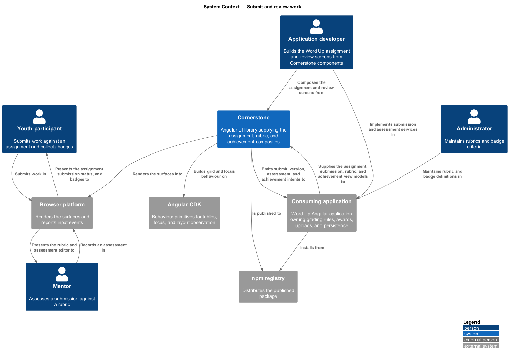
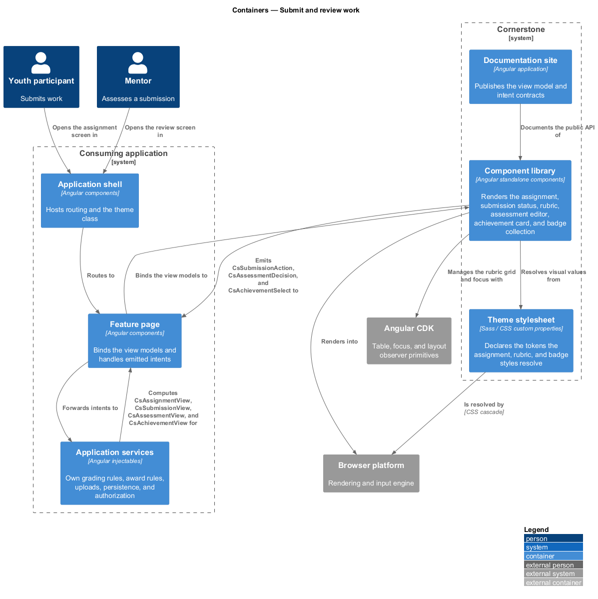
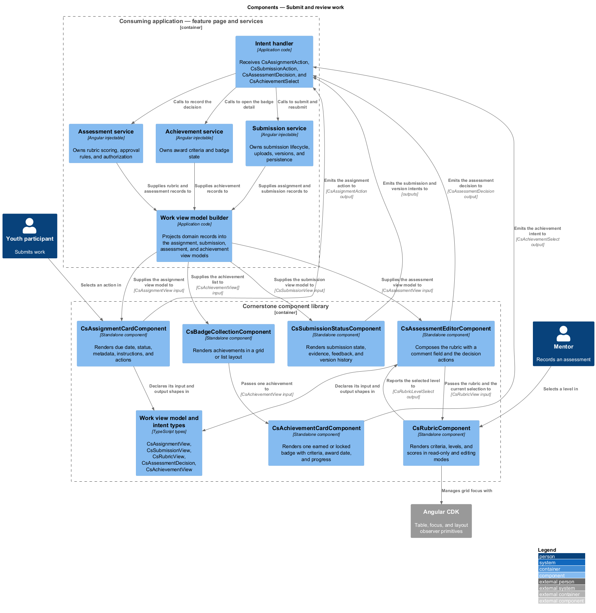
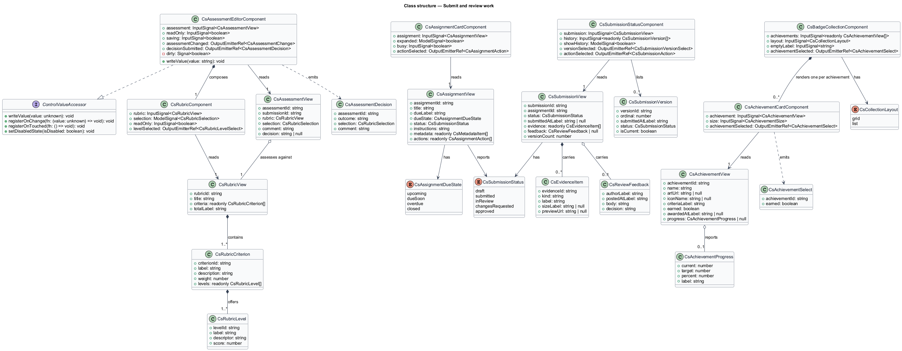
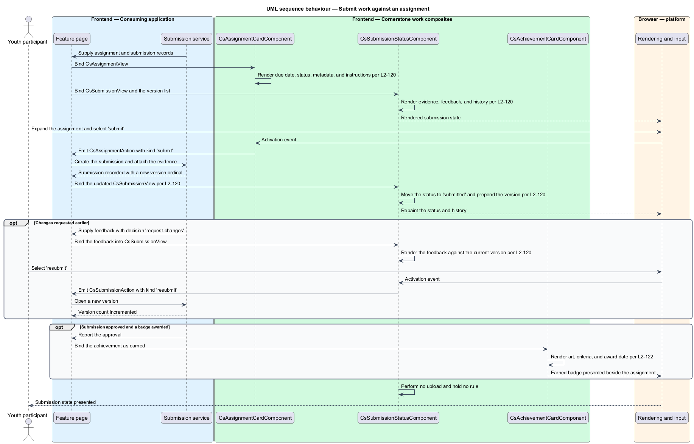
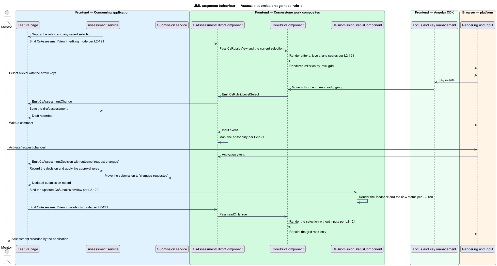
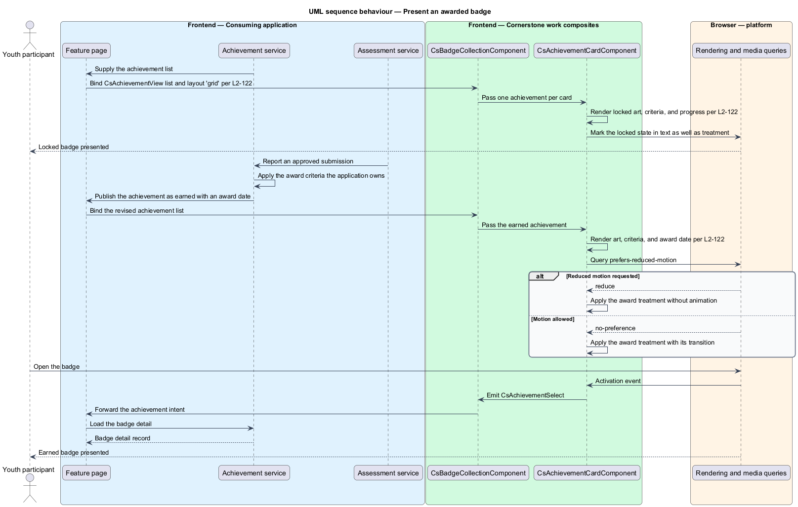

# Submit and review work

## Overview

Cornerstone is the Angular user-interface library published as `@quinntyne/cornerstone`.
It supplies the components that the Liturgy and Word Up applications compose
their screens from. This feature belongs to the workflows subsystem, the layer of
compound components that present a whole task rather than a single control.

Word Up sets work for a participant, collects what the participant produces,
puts that work in front of a mentor for assessment, and recognises the result
with a badge. This feature covers the six components that carry that loop end to
end: two for the assignment and its submission, two for the assessment, and two
for the recognition.

**assignment** — unit of work set for a participant, carrying instructions and a
due date

**submission** — one delivery of work against an assignment, carrying evidence and
a status

**version** — earlier submission retained alongside the current one, identified by
its ordinal and its submission time

**evidence** — file, link, or text attached to a submission as the work itself

**rubric** — grid of assessment criteria, each offering ordered levels with a
score

**assessment** — mentor's judgement of a submission against a rubric, ending in an
approval or a request for changes

**badge** — named recognition awarded on completion of stated criteria

**view model** — read-only data structure describing what a composite renders,
computed by the consuming application

**intent** — typed output event naming what a user asked for, stating nothing about
how the application satisfies it

The six components are composites. They accept a typed view model input and emit
typed intents. They hold no domain rules: they do not compute a due state, do not
total a rubric score into a grade, do not decide an approval, do not decide
whether a badge is earned, do not upload, do not read or write persistence, do
not authorize, and do not route. Word Up's application services own each of those
decisions. The components render what they are given and report what the user
did.

The consuming applications are Word Up in the youth role for submission, in the
mentor role for assessment, and in the mentor and administrator roles for rubric
authoring.

## Description

The feature is a vertical slice from a Word Up assignment page and review page
down to the rendered assignment, rubric, and badge surfaces. It introduces six
components, their view model types, and their intent types.

- **`AssignmentCardComponent`** — selector `cs-assignment-card`. It renders one
  assignment: title, due date, status, metadata, instructions, and the actions
  open to the current viewer. Inputs: `assignment:
  InputSignal<AssignmentView>`, `expanded: ModelSignal<boolean>`, and `busy:
  InputSignal<boolean>`. Output: `actionSelected:
  OutputEmitterRef<AssignmentAction>`. States: collapsed, expanded, and busy.
- **`SubmissionStatusComponent`** — selector `cs-submission-status`. It renders
  the state of a submission, its evidence, the review feedback attached to it,
  and its version history. Inputs: `submission:
  InputSignal<SubmissionView>`, `history:
  InputSignal<readonly SubmissionVersion[]>`, and `showHistory:
  ModelSignal<boolean>`. Outputs: `versionSelected:
  OutputEmitterRef<SubmissionVersionSelect>` and `actionSelected:
  OutputEmitterRef<CsSubmissionAction>`. States: draft, submitted, under review,
  changes requested, and approved.
- **`RubricComponent`** — selector `cs-rubric`. It renders a criterion by level
  grid with the selected level and score for each criterion. Inputs: `rubric:
  InputSignal<RubricView>`, `selection: ModelSignal<RubricSelection>`, and
  `readOnly: InputSignal<boolean>`. Output: `levelSelected:
  OutputEmitterRef<RubricLevelSelect>`. States: read-only and editing. At the
  narrow breakpoint the grid reflows to one stacked criterion block per row; the
  breakpoint value is `<TO SUPPLY>`.
- **`AssessmentEditorComponent`** — selector `cs-assessment-editor`. It
  composes `RubricComponent` with a comment field and the two decision actions.
  Inputs: `assessment: InputSignal<AssessmentView>`, `readOnly:
  InputSignal<boolean>`, and `saving: InputSignal<boolean>`. Outputs:
  `assessmentChanged: OutputEmitterRef<AssessmentChange>` and
  `decisionSubmitted: OutputEmitterRef<AssessmentDecision>`. States:
  read-only, editing, dirty, and saving.
- **`AchievementCardComponent`** — selector `cs-achievement-card`. It renders
  one badge with its art or icon, its criteria, its award date when earned, and
  its progress when unearned. Inputs: `achievement:
  InputSignal<AchievementView>` and `size: InputSignal<CsAchievementSize>`.
  Output: `achievementSelected: OutputEmitterRef<AchievementSelect>`. States:
  earned and locked.
- **`BadgeCollectionComponent`** — selector `cs-badge-collection`. It renders a
  set of achievements in a grid or a list. Inputs: `achievements:
  InputSignal<readonly AchievementView[]>`, `layout:
  InputSignal<CollectionLayout>` defaulting to `'grid'`, and `emptyLabel:
  InputSignal<string>`. Output: `achievementSelected:
  OutputEmitterRef<AchievementSelect>`. States: populated and empty.
- **`AssignmentView`** — view model of an assignment. Fields: `assignmentId`,
  `title`, `dueLabel`, `dueState`, `status`, `instructions`, `metadata`, and
  `actions`.
- **`AssignmentDueState`** — union type of the due states supplied by the
  application: `'upcoming' | 'due-soon' | 'overdue' | 'closed'`.
- **`CsMetadataItem`** — labelled value rendered in the assignment metadata row.
  Fields: `label` and `value`.
- **`SubmissionView`** — view model of the current submission. Fields:
  `submissionId`, `assignmentId`, `status`, `submittedAtLabel`, `evidence`,
  `feedback`, and `versionCount`.
- **`SubmissionStatus`** — union type of the submission states: `'draft' |
  'submitted' | 'in-review' | 'changes-requested' | 'approved'`.
- **`SubmissionVersion`** — view model of an earlier submission. Fields:
  `versionId`, `ordinal`, `submittedAtLabel`, `status`, and `isCurrent`.
- **`EvidenceItem`** — view model of one piece of evidence. Fields:
  `evidenceId`, `kind`, `label`, `sizeLabel`, and `previewUrl`.
- **`ReviewFeedback`** — view model of the feedback attached to a submission.
  Fields: `authorLabel`, `postedAtLabel`, `body`, and `decision`.
- **`AssignmentAction`** and **`CsSubmissionAction`** — intents naming an action
  the user selected. Fields: `actionId`, `kind`, and the owning identifier. The
  `kind` values cover `'submit'`, `'resubmit'`, `'withdraw'`, and `'open'`.
- **`SubmissionVersionSelect`** — intent emitted when a viewer opens an earlier
  version. Fields: `submissionId` and `versionId`.
- **`RubricView`** — view model of a rubric. Fields: `rubricId`, `title`,
  `criteria`, and `totalLabel`.
- **`RubricCriterion`** — view model of one criterion. Fields: `criterionId`,
  `label`, `description`, `weight`, and `levels`.
- **`RubricLevel`** — view model of one level. Fields: `levelId`, `label`,
  `descriptor`, and `score`.
- **`RubricSelection`** — record keyed by `criterionId` holding the selected
  `levelId` for each.
- **`RubricLevelSelect`** — intent emitted on each level selection. Fields:
  `rubricId`, `criterionId`, `levelId`, and `score`.
- **`AssessmentView`** — view model of an assessment in progress. Fields:
  `assessmentId`, `submissionId`, `rubric`, `selection`, `comment`, and
  `decision`.
- **`AssessmentChange`** — intent emitted on each edit. Fields: `assessmentId`,
  `selection`, and `comment`.
- **`AssessmentDecision`** — intent emitted when a mentor concludes. Fields:
  `assessmentId`, `outcome` of `'approve' | 'request-changes'`, `selection`, and
  `comment`.
- **`AchievementView`** — view model of a badge. Fields: `achievementId`,
  `name`, `artUrl`, `iconName`, `criteriaLabel`, `earned`, `awardedAtLabel`, and
  `progress`.
- **`AchievementProgress`** — view model of progress toward an unearned badge.
  Fields: `current`, `target`, `percent`, and `label`.
- **`AchievementSelect`** — intent emitted when a viewer opens a badge. Fields:
  `achievementId` and `earned`.
- **`CollectionLayout`** and **`CsAchievementSize`** — union types of the layout
  and size selections: `'grid' | 'list'` and `'sm' | 'md' | 'lg'`.

All six components are standalone and use `OnPush` change detection.
`AssessmentEditorComponent` composes `RubricComponent` rather than
reimplementing the grid, and holds the comment field as a value-bearing control
implementing `ControlValueAccessor`.

The rubric grid renders as a table with a row per criterion and a column per
level, and each cell is a radio in a group named for its criterion, so arrow keys
move within a criterion and `Tab` moves between criteria. Selected levels are
conveyed by text as well as by fill. `RubricComponent` renders the supplied
`totalLabel`; it sums no scores.

`SubmissionStatusComponent` renders version history as an ordered list, newest
first, with the current version marked in text. It performs no upload: evidence
arrives already described in the view model, and a submit action emits an intent
for the application to satisfy.

`AchievementCardComponent` renders a locked badge with its criteria and its
progress, and marks the locked state in text as well as in treatment. Under
`prefers-reduced-motion: reduce` the award treatment appears without animation.

## Requirements

The feature realizes the following level-2 (L2) requirements. Each L2 requirement
refines a level-1 (L1) requirement, cited by identifier.

| L2 ID | Refines (L1) | Requirement |
|-------|--------------|-------------|
| `L2-120` | `L1-013` | The library shall provide due date, status, and metadata, instructions, evidence, submit and resubmit actions, review feedback, and version or history states. |
| `L2-121` | `L1-013` | The library shall provide rubric criteria, levels, and scores, comments, approve and request-changes actions, and read-only and editing modes. |
| `L2-122` | `L1-013` | The library shall provide earned and locked badge presentation with art or icon, criteria, award date, progress, and grid or list layouts. |

## Diagrams

### System context

A youth participant submits work, a mentor assesses it, and both see the badge
that follows. Word Up owns the grading rules and the award rules; Cornerstone
renders the assignment, the rubric, and the recognition.

### Containers

The Word Up assignment page and review page bind view models and forward intents
to application services. The Cornerstone component library renders the six
surfaces and reads its visual values from the theme stylesheet.

### Components

Word Up's submission, assessment, and achievement services build the view models
and receive the intents. `AssessmentEditorComponent` composes
`RubricComponent`; neither one totals a score or decides an outcome.

### Class structure

The three component pairs sit over three view model families. The intent types
carry identifiers and selections only, never the domain records they came from.

### Behaviour — submit work against an assignment

A participant opens an assignment, attaches evidence, and submits. The submission
status moves to submitted and the version list gains an entry.

### Behaviour — assess a submission against a rubric

A mentor selects a level for each criterion, writes a comment, and requests
changes. The editor emits a decision intent; the application records it and
returns the updated submission view model.

### Behaviour — present an awarded badge

The application awards a badge after an approval and republishes the achievement
list. The collection re-renders the badge as earned with its award date.

