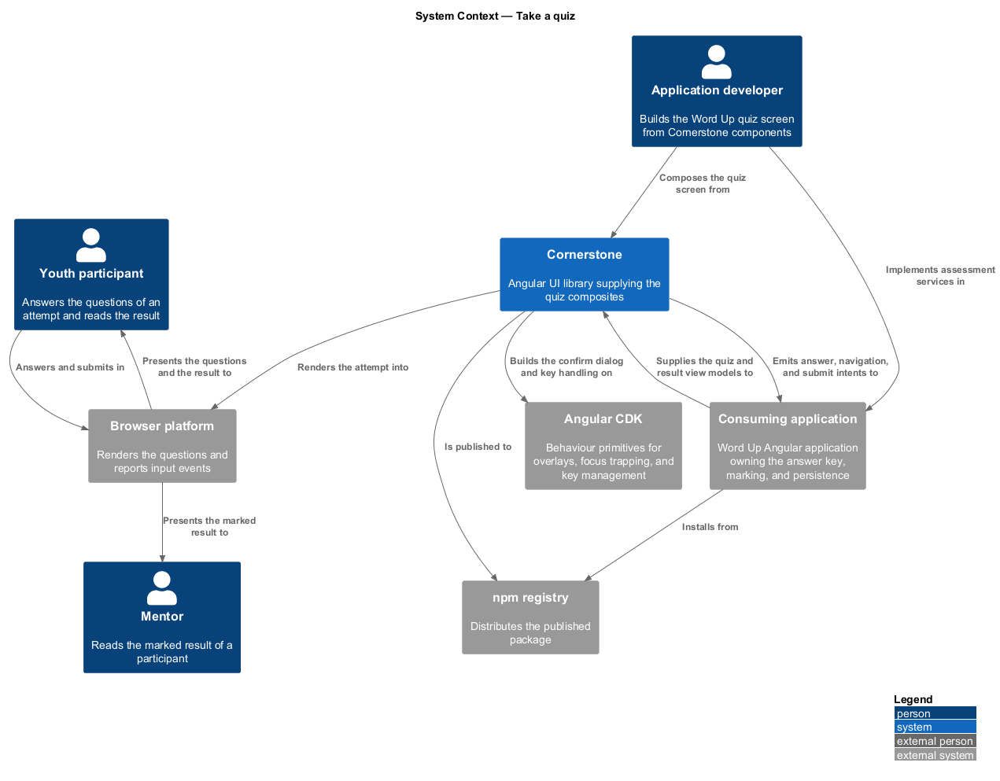
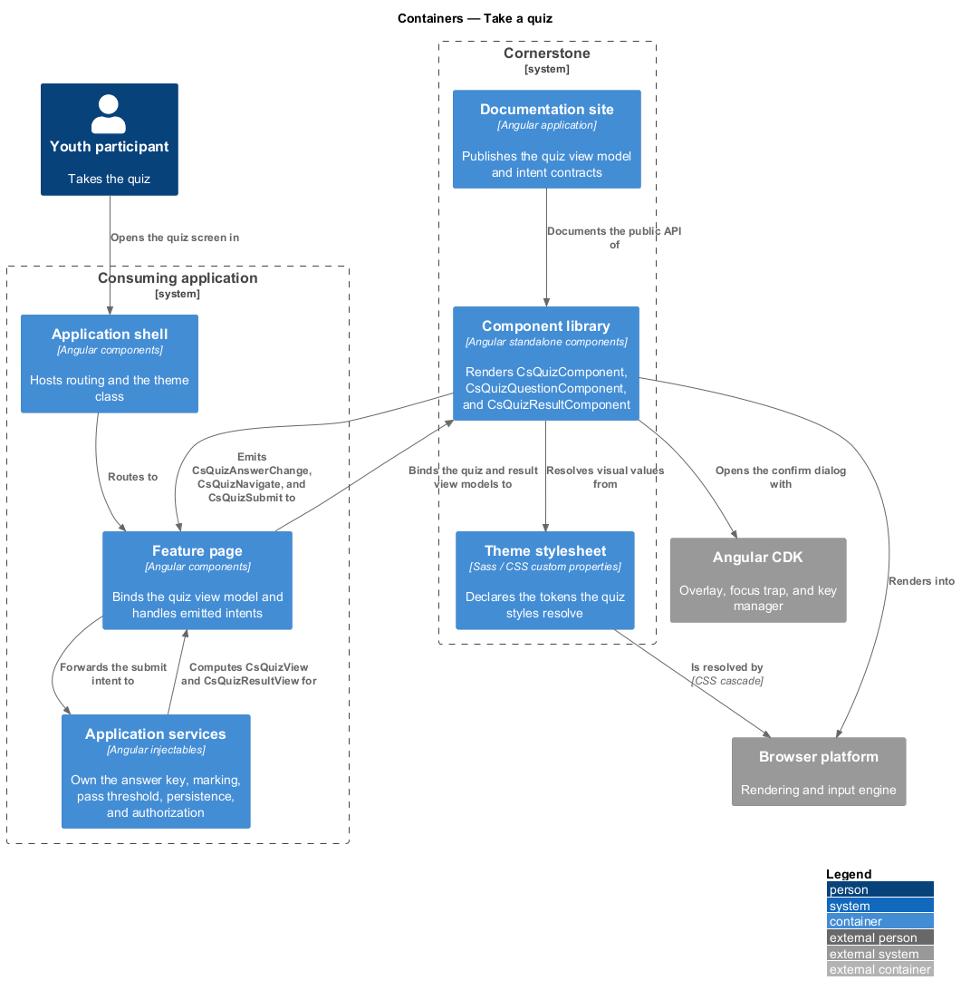
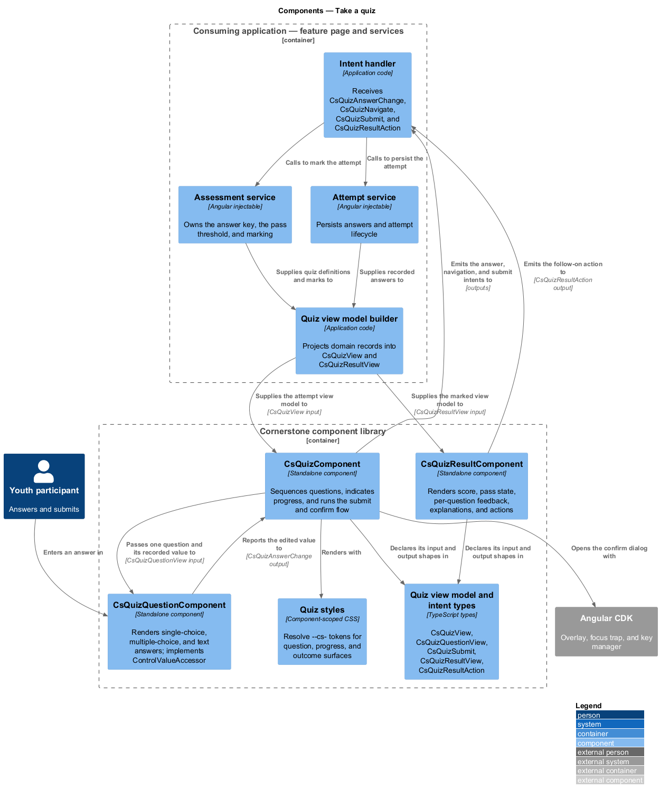
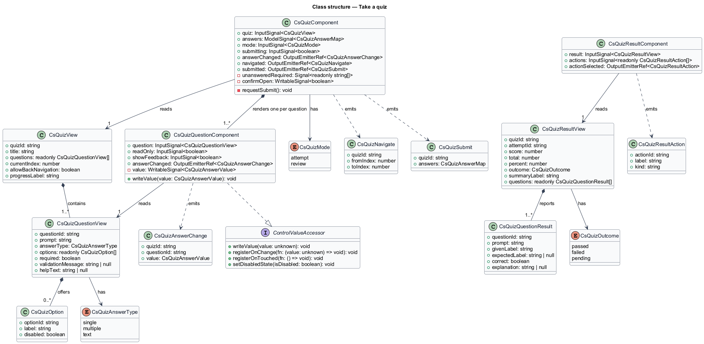
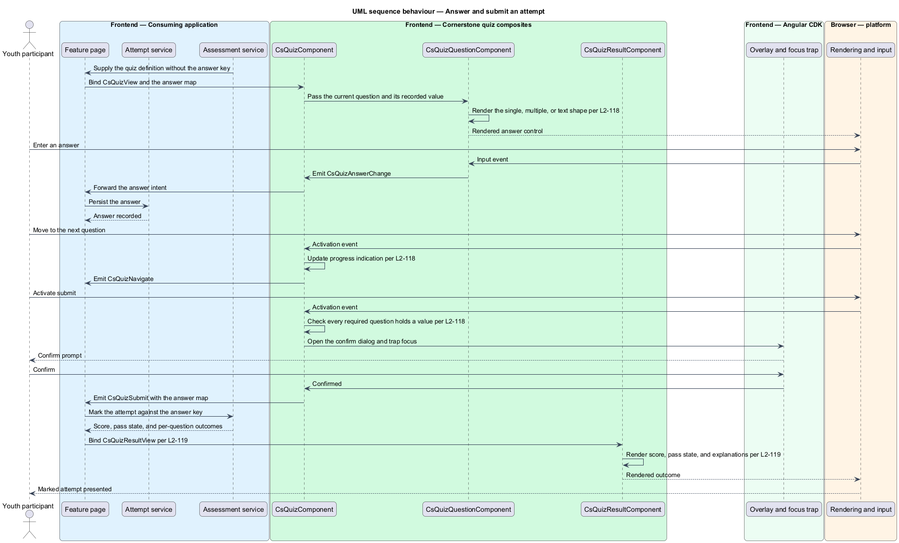
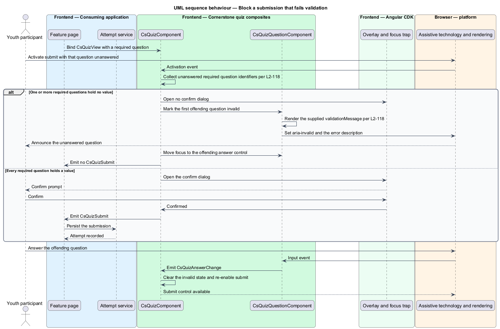
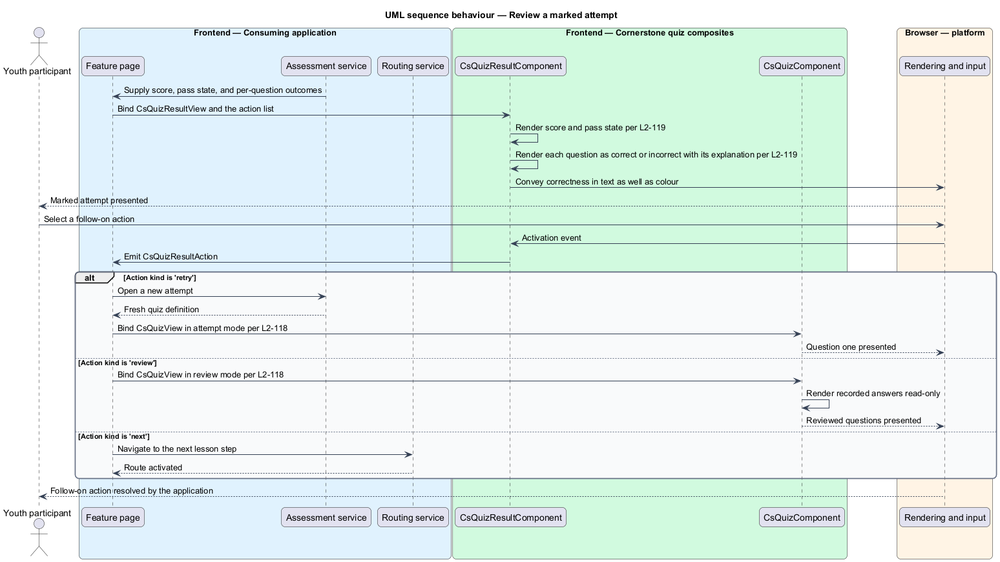

# Take a quiz

## Overview

Cornerstone is the Angular user-interface library published as `@quinntyne/cornerstone`.
It supplies the components that the Liturgy and Word Up applications compose
their screens from. This feature belongs to the workflows subsystem, the layer of
compound components that present a whole task rather than a single control.

Word Up checks understanding at the end of a lesson with a short assessment. A
participant answers a set of questions, confirms the submission, and then reads
back which answers were right and why. This feature covers the three components
that present that pass.

**quiz** — ordered set of questions presented as one attempt, carrying a pass
threshold defined by the consuming application

**question** — single prompt with one answer type and zero or more selectable
options

**answer type** — kind of response a question accepts: single choice, multiple
choice, or free text

**attempt** — one traversal of a quiz by a participant, ending in a submission or
an abandonment

**review state** — presentation in which a question renders its recorded answer
and its correctness without accepting further input

**view model** — read-only data structure describing what a composite renders,
computed by the consuming application

**intent** — typed output event naming what a user asked for, stating nothing about
how the application satisfies it

The three components are composites. They accept a typed view model input and
emit typed intents. They hold no domain rules: they do not mark an answer, do not
hold the answer key, do not compute a score, do not decide a pass, do not read or
write persistence, do not authorize, and do not route. Word Up's application
services own each of those decisions. The components render what they are given
and report what the participant did.

The consuming application is Word Up, in the youth role for the attempt and in
the youth and mentor roles for the result.

## Description

The feature is a vertical slice from a Word Up quiz page down to the rendered
question and result surfaces. It introduces three components, their view model
types, and their intent types.

- **`QuizComponent`** — the outer composite, selector `cs-quiz`. It holds the
  question sequence, the progress indication, and the submit and confirm flow.
  Inputs: `quiz: InputSignal<QuizView>`, `answers:
  ModelSignal<QuizAnswerMap>`, `mode: InputSignal<QuizMode>` defaulting to
  `'attempt'`, and `submitting: InputSignal<boolean>`. Outputs: `answerChanged:
  OutputEmitterRef<QuizAnswerChange>`, `navigated:
  OutputEmitterRef<QuizNavigate>`, and `submitted:
  OutputEmitterRef<QuizSubmit>`. States: attempt, confirming, submitting, and
  review.
- **`QuizQuestionComponent`** — the inner composite, selector
  `cs-quiz-question`. It renders one question in the shape its answer type calls
  for and carries the answer value. Inputs: `question:
  InputSignal<QuizQuestionView>`, `readOnly: InputSignal<boolean>`, and
  `showFeedback: InputSignal<boolean>`. Output: `answerChanged:
  OutputEmitterRef<QuizAnswerChange>`. The component implements
  `ControlValueAccessor` over `QuizAnswerValue`, so a page may bind it to a
  form control instead of the outer composite.
- **`QuizResultComponent`** — the result composite, selector `cs-quiz-result`.
  It renders the score, the pass state, the per-question outcome with its
  explanation, and the follow-on actions. Inputs: `result:
  InputSignal<QuizResultView>` and `actions:
  InputSignal<readonly QuizResultAction[]>`. Output: `actionSelected:
  OutputEmitterRef<QuizResultAction>`. States: passed, failed, and awaiting
  review.
- **`QuizView`** — view model of one attempt. Fields: `quizId`, `title`,
  `questions`, `currentIndex`, `allowBackNavigation`, and `progressLabel`.
- **`QuizQuestionView`** — view model of one question. Fields: `questionId`,
  `prompt`, `answerType`, `options`, `required`, `validationMessage`, and
  `helpText`.
- **`QuizAnswerType`** — union type of the answer types: `'single' | 'multiple'
  | 'text'`.
- **`QuizAnswerValue`** — union type of the recorded values: `string | readonly
  string[] | null` for choice types and `string | null` for text.
- **`QuizAnswerMap`** — record keyed by `questionId` holding one
  `QuizAnswerValue` each.
- **`QuizAnswerChange`** — intent emitted on each answer edit. Fields:
  `quizId`, `questionId`, and `value`.
- **`QuizNavigate`** — intent emitted when a participant moves between
  questions. Fields: `quizId`, `fromIndex`, and `toIndex`.
- **`QuizSubmit`** — intent emitted after the participant confirms. Fields:
  `quizId` and `answers`.
- **`QuizResultView`** — view model of a marked attempt. Fields: `quizId`,
  `attemptId`, `score`, `total`, `percent`, `outcome`, `summaryLabel`, and
  `questions`.
- **`QuizQuestionResult`** — view model of one marked question. Fields:
  `questionId`, `prompt`, `givenLabel`, `expectedLabel`, `correct`, and
  `explanation`.
- **`QuizOutcome`** — union type of the outcomes: `'passed' | 'failed' |
  'pending'`.
- **`QuizResultAction`** — intent describing a follow-on action. Fields:
  `actionId`, `label`, and `kind` of `'next' | 'retry' | 'review'`.
- **`QuizMode`** — union type of the presentation modes: `'attempt' |
  'review'`.

All three components are standalone and use `OnPush` change detection. Validation
is presentational: `QuizComponent` blocks the submit action while a question
marked `required` holds no value and renders the supplied `validationMessage`
against that question. The message text comes from the view model; the component
composes no message of its own.

The confirm step renders as a dialog built on the CDK overlay. Confirmation is
required before `submitted` fires, and the dialog returns focus to the submit
control when it closes without confirming.

Progress renders as a labelled `progressbar` role reporting answered questions
against total questions. Each question is a `group` with the prompt as its
accessible name, and correctness in the result is conveyed by text as well as by
colour. The retention period for an abandoned attempt is `<TO SUPPLY>`; the
components hold no attempt state across a page reload.

## Requirements

The feature realizes the following level-2 (L2) requirements. Each L2 requirement
refines a level-1 (L1) requirement, cited by identifier.

| L2 ID | Refines (L1) | Requirement |
|-------|--------------|-------------|
| `L2-118` | `L1-013` | The library shall provide single-choice, multiple-choice, and text answer types, question navigation, progress indication, validation, a submit and confirm flow, and review states. |
| `L2-119` | `L1-013` | The library shall provide score and pass state, per-question correct and incorrect feedback, explanations, and next or retry actions. |

## Diagrams

### System context

A youth participant takes the quiz and a mentor reads the result. Word Up owns
the answer key and the marking; Cornerstone renders the attempt and the outcome.

### Containers

The Word Up quiz page binds the attempt view model and forwards the submit intent
to application services. The Cornerstone component library renders the questions
and the result and builds the confirm dialog on Angular CDK overlays.

### Components

`QuizComponent` receives `QuizView` from Word Up's assessment service and
emits `QuizSubmit` back to it. The marking service returns `QuizResultView`,
which `QuizResultComponent` renders. No Cornerstone component holds the answer
key.

### Class structure

`QuizComponent` composes one `QuizQuestionComponent` per question and hands
the answer map back through a `model()` signal. `QuizResultComponent` reads a
separate result view model produced by the application.

### Behaviour — answer and submit an attempt

A participant answers the questions, moves through the sequence, confirms, and
submits. The application marks the attempt and returns a result view model.

### Behaviour — block a submission that fails validation

A participant reaches the submit action with a required question unanswered. The
component blocks the action, moves focus to the first offending question, and
renders the supplied validation message.

### Behaviour — review a marked attempt

The participant reads the result: the score, the pass state, each question's
outcome and explanation, and the follow-on actions. Selecting an action emits an
intent that the application resolves.

